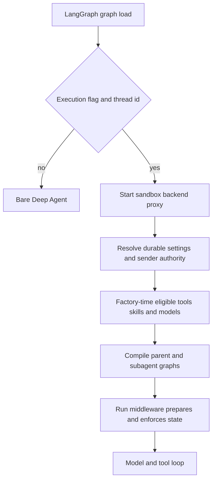

# Coding Agent Assembly

`get_agent(config)` in `agent/server.py` is the composition boundary for the primary coding graph. It turns an executable, thread-scoped LangGraph load into a `create_deep_agent` call by resolving durable settings, run-scoped authority, a sandbox-backed filesystem, models, skills, a curated tool surface, and independently compiled subagents. The deployment registers `agent.graphs.agent:traced_agent`, an alias of this factory.

## Entry gate and assembly flow

This shows the boundary between factory-time eligibility decisions and state-aware middleware enforcement during a run.

The factory sets `DEFAULT_RECURSION_LIMIT`. Full assembly requires a `thread_id` and `__is_for_execution__ is True`; discovery and state-reading loads instead receive a bare agent with an empty system prompt and no tools, backend, or supplied middleware. The bound result strips `__pregel_*` keys: those read-time runtime internals are non-serializable and LangGraph injects them again per invocation.

`RunConfig` is deliberately a tolerant `configurable` contract shared by launchers and graph types. Its fields are optional, unknown keys survive serialization, and parsing discards failing fields individually instead of losing a usable `thread_id` or the remaining configuration.

## Settings, identity, sandbox, and models

The triggering `profile_login` governs authorization. Durable model choices and repository instructions instead come from thread settings, initially seeded from a profile and then reused so a later sender does not silently alter the thread's decisions. The sandbox proxy starts before settings resolution; desktop runs reconnect to a validated local-project `LocalShellBackend`, while hosted runs call `ensure_sandbox_for_thread` for the selected workspace.

Hosted sandbox recovery protects work: a cached or recorded sandbox is reused and its proxy/identity refreshed. An unreachable existing sandbox raises rather than being silently replaced, because it may hold uncommitted changes; a deleted sandbox is replaced so a stale recorded id cannot permanently brick the thread.

Main and general-purpose-subagent model/effort pairs resolve from workspace defaults, then profile overrides (including an optional distinct subagent override), stored thread settings, and finally a validated canonical per-run pair. Resolved hosted settings—including repository instructions and routing preference—are persisted before Fable gating. A Slack ask is then forced onto the fast route without changing stored settings. Adaptive routing constructs route models and records its deterministic auto/performance mode in metadata; model creation failures are deferred to an error model, and fallback middleware exists only when its id differs from the main model.

## Prompt and per-run context

The factory passes an empty static prompt. `PrepareAgentRunMiddleware` builds the real prompt at run preparation and `BasePrepareRunMiddleware` prepends its rendered value to each model request. Prompt text is resource-backed rather than embedded in assembly code: `agent.resources/prompts/system/main.md` receives sections rendered or loaded from the `system/*.md` templates through `construct_system_prompt`; `system/shared-base.md` is appended by `render_open_swe_shared_base`, with `system/sandbox-file-downloads.md` only when downloads are available. This keeps prompt policy in versioned resources while the factory supplies trusted run values such as working directory, source, workspace, repository instructions, and plan state.

Preparation separately resolves the GitHub token, sender identity, sandbox work directory, workspace, sender instructions, and thread participants. It writes sender identity, attribution, user instructions, and participant context as a generated context message after a human input—not into the durable prompt or a rewritten human message—and avoids reinjecting a context hash that remains visible after summarization. A sandbox-unreachable failure notifies the user and is re-raised.

Preparation is checkpointed by a fingerprint of middleware type, latest message, and configuration. The same resumed invocation skips completed setup, while a later invocation refreshes prompt and credentials. Therefore `_prepare` operations must be idempotent: a failure before its checkpoint permits retry.

## Backend and skills

The parent backend is a `CompositeBackend` with the thread `SandboxBackendProxy` as default. Read-only routes overlay bundled skills from `FilesystemBackend`; hosted organization skills from a shared `StoreBackend` namespace; and, when private credentials are available, user skills from a login-scoped store namespace. Desktop instead exposes snapshotted user skills through read-only `StateBackend`. The ordered routes are passed to both parent and general-purpose subagent. When hosted private credentials are unavailable, `WorkspaceSkillsMiddleware` supplies workspace skills instead.

For desktop, `/large_tool_results/` and `/conversation_history/` are routed to a sanitized, thread-specific artifact root outside the selected repository. The virtual paths remain stable while offloaded history and tool output cannot be added to the project by Git.

## Tool eligibility versus state enforcement

Factory-time construction selects the static tools from source and authority. Trusted Slack/schedule/incident source context enables Slack tools; channel-history reads additionally require a private thread. Verified private credential scope enables personal settings and user-skill tools. Admin context adds `ADMIN_TOOLS`, while `read_only_sql` additionally requires a private admin surface. Desktop and stop-summary runs replace the normal list with deliberately restricted lists; sandbox download/service tools require the LangSmith provider.

Optional integrations are represented by `DynamicToolMiddleware`. Hosted assembly eagerly retrieves MCP and Notion schemas only when credentials are known and the run is neither desktop nor stop-summary; retrieval failure or timeout yields no tools. The middleware advertises only the loader initially, resets selections at run start, requires `load_integration_tools` before a selected tool can be called, serializes group construction, turns unavailable integrations into error results, and rejects reserved or duplicate names. It is both a late-binding mechanism and a run-state enforcement boundary.

`ExcludeToolsMiddleware` removes Deep Agents' `grep` (or the broader stop-summary/Slack-ask/automatic-incident exclusion set). `PlanModeMiddleware`, by contrast, recomputes every model request from state. It resets state to the configured initial value at run start and immediately honors an `enter_plan_mode` state update on the next turn. Its exclusion set blocks delegation, external mutation, and MCP tools while retaining editing and `execute`; the latter's read-only discipline is prompt policy, not a shell security boundary. Excluding `task` is essential because subagents do not inherit parent middleware.

## Subagent and middleware assembly

The general-purpose Deep Agents subagent receives the shared-base template plus Deep Agents task mechanics, the same skill routes, and parent tools with background execution, feedback, Slack, thread, incident, user-settings, and other source-sensitive tools removed. Its description directs Slack communication through the parent. It is a separately compiled graph, so parent guards do not secure it; it carries its own optional dynamic tools, Deep Agent exclusion, workflow-push guard, response sanitizer, error handler, timeout, plus applicable incident, workspace-skills, and conversation-offloading middleware.

The parent stack is supplied outermost to innermost: conversation offloading; run preparation; optional incident/workspace-skill/dynamic-tool layers; input and image validation; call limit, tool error/exclusion/subdirectory/retry layers; repository/workflow/proxy/message-queue guards; timeout wrap-up, limits, usage, optional model selection and fallback; plan mode; provider/thinking sanitizers; stable tool-result order; model errors; and `ModelCallTimeoutMiddleware`. The innermost timeout covers the provider call and can escape outward to fallback. `create_deep_agent` contributes its own `PatchToolCallsMiddleware`, so the factory does not add the obsolete custom orphaned-call repairer.

## Operational change guidance and tests

Use `get_agent` to change providers, model policy, eligibility, skills routes, or the stack, but preserve the separation of durable thread settings from triggering-sender authority. Factory-time omission limits what is eligible; state-aware middleware is necessary for restrictions that can change during a run. A parent-only guard is not a subagent security control.

Focused assembly tests cover sandbox start overlap, model routing and persistence, backend/skill routes, desktop and stop-summary surfaces, authority-gated tools, parent-only subagent boundaries, provider prompts, exclusions, guards, and ordering. `tests/models/test_agent_subagent_models.py` verifies that the subagent can use a profile-specific model/effort pair. See also [Middleware Stack](middleware-stack.md), [Sandbox Lifecycle](sandbox-lifecycle.md), [Models & Profiles](../concepts/models-profiles-instructions.md), [Tools](../concepts/tools.md), and [Context Engineering](../workflows/context-engineering.md).
