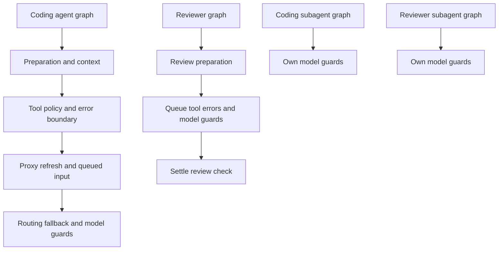
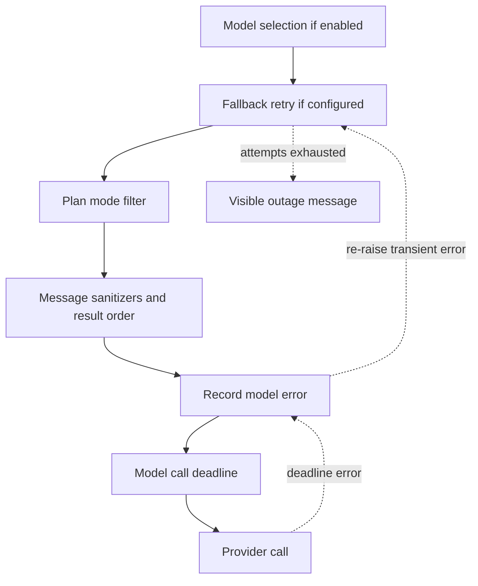

# Agent middleware and failure boundaries

`create_deep_agent` receives an ordered middleware list. The list is an onion: an earlier entry wraps later entries, so it can alter a request before an inner handler or handle an exception that escapes it. Ordering is therefore a runtime contract, not a file-listing detail. The three graph types do **not** share one universal stack: the coding agent has the broadest policy and lifecycle layer, the reviewer has review-specific recovery and completion, and each subagent compiles as a separate graph with its own model guards. See [Agent Graph](agent-graph.md), [Tools](../concepts/tools.md), [Follow-up Messages](../workflows/follow-up-messages.md), and [PR Creation](../workflows/pr-creation.md).

## Graph-specific installation order

### Coding agent

The coding agent installs the following outer-to-inner chain. Optional entries are included only under their stated conditions.

1. `ConversationOffloadingMiddleware`
2. `PrepareAgentRunMiddleware`
3. `IncidentMiddleware`, for an incident session
4. `WorkspaceSkillsMiddleware`, for eligible non-local credentialless runs
5. `DynamicToolMiddleware`, when integration groups contain tools
6. `SanitizeToolInputsMiddleware`
7. `ValidateImageReadsMiddleware`
8. `ModelCallLimitMiddleware`
9. `ToolErrorMiddleware`
10. `ExcludeToolsMiddleware`
11. `SubdirAgentsReadMiddleware`
12. `ToolRetryMiddleware` for `task`
13. `PullRequestCreationGuardMiddleware`, except in local runs
14. `WorkflowPushGuardMiddleware`
15. `refresh_github_proxy_before_model`
16. `check_message_queue_before_model`, except in stop-summary mode
17. `TimeoutWrapupMiddleware`
18. `notify_step_limit_reached`
19. `record_run_usage`
20. `ModelSelectionMiddleware`, when adaptive routing is enabled
21. `ModelFallbackMiddleware`, when a different fallback model resolves
22. `PlanModeMiddleware`
23. `SanitizeFireworksMessagesMiddleware`
24. `SanitizeOpenAIResponsesMiddleware`
25. `SanitizeThinkingBlocksMiddleware`
26. `StableToolResultOrderMiddleware`
27. `ModelErrorMiddleware`
28. `ModelCallTimeoutMiddleware`

`ConversationOffloadingMiddleware` is a summarization wrapper that emits offload status events while hiding its internal model output from the user stream. `PrepareAgentRunMiddleware` prepares per-run context and supplies the rendered system prompt. The outer tool layers control which tools are available and how their results fail; the inner model layers make provider input valid, choose and recover a model, and impose a deadline.

### Reviewer and subagents

The reviewer main graph is deliberately leaner: `PrepareReviewerRunMiddleware`, tool-input sanitation, call limit, tool-error handling, proxy refresh, queue delivery, wrap-up, the three message sanitizers, `RepairOrphanedToolCallsMiddleware`, stable tool-result ordering, model-error recording, call timeout, and `settle_review_check_on_exit`.

It omits conversation offloading, incident and workspace-skill middleware, dynamic tools, image-read validation, tool exclusion, subdirectory instructions, task retry, PR/workflow push guards, adaptive selection, fallback, plan mode, step-limit notification, and usage recording. This is an intentional difference, not an assumption that a reviewer has the coding-agent policy stack.

Coding subagents likewise compile independently: optional incident/workspace/dynamic-tool layers and conversation offloading surround `ExcludeToolsMiddleware`, `WorkflowPushGuardMiddleware`, `SanitizeOpenAIResponsesMiddleware`, `ModelErrorMiddleware`, and `ModelCallTimeoutMiddleware`. Reviewer subagents contain only the last three model protections. Parent middleware does not wrap subagent model calls.

The main graphs and each subagent graph have separately installed boundaries; the reviewer adds a review-check completion path.

## Preparation and model lifecycle

`BasePrepareRunMiddleware` provides checkpointed `before_agent` setup for coding and reviewer specializations. Its latch fingerprints the latest message, middleware class, and preparation configuration. A matching checkpointed `run_prepared_for` skips setup on a resumed invocation, whereas a new invocation re-prepares fresh prompt, token, and context material. A failure before the checkpoint may execute preparation again, so `_prepare` implementations must be idempotent. When state contains `rendered_system_prompt`, the wrapper prepends it to the request system message.

For adaptive coding runs, `ModelSelectionMiddleware` selects a persisted or classifier-chosen `fast`, `balanced`, or `performance` route before the model call, emits the chosen route for the UI in automatic mode, and overrides the request model. Plan mode forces the performance route. `RecordRunUsageMiddleware` tags responses with the invocation and route metadata and finalizes invocation usage after the agent; on a model exception it finalizes usage with error status before re-raising.

`PlanModeMiddleware` is always installed in the coding graph. It resets `plan_mode` at `before_agent` to the value resolved for this invocation, but filters the tools on *every* model request. Thus `enter_plan_mode` can restrict the next turn, while a stale state value cannot silently constrain a later approved run.

## Model failure and recovery path

Provider-specific sanitizers and stable tool-result ordering run inside routing/fallback but outside error recording and the deadline. `ModelCallTimeoutMiddleware` is innermost, so `asyncio.wait_for` covers the provider call itself. It turns a stall into `ModelCallTimeoutError`, a `TimeoutError`; `ModelErrorMiddleware` logs/classifies it, writes type and classification code to thread metadata when possible, and re-raises unchanged. Only then can outer fallback consume a transient failure.

This is the coding-agent model path: a timeout is recorded before fallback decides to retry it. Reviewer and subagent graphs retain the recorder and deadline but have no fallback.

Fallback is installed only when `LLM_FALLBACK_MODEL_ID` (or a primary-model default) names a different model. It alternates primary and fallback across six default attempts, with schedule `0, 5, 15, 30, 45` seconds and positive jitter before retries. Retry eligibility includes connection/timeout failures, retryable LangChain model errors, selected 408/409/425/429/5xx/529 statuses, and the middleware deadline. A recognized Anthropic or OpenAI unavailable-model access error immediately becomes a user-facing `AIMessage`; exhausted transient attempts normally return an outage `AIMessage`, while `surface_outage_message=False` re-raises the final exception. `OPEN_SWE_MODEL_CALL_TIMEOUT_SECONDS` configures the positive deadline and otherwise defaults to 900 seconds.

`TimeoutWrapupMiddleware` is different from the model-call deadline: it starts a per-instance monotonic run clock lazily and, after positive `OPEN_SWE_WRAPUP_TIMEOUT_SECONDS` (45 minutes by default), appends a finish-and-preserve-state instruction to each later model request. It does not terminate a call itself.

## Tool and delivery boundaries

Tool sanitation runs before tool execution. `SanitizeToolInputsMiddleware` extracts leading integer values from malformed string `offset` and `limit` arguments on `read_file`, avoiding unnecessary Pydantic validation turns. `ValidateImageReadsMiddleware` examines image block magic bytes in a `read_file` result and converts an extension/content mismatch into a text error, preventing a checkpointed non-image payload from poisoning future provider requests.

`ToolErrorMiddleware` makes ordinary tool exceptions recoverable model context by returning an error `ToolMessage`. It has two sandbox exceptions:

* An SDK-marked transient sandbox connection rejection becomes a `sandbox_transient` tool error because the command never started, so retrying cannot duplicate a mutation.
* An unreachable sandbox (`SandboxConnectionError` other than server reload, or a sandbox `ResourceNotFoundError`) is notified and re-raised. Continuing would make every later sandbox call fail and repeatedly notify.

The `task` tool has a separate retry boundary. `ToolRetryMiddleware` retries eligible delegated-subagent failures twice with one-second initial and ten-second maximum delay. Its predicate admits transient transport names, retryable statuses, and `ModelCallTimeoutError`, because subagents have no fallback. After exhaustion, invalid-prompt and context-limit failures return structured `failed` data to the model; other exceptions continue outward.

The PR guard blocks shell fallbacks to PR creation through `execute` or `background_execute`—including `gh pr create`, relevant GitHub API calls, curl, and bounded nested shell forms—and returns an error instead of executing. The workflow-push guard detects pushes affecting workflow changes, persists or reads approval state keyed by an exact change fingerprint, posts approval when needed, and only forwards an approved rewritten safe push; otherwise it returns a blocked tool result with an approval URL.

Before each coding or reviewer model call, proxy refresh best-effort renews a near-expiry GitHub installation token. The queue hook then consumes an autofix event and reads `("queue", thread_id)/pending_messages`. It deletes queued messages before constructing updates to avoid duplicate delivery and preserves FIFO order when injecting the content as human input. Queue/store failures are logged and do not fail the model turn.

On a resumed reviewer thread, `RepairOrphanedToolCallsMiddleware` inserts synthetic error results immediately after AI tool calls with no matching `ToolMessage`; this prevents provider rejection of a persisted interrupted tool call. Finally, `settle_review_check_on_exit` closes a tracked unpublished review check as neutral. If publishing completed but its completion PATCH was pending, it retries the stored real conclusion instead.

## Operations and tests

When changing this architecture, preserve the outer-to-inner relationship: moving the deadline outside fallback prevents timeout recovery, and moving error recording outside fallback misses failures fallback consumes. Retain delete-before-inject queue delivery, idempotent preparation, and the distinction between a pre-start transient sandbox rejection and an unreachable sandbox.

Focused tests in `tests/middleware` exercise queue injection, preparation latching and prompt injection, fallback eligibility/alternation, timeout behavior, input and message sanitizers, orphan repair, stable ordering, dynamic tools, step limits, subdirectory instructions, usage recording, and conversation offloading. `tests/sandbox/test_reviewer_sandbox_recovery.py` verifies the distinct sandbox policy: reviewer setup opts into replacement because its checkout is re-derived; coding setup normally fails rather than replacing potentially uncommitted work; replacement failure remains a typed `SandboxUnreachableError` and is notified.
