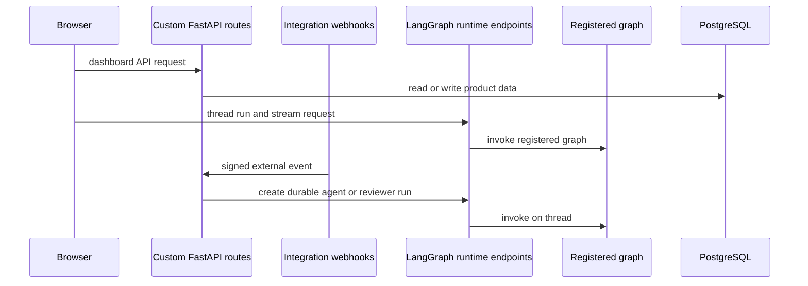

# Runtime and product architecture

Open SWE combines a LangGraph runtime with a custom FastAPI application. LangGraph owns registered graph execution, threads, checkpoints, and runs; the mounted FastAPI application owns the product-specific HTTP surface: dashboard APIs and assets, webhooks, plan and approval APIs, and health. PostgreSQL is the application database for repository and pull-request records and related product data.

## Deployment and request boundaries

`langgraph.json` is the cloud deployment manifest. It registers five named graphs through thin `agent/graphs/` re-export modules and mounts `agent.webapp:app`. The latter is deliberately only a compatibility shim for the application composed in `agent/api/app.py`.

| Graph ID | Runtime entrypoint | Architectural role |
|---|---|---|
| `agent` | `agent.graphs.agent:traced_agent` | Main thread-scoped coding agent factory. |
| `reviewer` | `agent.graphs.reviewer:traced_reviewer_agent` | Code-review and findings workflow. |
| `analyzer` | `agent.graphs.analyzer:traced_analyzer` | Per-repository review-style learning. |
| `chat` | `agent.graphs.chat:traced_chat_agent` | Read-only PR discussion. |
| `scheduler` | `agent.graphs.scheduler:get_scheduler` | Cron-tick dispatcher. |

This flow distinguishes routes mounted by `create_app` from the LangGraph runtime endpoints that execute graph IDs and expose run streams. Browser activity can use both surfaces: dashboard configuration and product data go through the custom API, while graph execution and streaming use the runtime. Integration webhooks enter only through the custom API and create runs through the dispatch boundary.

## FastAPI composition, lifecycle, and persistence

`create_app` creates the FastAPI application, adds tracing resource names, conditionally enables credentialed CORS for the comma-separated `DASHBOARD_ALLOWED_ORIGINS` list, and rejects `*` because credentials are enabled. It mounts the dashboard, plan, workflow-approval, Linear, Slack, health, and GitHub routers, then mounts bundled dashboard assets.

The lifespan pins the process to one event loop before queue workers are constructed and again at startup. It validates GitHub-login allowlisting, sandbox configuration, local-development LLM configuration, and the required PostgreSQL configuration; it then migrates the database. Workspace and user imports from the legacy LangGraph Store are attempted but do not abort startup on failure. Workspace loading, reporting activation, and the analytics worker are likewise isolated behind a warning. Shutdown stops the analytics worker, closes the database engine, and closes cached models.

PostgreSQL access is centralized in `agent.database.postgres`: it normalizes supported PostgreSQL URI forms to `asyncpg`, rejects non-PostgreSQL or conflicting SSL configuration, uses the `open_swe` schema, and runs Alembic migrations under a PostgreSQL advisory transaction lock. This makes database initialization safe when multiple application processes start together.

The dashboard aggregate router is rooted at `/dashboard/api` and applies the same-origin dependency to mutations. It aggregates browser-facing authentication, profiles and users, workspace and repository configuration, PR/review, schedules, skills, analytics, integrations, and thread APIs. Its package-level `__getattr__` defers importing this wide router until the web app asks for `router`, avoiding the full FastAPI and job import cost for code that only imports a dashboard submodule.

## Graph factories and durable execution

`get_agent` is the main graph factory. For an executable thread it resolves the initiating GitHub identity, obtains a cached or reconnected sandbox (or a desktop local backend), starts it, resolves and may persist thread settings, and creates a fresh deep agent with its backend, tools, skills, subagents, and middleware. A load without a thread ID, or a graph load that is not for execution, receives an empty no-sandbox deep agent instead; discovery must not provision a sandbox.

The reviewer shares the sandbox lifecycle but is intentionally review-only: its toolset includes `add_finding`, `update_finding`, `list_findings`, and `publish_review`, not commit, push, or PR-opening operations. Its repo preparation computes the in-diff lines used to validate findings. The analyzer uses the corresponding sandbox and GitHub CLI pattern to mine historical human feedback and finding outcomes and save a repository-specific review-style prompt. See [Reviewer & Analyzer](./reviewer-and-analyzer.md) for their detailed behavior.

The chat graph is a separate sandbox-less, read-only PR agent. The dashboard review-chat proxy places the PR diff, findings, and overview in virtual `/pr/` files in the graph `files` channel. It exposes read-oriented filesystem and GitHub tools but excludes execution and file mutation, and resolves a repository-scoped GitHub App token rather than handing it a user credential.

The scheduler compiles a one-node `StateGraph`. Its task dispatches reconciliation, watch and expedited-review evaluation, background-task monitoring, workspace refresh, session/agent cost refresh, feedback prompting, or a scheduled agent launch. Required identifiers such as a watch key, thread ID, or schedule ID are checked before the relevant operation; missing values return a structured status rather than launch ambiguous work.

## Run creation and state ownership

`dispatch_agent_run` is the common durable creation contract for agent and reviewer triggers. `assistant_id` selects the graph while `source` builds input identity and supplies metadata/logging. It prevents callers from mixing a prebuilt input with independently supplied content or identities.

Its normal defaults are `multitask_strategy="interrupt"`, synchronous durability, resumable streams, subgraph streaming, and the compatible event-stream marker and stream modes used by the dashboard. An interrupting follow-up preserves progress from checkpoints and resumes with history plus the new message; callers with background semantics can opt into another strategy such as `enqueue`. Completion callbacks are attached only when a secret is present and the configured URL is absolute and non-loopback, so invalid optional callback configuration cannot make run creation fail.

Graph factories are per-run, whereas execution context is thread-scoped. LangGraph checkpoints retain graph state; thread metadata retains the sandbox ID and thread settings. The in-process backend cache is keyed by thread ID, and a worker that lacks a cached connection reconnects to the persisted sandbox ID. A deleted sandbox is recreated, but an existing unreachable coding sandbox raises by default rather than silently replacing uncommitted work. Replacement can be explicitly allowed for the reviewer because its checkout is re-derived. A newly created backend is written to thread metadata and cached only after initialization succeeds.

## External triggers

Slack, Linear, and GitHub routes validate their signed webhook bodies before delegating work. GitHub also checks that a repository is assigned to a workspace: an unreadable ownership lookup yields 503 so GitHub retries, while an unowned repository is ignored. Webhook services resolve stable external identities such as Linear issue IDs and repository/PR coordinates so follow-up activity can target the relevant thread rather than arbitrarily creating a new session.

## Cloud and desktop surfaces

The cloud manifest pins Python 3.14 and API version 0.13.3. It loads `.env`; configures deleting checkpoint TTLs with a 60-minute sweep and a 43,200-minute default; and best-effort builds static dashboard assets, allowing a backend-only image if the UI build fails.

The desktop manifest registers only `agent`, disables bundled UI, uses local authentication at `agent.local_auth:auth`, and replaces the deployment checkpointer with `agent.local_checkpointer.create_checkpointer`. The Electron backend supervisor launches `langgraph dev` on loopback with the desktop manifest, a random bearer token, ten jobs per worker, and the projects/worktrees paths. It waits for an authenticated health response and tears down the child on startup failure or timeout.

A desktop graph run is marked by `configurable.source == "desktop"`. `local_project_path` must resolve to an existing directory listed in `OPEN_SWE_LOCAL_PROJECTS_FILE` or inside `OPEN_SWE_LOCAL_WORKTREES_DIR`; the `LocalShellBackend` receives only a narrow shell environment. Desktop artifact routes keep large tool results and evicted conversation history outside the project so they are not accidentally included by `git add -A`.

The `ui/` product is a TanStack Router React application. Its router takes the Vite base as `basepath`, preserving client navigation when the dashboard is mounted below a prefix; it also supplies query-client context, intent preloading, scroll restoration, a default load-error component, and navigation instrumentation. See [Dashboard UI](../integrations/dashboard-ui.md) for UI route and streaming details.

## Safe extension and operations

- Add a deployment graph by exporting a stable entrypoint under `agent/graphs/` and registering it in the relevant manifest. Registration alone does not make it valid for `dispatch_agent_run` callers.
- Add product HTTP endpoints through `create_app` and preserve CORS, same-origin mutation protections, and lifecycle initialization rather than bypassing the mounted application.
- Treat an unreachable coding sandbox as a recovery decision, not a cache miss: replacement changes the working tree associated with the thread.
- Changes to dispatch stream settings require exercising externally initiated runs in the dashboard, because later attachment depends on durable, replayable compatible streams.
- Preserve desktop real-path authorization and scratch-file routing when changing local-project support; they protect local filesystem authority and repository hygiene.

Related pages: [Agent Graph](./agent-graph.md), [Reviewer & Analyzer](./reviewer-and-analyzer.md), [Dashboard UI](../integrations/dashboard-ui.md), [Deployment](../operations/deployment.md), and [Invocation](../workflows/invocation.md).
