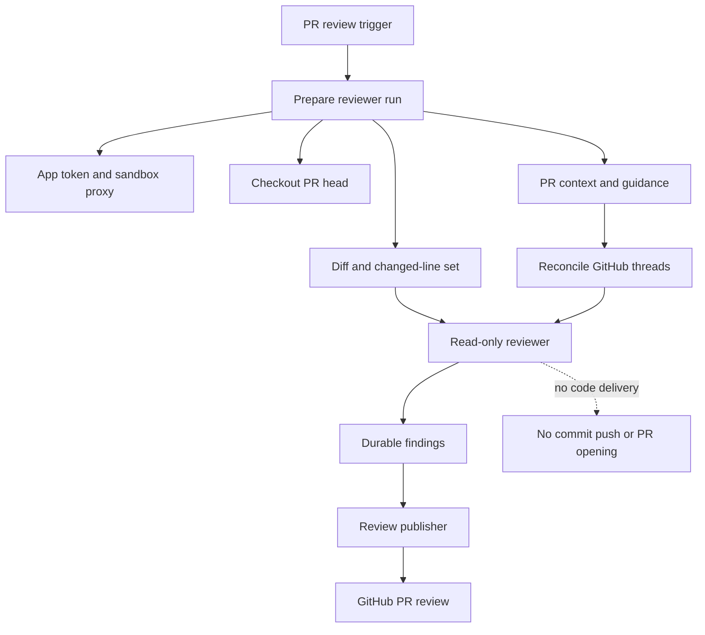
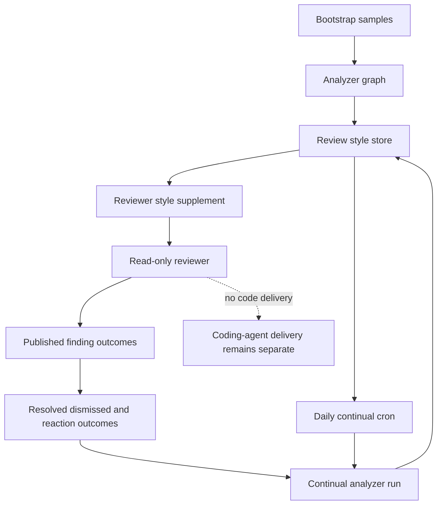

# Read-only review and style-learning graphs

Open SWE registers distinct LangGraph graphs for `reviewer`, `analyzer`, and `chat`. The reviewer evaluates a PR and publishes review feedback; the analyzer develops a repository-specific supplement to that policy; PR chat answers questions from separately scoped conversations. None is a coding-agent delivery path: the reviewer has no commit, push, or PR-opening tool, and review mutations are limited to finding-thread handling and the centralized review publisher. See [PR review](../workflows/pr-review.md) for trigger routing, [sandbox lifecycle](sandbox-lifecycle.md) for sandbox operations, and [context engineering](../workflows/context-engineering.md) for the wider preparation model.

## Review execution: checkout, context, and boundary

`get_reviewer_agent` makes a graph per executable run. It copies the caller config and nested `configurable` map before applying a default recursion limit. A missing `thread_id`, or an execution-disabled graph, returns an empty agent without provisioning a sandbox. Otherwise the graph uses the review lifecycle tools (`fetch_review_diff`, `add_finding`, `update_finding`, `list_findings`, `publish_review`, `resolve_finding_thread`, and `reply_to_finding_thread`) plus read helpers (`web_search`, `fetch_url`, `http_request`). Its one `reviewer` subagent is for candidate defects only; the parent owns finding persistence and publication.

Before the first model call, `PrepareReviewerRunMiddleware` obtains a repository-scoped GitHub App token when the run has a source, caches it as the bot token for the thread, and gives it to the sandbox proxy. It prepares a checkout at the PR head and loads trusted repository skills from the base SHA. Reviewer sandboxes allow replacement because the checkout is re-derived for every run, whereas the findings are durable thread metadata. If replacement still fails, the middleware posts an unreachable-sandbox notification and fails rather than appearing to have reviewed the PR.

The middleware computes the applicable review range—only the delta since `last_reviewed_sha` for a re-review when possible—and produces a unified diff plus changed file/side/line set. Concurrent retrieval obtains the PR overview, GitHub review threads, saved style prompt, root instructions, organization guidance, and API-standards skill; scoped instructions are fetched after the changed files are known. GitHub threads are reconciled before being rendered into the context. The final prompt chooses first-review, re-review, or finding-reply context; background diff grouping is best effort and does not delay review.

Author-controlled PR text, thread comments, and replies are rendered as XML data blocks. Closing wrapper tags are neutralized and GitHub login attributes are grammar-checked, preserving the distinction between untrusted data and system instructions.

Reviewer lifecycle. The dashed branch is the intentional boundary from review work to coding-agent delivery.

## Findings are durable review state

A deterministic reviewer thread stores PR identity, review state, and findings in LangGraph metadata, tagged `kind: "reviewer"`. This survives sandbox eviction and lets UI and usage code find reviewer threads. A finding retains its location and diff side, severity/confidence, descriptive content, status and SHA history, publication and resolution identities, surface state, human feedback bookkeeping, diff hunk, fingerprint, and interaction log. Legacy shapes are normalized; surface state only progresses from `not_surfaced` through `surfaced`, `resolve_pending`, and `resolved`.

`add_finding` resolves diff evidence from state, then configurable input, then a fresh authenticated PR diff. A range outside the diff is rejected with `success: false` and `in_diff: false`, so the reviewer should not blindly re-anchor and retry. Valid findings can preserve an extracted hunk; fingerprinting deduplicates them and suggestions over four lines are dropped.

Before a normal run, reconciliation matches stored findings to current GitHub threads using the embedded marker first and stored IDs next. It backfills IDs, marks surfaced findings, resolves a finding only when all its matched threads are resolved, and records the latest relevant human reply as a `needs_reassessment` interaction.

## Publication lifecycle

`publish_review` selects open, in-diff, unpublished findings at or above the threshold (default `medium`) up to `REVIEW_FINDING_CAP`. It posts one GitHub PR review with a host-generated summary and one renderable inline comment per finding; suggestions use GitHub's fenced `suggestion` format. Every inline comment carries an `open-swe-review-comment` JSON marker that makes subsequent reconciliation resilient to missing stored IDs.

After a post, publication records review/comment/thread IDs, resolves eligible GitHub threads with GraphQL, advances `last_reviewed_sha`, records usage, and settles the review check. An empty re-review after a prior Open SWE review is deliberately skipped while resolution and state advancement still occur. Callers must inspect the result: a successful `review_id: null` with `skipped_empty_re_review` is not a new review. If GitHub rejects anchors, the publisher filters invalid anchors and retries once when a valid subset remains; otherwise it returns structured unresolvable IDs and a remediation hint.

## PR chat is a separate read context

Review chat is available only after the canonical reviewer thread exists. Each viewer gets private `review_chat` threads, identified by owner, repository, PR, and GitHub login; every proxied operation checks that scope and ownership, rejecting a reviewer thread or another user's chat as not found. On its first run—and whenever the PR head has changed—it seeds virtual `/pr/overview.md`, `/pr/diff.patch`, and `/pr/findings.md` files. A failed reseed can retain an existing last-seeded context, but a new chat with no usable context returns an error rather than inventing one. Chat thus explains the review; it does not share the reviewer graph's authority to publish findings.

## Analyzer: learned style feedback

The analyzer uses the same sandbox and GitHub CLI pattern, but only has `read_finding_outcomes` and `save_review_style_prompt` as domain tools. It configures the GitHub proxy with a user-supplied OAuth token when present, otherwise an App installation token. `analyzer_mode` selects the bootstrap playbook for historical merged-PR human feedback or the continual playbook for confirmed/dismissed reviewer outcomes. Both are virtual `SKILL.md` files mounted by a `StateBackend` at `/skills/`, seeded in the run input rather than written into the sandbox.

`REVIEW_STYLES` is the typed `review_styles` store keyed by `owner/repo`. Its record contains status, custom prompt and analysis summary, sampling metadata, run/thread and cron IDs, error, and timestamps. Reviewer lookup fails soft: an unavailable store removes only the style supplement. When available, the prompt is injected as repository-specific review style and remains subordinate to the global high-signal review bar.

Bootstrap first collects samples, marks the record running, then launches a durable analyzer run on a deterministic style thread; collection or launch failure marks it failed. The save tool writes a nonempty trimmed prompt and metadata as completed, then attempts idempotent cron registration without rolling back a successful save when cron creation fails. The cron runs daily at a SHA-256-staggered time from 05:00 through 08:59 UTC. Although scheduled runs are threadless and carry no accumulated chat history, their configurable explicitly supplies the deterministic style thread and continual mode; without it the analyzer would return an empty agent.

Style-feedback lifecycle. Repository guidance is learned from feedback and constrains review selection, never grants code-delivery authority.

## Focused tests

The reviewer tests cover config isolation, diff anchors, finding persistence and outcomes, publication and reconciliation, review API behavior, watch/re-review handling, grouping, and chat access/context refresh. Analyzer cron tests cover idempotent registration, removal, deterministic schedule, virtual skill files, and explicit style-thread configuration. These are the useful regression points when changing durability, security scope, or feedback-loop scheduling.
