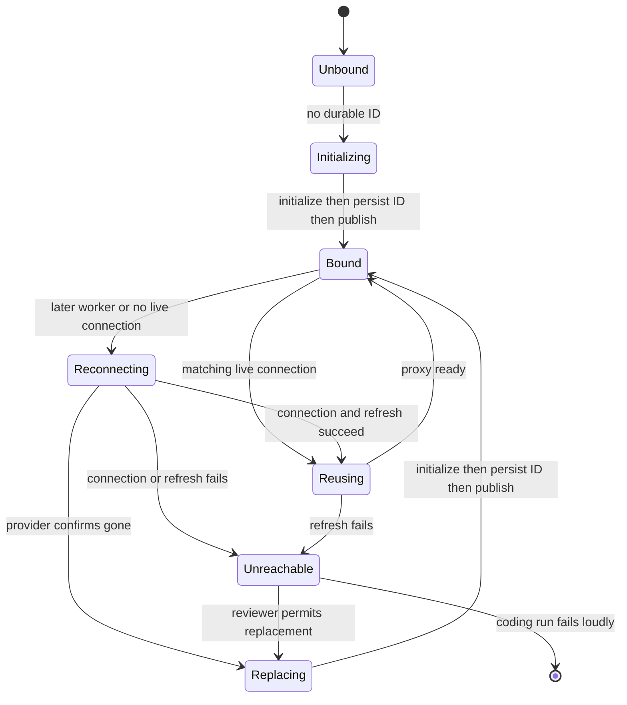

# Thread Sandbox Lifecycle

A normal agent thread is bound to a persistent sandbox, whose filesystem can contain the checkout and uncommitted work across runs. The durable binding and the live handle are deliberately separate: metadata lets a later worker reconnect, while a worker-local proxy lets already-constructed tools continue to refer to the same per-thread object after a reconnect or deliberate rebind.

> **Safety invariant:** an unreachable coding sandbox is **not silently replaced**. It may recover, and it may be the only copy of uncommitted working-tree changes. Replacing it with an empty filesystem would cause the agent to continue with a false view of its work.

Related: [Agent graph](agent-graph.md), [Threads and state](../concepts/threads-and-state.md), [Auth and security](../concepts/auth-and-security.md), [Sandbox providers](../integrations/sandbox-providers.md), and [Follow-up messages](../workflows/follow-up-messages.md).

## Durable binding and worker-local handles

`thread.metadata["sandbox_id"]` is the durable provider identity. `get_sandbox_metadata` first accepts inline run metadata containing a string ID, then reads the live thread otherwise. A failure to read metadata is propagated: it must not be interpreted as an unbound thread, because doing so could bind a replacement over a still-live sandbox.

Two in-memory maps serve different purposes:

- `SANDBOX_BACKENDS` maps a thread ID to its stable `SandboxBackendProxy`.
- `SANDBOX_CONNECTIONS` maps a sandbox ID to a live connection. Keying this cache by sandbox rather than thread prevents a worker holding an old connection from using it after another worker rebinds the thread.

The proxy is async-only and subclasses `BaseSandbox`, preserving filesystem middleware's capture-at-source behavior. Its async operations resolve and delegate to the current backend; synchronous methods raise instead. If a backend has no offload method, `aexecute_with_offload` uses ordinary execution and reports that it did not offload.

A proxy can start reconnecting eagerly when the agent factory creates it. If no backend is present, it uses its registered lifecycle callback, or as a lower-level fallback reconnects from `sandbox_id` metadata. A lock and one shared startup task collapse concurrent callers into one connection attempt; shielding the task means cancellation of one waiter does not cancel startup for the others. On success, the resolved backend is remembered by sandbox ID; a failed startup may be tried again later.

## Provisioning inputs and initialization

`create_sandbox` is the provider-neutral create-or-reconnect boundary. `SANDBOX_TYPE` chooses a lazily imported factory: `langsmith`, `daytona`, `modal`, `runloop`, `e2b`, or `local`. LangSmith alone receives snapshot, resource, and create-body overrides; native async factories are awaited and synchronous factories run in a thread.

For new lifecycle-managed sandboxes, `SandboxCreateConfig.resolve` loads the selected workspace unless the caller explicitly requests `source="base"`. It uses the workspace's ready snapshot when available, otherwise the administrator base snapshot. Workspace resource settings and create parameters flow into provisioning. If the workspace snapshot is stale, its update script runs before the first model call, with a bounded timeout and non-fatal failure; a background update capture is then triggered for future creations.

Creation also configures bot Git identity and, for LangSmith, GitHub proxy credentials before the thread is bound. Metadata is written only after this initialization succeeds; publication through `set_sandbox_backend` happens last. Thus a creation or metadata-write failure cannot expose a partially initialized target through the stable proxy.

*Thread binding distinguishes unbound, recoverable connectivity, and confirmed deletion; only safe paths publish a new target.*

## Reuse, reconnection, and failure semantics

`ensure_sandbox_for_thread` is the normal lifecycle entrypoint. It reads the durable ID, reuses only a cached connection with that exact ID, otherwise reconnects through the configured provider. It reapplies bot Git identity and refreshes the LangSmith proxy as a meaningful reachability operation rather than issuing a separate ping. Normal agent factories register this function as the proxy reconnect callback and start the proxy early. Thread dispatch uses `multitask_strategy="interrupt"`, so the lifecycle does not maintain a cross-process `__creating__` sentinel.

Recovery differentiates provider-confirmed absence from uncertainty:

- `SandboxGoneError` means the bound resource no longer exists. It is always replaced and the new ID is persisted, preventing subsequent runs from reconnecting to stale metadata.
- Connection, credential-refresh, or other reconnect errors become `SandboxUnreachableError`. The default behavior is to raise it without replacement, retaining the old binding for a later recovery attempt.
- `allow_replacement=True` is used by the reviewer only. Its repository is re-derived on every run, so its sandbox is not the authoritative holder of uncommitted coding work. If a permitted replacement itself fails, the lifecycle still raises `SandboxUnreachableError`.

Command failures are not automatically lifecycle failures. The LangSmith command retry policy retries only `SandboxRetryableConnectionError`, for which the SDK guarantees the WebSocket upgrade was rejected before the command frame was sent. It makes at most four attempts with exponential jittered backoff, avoiding duplicate execution. Other command-level errors remain tool errors; a non-transient connection failure follows the run's unreachable-sandbox handling rather than creating a replacement mid-run.

## LangSmith GitHub credential proxy

For LangSmith, the real GitHub token is installed in proxy rules, not the sandbox filesystem. `api.github.com` receives a Bearer header and `github.com` plus `*.github.com` receive Basic authentication for `x-access-token:<token>`. The sandbox receives only `GH_TOKEN=proxy-injected`, which lets `gh` run without revealing the actual token.

Proxy configuration starts with the workspace-provided base configuration, removes superseded managed rules, preserves unrelated custom rules, then adds managed GitHub rules. It retries transient PATCH transport and selected status failures; if the API says the sandbox is not ready, it best-effort starts the stopped sandbox and retries. A stopped sandbox retains its filesystem, so it is not treated as deleted. The base proxy configuration is recorded worker-locally and persisted as `sandbox_base_proxy_config` when a newly created box is bound, allowing reconnects and rotations to retain custom rules.

GitHub App installation tokens expire after one hour. Per-thread proxy records retain expiry or recording time, repository scope, permission scope, and base configuration. Before each model call, middleware refreshes within five minutes of known expiry or after 50 minutes when expiry is unknown. Refresh normally reuses the recorded scopes so it does not broaden access; refresh failure is logged rather than blocking the model call.

## Explicit recreation and reviewer preparation

The `recreate_sandbox` tool calls `recreate_sandbox_for_thread`. It requires an existing sandbox, creates and initializes a distinct fresh sandbox from either the workspace snapshot or explicitly requested base source, persists its new ID (and recorded base proxy configuration when present), and only then swaps the proxy target. It does not delete the old sandbox. If metadata persistence fails, the old target remains active; the new provider resource may be detached. Selecting another workspace through the tool is restricted to the private admin surface.

Reviewer preparation makes its replacement exception safe: `prepare_review_repo` clone-or-fetches, fetches relevant base and PR references, force-checks out the requested PR head, and verifies `HEAD`; it returns `False` rather than making the sandbox unusable if preparation fails. Reviewer skill directories are extracted from the trusted base reference into `.review-skills` outside the PR checkout, never from PR-head content.

Repository paths are provider-portable. The resolver tries provider work-directory methods, shell `pwd`, provider home/root methods, and shell `$HOME`, checks each candidate is writable, then caches the first usable directory on the backend.

## Provider and desktop operations

LangSmith startup validation runs at server startup: numeric sizing and retention settings must parse as integers, retention values cannot be negative, and `SANDBOX_CREATE_EXTRA_JSON` must be a JSON object. LangSmith creation also supplies idle and delete-after-stop retention, which delegates eventual reclamation to the platform rather than a lifecycle delete API.

The `local` provider is for local development and executes on the host without isolation. It uses `.gitconfig-sandbox` to keep repeated bot identity configuration from overwriting the developer's global Git identity, and builds a child environment without listed model and provider API keys.

Desktop runs bypass the remote thread-sandbox lifecycle: the registered reconnect callback returns a `LocalShellBackend` rooted only in an allowlisted project or a desktop-created worktree. Desktop artifact routes place large tool results and conversation history outside that project, preventing internal agent files from being swept into `git add -A`.

## Focused verification

Sandbox tests cover concurrent proxy startup and cancellation, metadata fallback and stale connection handoff, publish-after-initialization ordering, gone versus unreachable recovery, reviewer replacement, explicit recreation's persistence-before-handoff rule, proxy authentication and refresh scope, workspace snapshot selection, portable paths, and desktop/local constraints. These tests encode the key operational rule: preserve the existing coding sandbox whenever the system cannot prove it is gone.
