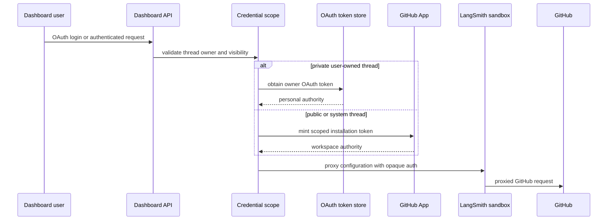

# Authentication, authorization, and credential scope

Open SWE separates browser identity, GitHub authority, workspace authority, and sandbox execution. The important invariant is that a credential is selected from verified request and saved-thread context—not from model input—and credentials are never documented or passed as literal secret values. Related operational context is in [configuration](../operations/configuration.md), while [sandbox lifecycle](../architecture/sandbox-lifecycle.md) and [tools](./tools.md) describe the execution surfaces.

## Trust boundaries and credential selection

This shows that private work uses the verified owner's personal authority, while public and system work uses workspace GitHub App authority.

`private_credential_login` loads the saved thread metadata and rejects a missing `thread_id`, unknown visibility or owner type, and a private system thread. A public thread has no personal credential owner. For a private thread, `owner_login` must exist and match the current run's `github_login` after normalization; otherwise personal credentials cannot be used. This same check gates personal Notion MCP tools both when they are loaded and immediately before invocation, so an `on_behalf_of` argument cannot escape the private owner boundary.

PR authorship is related but distinct. `pr_author_login` returns the private owner for private threads, the current authenticated requester for user-owned public threads, and no user for system threads (which therefore use the App). Background completion is refused where a user-owned context would require a requester, rather than guessing who should author a PR.

### GitHub tokens for runs

`resolve_github_token` invalidates the thread cache and applies the saved-thread scope: public threads receive a GitHub App installation token, while private threads require the verified owner’s dashboard OAuth token. An unavailable private OAuth token raises `GitHubUserAuthRequired`; it never falls back to the workspace bot. The older LangSmith per-user OAuth helper remains available for flows that resolve a user by email; its bot-only mode is enabled only when `LANGSMITH_API_KEY` is configured but neither `X_SERVICE_AUTH_JWT_SECRET` nor `USER_ID_API_KEY_MAP` is available.

Resolved run tokens are process-memory only. Entries are keyed by `(thread_id, principal)`, where normalized `login:` or `email:` principals isolate users and `bot` isolates installation credentials; an unbound user token is not cached. Entries expire at their token expiry with a 60-second skew or at 24 hours, whichever is sooner. Invalidating a thread removes all its cached entries.

GitHub App credentials use a separate boundary: the App signs a short-lived RS256 JWT with its private key and exchanges it for an installation access token. The token cache key includes installation ID, repository IDs or names, and requested permissions, preventing reuse across scopes; it is in-process only and stops reusing a token ten minutes before expiry. Missing App configuration or minting failure returns no token.

### Repository and workspace access

Dashboard actions do not infer repository access from a session alone. `require_repo_access_for_user` gets the signed-in user’s valid OAuth token and verifies access with `GET /repos/{owner}/{repo}`; on a 401 it force-refreshes once before requiring re-login. Invalid names are rejected, while GitHub 403 and 404 remain meaningful no-access/not-found outcomes. `filter_repo_records_for_user` uses the same check to omit inaccessible records.

Workspace-owned schedules instead use an installation token and verify the same repository endpoint. A missing workspace token produces 503; an App 401 is represented as 502 and App 403/404 as repository-unavailable errors. Thus a schedule explicitly chooses user credentials or workspace credentials rather than mixing the two.

## Dashboard login and request authorization

The dashboard uses GitHub App OAuth authorization-code exchange and an HS256 `osw_session` JWT signed with `DASHBOARD_JWT_SECRET`. The session holds the GitHub login, optional email and avatar, a user ID, and a seven-day expiry. `require_session` rejects a missing or invalid cookie, and `/me` returns the signed-in identity plus a newly evaluated admin flag.

The login route creates a random nonce, places only its HMAC in a signed state JWT, and sets the raw nonce in the short-lived state cookie. The callback uses a constant-time comparison before exchanging the code, resolving the GitHub user, applying the login gate, storing OAuth credentials, and issuing a session. Redirects pass through `sanitize_redirect_to`: they must be a safe relative path or use an origin from `DASHBOARD_BASE_URL` and `DASHBOARD_ALLOWED_ORIGINS`; login/API callback paths and unlisted or malformed origins fall back instead.

At startup, a non-local deployment must configure `ALLOWED_GITHUB_USERS` or `ALLOWED_GITHUB_ORGS`; otherwise startup fails. At login, an account is authorized by case-insensitive user allowlist match or active membership in any allowed organization. Organization membership is checked with an App token scoped to `members: read`, and token, HTTP, parsing, inactive-member, or lookup failures deny access. This is a fail-closed gate.

Desktop login does not place a session cookie on the loopback redirect. It sends a 120-second signed handoff code containing inert identity claims and the desktop PKCE S256 challenge to a fixed `127.0.0.1` callback; the desktop app must present a matching verifier in a constant-time check to mint a session. Cloud terminal tickets are separate 60-second JWTs with a fixed audience and bound `thread_id`.

Session cookies are `HttpOnly`; a split-origin HTTPS deployment uses `Secure; SameSite=None`, while same-origin or HTTP uses `SameSite=Lax`. The state cookie is `HttpOnly`, `SameSite=Lax`, scoped to `/dashboard/api/auth`, and limited to the state TTL. Dashboard-wide mutation protection exempts safe methods, but validates `Origin` or `Referer` against configured dashboard origins for cookie-authenticated unsafe requests. A bearer-only request without the session cookie is exempt because it does not use an ambient credential. With no origins configured the check is intentionally a local-development no-op.

### Admin and CI credentials

`CONFIGURED_ADMINS` is a case-insensitive set of emails and GitHub logins. Dashboard admin dependencies reevaluate it from the session claims, and agent tools reevaluate the triggering actor at call time (including an email lookup when needed); a schedule is permitted only when its saved authorization is valid. This avoids granting authority merely because a thread was marked as administrative.

Selected endpoints opt in to `ADMIN_OR_TOKEN_DEP`. Besides an admin session, it accepts either an admin GitHub bearer token—resolved through `/user`, with primary-email fallback—or a GitHub Actions OIDC token. An installation token that cannot identify a user is rejected. Actions OIDC is disabled unless `ADMIN_OIDC_SUBJECTS` has entries; verification requires GitHub’s issuer, RS256 signature from its JWKS, audience, expiry and other standard claims. An allowlist entry can match the full `sub` or an `owner/repo` repository claim, so operators should restrict it to trusted repositories and refs.

## Secrets at rest and in a sandbox

OAuth access and refresh tokens are kept separately from editable profile settings in the `oauth_tokens` namespace, avoiding profile-save versus callback-refresh clobbering. They are encrypted with `MultiFernet` from `TOKEN_ENCRYPTION_KEY`. The environment value may be a newest-first comma- or newline-separated key list: the first encrypts and all keys decrypt, enabling rotation. Invalid ciphertext or a missing key degrades to an empty value. Near-expiry user tokens refresh under a per-login lock; permanent `bad_refresh_token` or `unauthorized_client` failures delete the old authorization unless a concurrent callback already replaced it.

For LangSmith sandboxes, the GitHub App token is delivered through proxy configuration, not an environment secret. The sandbox gets a placeholder `GH_TOKEN`; proxy rules add opaque authorization on requests to `api.github.com` and `github.com`. The recorded proxy scope includes repositories and permissions, and refresh preserves that scope rather than broadening it. Refresh is considered near expiry within five minutes (or after a 50-minute fallback where expiry is unknown), and only applies to LangSmith backends with an active sandbox.

## Authenticating inbound calls and untrusted content

All webhook checks operate before normal processing and fail closed when their signing secret is absent:

- GitHub recomputes `sha256=HMAC(GITHUB_WEBHOOK_SECRET, raw body)` and constant-time compares `X-Hub-Signature-256`; the route rejects invalid deliveries before JSON parsing.
- Slack constant-time compares the HMAC over `v0:timestamp:body` and rejects a timestamp more than 300 seconds away, limiting replay.
- Linear compares its raw-body HMAC-SHA256 to `Linear-Signature`.
- The public `/webhooks/run-complete` route constant-time compares its query token with `RUN_COMPLETE_WEBHOOK_SECRET`; with no configured secret every call is rejected and completion failure replies stay disabled.

GitHub comment text is content, not authority. Comments from authors outside the trusted login set are wrapped in reserved `<dangerous-external-untrusted-users-comment>` delimiters. Any occurrence of those delimiters in raw input is replaced before wrapping, preventing an external commenter from forging a trust boundary. Slack failure notices similarly avoid per-user OAuth URLs in shared threads and link only to the token-free dashboard settings URL.

## Focused verification and operator checklist

Focused tests cover OAuth redirect/state/PKCE behavior, CSRF behavior, GitHub bearer-token identity resolution, Actions OIDC routing, and the GitHub login gate. When deploying, set `DASHBOARD_JWT_SECRET` and `TOKEN_ENCRYPTION_KEY`, configure the GitHub App and webhook secrets, explicitly configure a GitHub login/org allowlist unless using local auth, and set `RUN_COMPLETE_WEBHOOK_SECRET` when completion callbacks are required. Treat missing authorization configuration and unavailable validation dependencies as outages to resolve—not reasons to bypass these checks.
