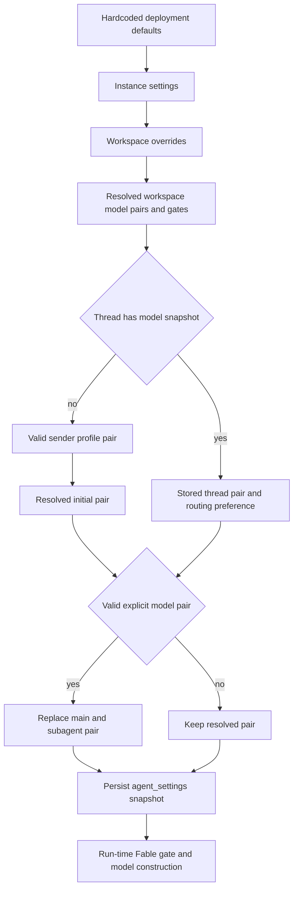

# Model, profile, and instruction resolution

An agent run combines values with intentionally different lifetimes. Workspace settings establish deployable defaults; the first run freezes selected model, routing preference, and repository custom instructions into the thread; a valid explicit model choice can rewrite that snapshot. In contrast, sender identity, personal instructions, and PR preference are fetched for the message being prepared. This prevents a later participant or profile edit from silently changing a long-lived multi-party thread. See [Agent graph](../architecture/agent-graph.md), [Tools](tools.md), [Dashboard UI](../integrations/dashboard-ui.md), [Configuration](../operations/configuration.md), and [Context engineering](../workflows/context-engineering.md).

## Model registry, validation, and recovery

`SUPPORTED_MODELS` in `agent/dashboard/options.py` is the curated picker registry. Each provider-prefixed `ModelOption` declares its label, supported reasoning efforts, default effort, image support, and whether it can be saved as a default. `SUPPORTED_MODEL_IDS` is the common membership boundary. Effort is model-specific, not a universal enum: for example, Haiku permits only `none`, Kimi K3 permits `low`, `high`, and `max`, and Gemini uses `minimal` through `high`. Validate a stored or submitted pair with `model_supports_effort`; use `model_supports_images` for image input.

`default_model_pair()` is the terminal deployment fallback. It reads `LLM_MODEL_ID` and `LLM_REASONING_EFFORT`, falling back to credential-sensitive built-in defaults, and rejects a model that is unsupported or ineligible as a default, or an unsupported effort, with `ValueError`. On localhost development, `validate_local_dev_llm_config()` additionally checks that the configured provider has credentials (with desktop OpenAI OAuth accepted for OpenAI).

A selection that disappeared from the registry is treated differently from an explicitly deprecated id. `provider_fallback_pair()` chooses a supported same-provider model, preferring the same Claude family and retaining the effort when possible; Gemini maps old `none` to `minimal`. Deprecated ids deliberately do not take that path: replacements are presently empty and `canonical_model_pair()` returns `None`, so resolution falls through to the applicable default. All workspace default resolvers therefore guarantee a constructible pair by trying a valid pair, same-provider recovery, then the deployment default.

The workspace-aware `GET /options` endpoint returns copies enriched with context-window data, from explicit Codex overrides first, then LangChain provider profiles, then a small fallback table. It resolves defaults for the requested workspace and omits Fable models when that workspace disables them.

## Precedence and persistence boundaries

Workspace resolution itself is separate from model resolution: the recorded thread workspace wins, then an opening-message workspace tag, repository owner, Slack-channel owner, user default workspace, and finally `default`. The effective workspace settings are hardcoded defaults overlaid by the instance record and then sparse workspace overrides; `None` means inherit. Reads fail soft to hardcoded defaults so settings-store trouble does not stop every agent run.

*Caption: settings are layered before a thread snapshot is selected; the Fable gate is deliberately evaluated after the snapshot is read.*

`get_agent` seeds main and subagent pairs from the effective workspace. It reads the initiating sender's profile only when no stored thread model exists. A valid profile main pair replaces both pairs, unless a valid profile subagent pair then replaces just the subagent. Stored `agent_settings` take precedence over those initial choices. Lastly, a valid `configurable.agent_model_id` and `agent_effort` pair replaces both and is the normal way to move an existing thread.

`agent_settings` is typed metadata on the LangGraph thread. It contains the main and subagent pair, routing toggle, and repository instructions, is cached for five minutes, and drops malformed or obsolete data rather than trusting it. Failed reads return an empty snapshot and failed writes are logged without failing a run. The snapshot is written before the Fable gate: global policy can therefore change between runs without being bypassed by a historical thread value.

### Workspace roles, profiles, and request choices

Workspace defaults support agent, reviewer, and review-chat roles plus agent/reviewer subagents, diff grouping, thread titles, and three routing tiers. Chat inherits the agent default when unset; grouping inherits the reviewer subagent default. A title model has its own default and falls back to Haiku on an Anthropic-only installation that cannot route to or authenticate with OpenAI.

Profiles are stored under `["profiles"]`, separate from encrypted GitHub OAuth records in `["oauth_tokens"]`; separate writes avoid profile edits racing a token refresh. They hold main and optional subagent model pairs, repository and branch preferences, PR preferences, direct-message session preference, and an optional adaptive-routing preference. Profile validation prevents non-default-eligible models and invalid model/effort combinations. Run-start lookup is fail-soft, while dashboard reads use `get_profile` and expose store failure.

Profile normalization accepts a valid eligible pair, otherwise attempts same-provider stale-model recovery; an absent or unknown-provider model yields no override. The lightweight `resolve_agent_model_id` order is supported per-thread id, valid profile id, then the selected workspace's agent default. Dashboard `model_selection` can explicitly choose `auto` or `explicit` routing mode. Image-bearing dashboard input upgrades a text-only resolved choice to `default_vision_model_pair()`; direct image-content validation rejects missing or text-only models with HTTP 422.

## Adaptive routing and deployment gates

Adaptive routing is opt-in: a profile boolean overrides the workspace boolean, whose unset default is off; a stored thread value normally freezes that choice. Dashboard `model_selection=auto` or `explicit` overrides it for that run and is persisted. When enabled, the factory builds the workspace's `fast`, `balanced`, and `performance` models. `ModelSelectionMiddleware` uses a hidden structured-output classifier on the latest human task, defaults to `balanced` if classification fails, honors a persisted route, and forces `performance` in plan mode. `/oswe` Slack ask mode instead uses `fast` without adaptive routing after persistence, so it does not permanently change the thread's normal selection.

Fable is a workspace-wide ZDR policy gate. Fable is selectable but cannot be saved as a default. Disabling Fable rewrites submitted default pairs to a non-Fable Anthropic fallback, hides Fable from `/options`, and `get_agent` gates its main, subagent, and title selections after reading the thread snapshot. A stale snapshot therefore cannot construct a disabled Fable model.

Gateway routing is a separate run-time deployment gate. A workspace `gateway_enabled` value of `True` or `False` wins; `None` inherits `LANGSMITH_GATEWAY_ENABLED`, or the presence of `LANGSMITH_GATEWAY_API_KEY` when that variable is unset. For routable providers with a LangSmith key, gateway overrides replace direct `base_url`, API key, and OpenAI Responses choice. Unsupported providers or missing gateway credentials log and call the provider directly.

`make_model` applies six retries and a 600-second timeout to shipped provider prefixes, configures OpenAI Responses with `store=False`, `output_version="responses/v1"`, and encrypted reasoning content, and can use desktop OpenAI OAuth when direct OpenAI credentials are absent. Baseten is OpenAI-compatible and requires `BASETEN_API_KEY` when not gateway-routed. Constructed models are cached by model id, gateway argument, token limit, frozen kwargs, and event loop; `close_cached_models()` closes and clears them. `provider_model_kwargs()` translates a resolved effort to each provider's API shape. Runtime availability fallback is different from stale-setting recovery: `ModelFallbackMiddleware` honors `LLM_FALLBACK_MODEL_ID` first, otherwise swaps Anthropic and OpenAI primaries only; Google and other providers are not silently cross-routed.

## Instructions, skills, and prompt composition

Repository custom instructions are records in `["agent_instructions"]` keyed by `owner/name`, accessible only after repository-access checks in the dashboard. On the first hosted run, the factory resolves the effective default repository's instructions and freezes the text in the thread snapshot. `construct_system_prompt()` renders it as **Repository-specific Custom Instructions**, shared by all participants in that thread. Workspace instructions are fetched for the run's workspace and rendered separately in the system prompt; unlike repository custom instructions, they are not in `agent_settings`.

Personal instructions are `["user_instructions"]` records keyed by GitHub login and capped at 20,000 characters. They are intentionally separate from profiles because both dashboard requests and the `save_user_instructions` tool write them. During run preparation, current instructions for the credential-owning triggering user become part of `construct_sender_context`, which explicitly says the data applies only to that turn and not to other thread participants.

Authority is encoded in the prompt templates: `AGENTS.md` wins over repository custom instructions, repository custom instructions win over workspace instructions, and both win over sender personal instructions. The configurable default prompt (`DEFAULT_PROMPT_PATH`, or the packaged default) is an earlier system-prompt section; its content is still subject to stronger repository instructions. Repository-scoped `AGENTS.md` files may also be loaded after file reads by middleware, so directory-specific guidance can apply as the task reaches those files.

Skills are not ordinary prompt text. The agent mounts read-only bundled skills plus organization skills for hosted runs, and user skills when a private credential scope is available; desktop runs use state-backed user skills instead. They are exposed through the Deep Agents skills mechanism. `WorkspaceSkillsMiddleware` scopes skill metadata to its configured sources and clears load errors, preventing one source's metadata from leaking into another skills pass. User skill save/delete tools resolve the triggering GitHub login; organization-skill mutation requires the admin gate.

## Change and test guide

When changing model availability or fallback rules, test registry validation, provider-preserving stale recovery, deprecated-id behavior, and deployment defaults. For settings changes, cover instance/workspace inheritance and role-specific fallback in `dashboard/test_workspace_settings_tiers.py` and `dashboard/test_workspace_settings_grouping.py`. Preserve the separation between frozen `agent_settings` and run-time gates: changes to Fable, gateway policy, sender context, or skills should not accidentally become permanent thread state. Thread normalization and fail-soft persistence are covered by `agent/test_thread_settings.py`; adaptive-routing tests should exercise classifier failure, persisted routes, plan mode, and dashboard mode overrides.
