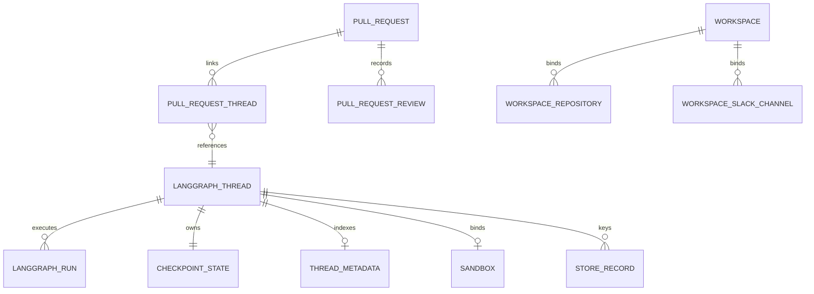
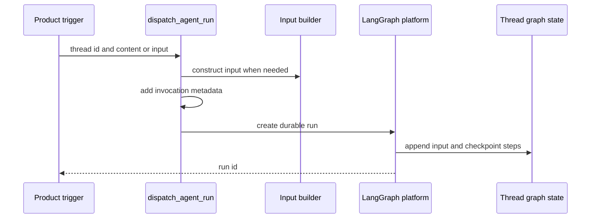

# Threads, runs, and durable state

A LangGraph **thread** is Open SWE's unit of conversational continuity: its `thread_id` selects checkpointed graph state and message history. A **run** is one execution against that thread and has its own platform `run_id`; Open SWE also assigns an application `invocation_id` to correlate an invocation across configuration, metadata, and terminal processing. Thread metadata, LangGraph Store entries, PostgreSQL product records, and sandbox files are related durable data, but they have different owners and failure semantics.

The diagram separates LangGraph-managed execution state from PostgreSQL product records and Store-backed records; links are references, not one shared database transaction.

## Identity is a routing contract

`agent/thread_ids.py` is the sole home for deterministic thread-ID derivation. Its strings and UUID namespaces are persisted, cross-process routing contracts: webhooks, dashboard-adjacent features, and reviewer code independently derive an existing identity from external identifiers. Changing a formula therefore makes live threads unreachable through their ordinary entrypoints.

| Purpose | Derivation and stable key |
| --- | --- |
| Slack location | `slack_thread_id`: `slack:{channel}:{timestamp}:{nonce}` |
| PR comment without an Open SWE branch | `pr_comment_thread_id`: `{owner}/{repo}/pr/{pr_number}` |
| PR reviewer | `reviewer_thread_id`: `{owner}/{repo}/pr/{pr_number}/reviewer` |
| Repository review style | `review_style_thread_id`: `{owner}/{repo}/review-style` |
| Linear issue | `linear_issue_thread_id`: `linear-issue:{issue_id}` |
| GitHub issue | `github_issue_thread_id`: `github-issue:{issue_id}` |
| Baby-sit lock | `baby_sit_lock_thread_id`: `open-swe:baby-sit-lock:{key}` |

Slack, PR-comment, reviewer, review-style, and baby-sit IDs are URL-namespaced UUIDv5 values. Linear and GitHub issues use a SHA-256-derived UUID. The reviewer suffix creates a separate namespace from normal PR-comment work, preventing a PR reviewer from sharing the agent's conversation.

A GitHub PR-comment webhook first recovers an ID embedded in an Open SWE branch through `thread_id_from_branch`; only a branch without that UUID uses the PR-comment formula. Linear dispatch supplies its issue's durable thread identity, so repeat activity belongs to the same conversation.

### Slack location mapping and code-channel sessions

Slack adds an explicit Store mapping, per channel and keyed by Slack timestamp, because a thread can be moved. `resolve_slack_thread_id` uses the stored mapping first, then searches `source_context` metadata for the same location. It rejects ambiguous matches; otherwise it binds either the sole match or the nonce-aware deterministic fallback. `bind_slack_thread_id` validates the location, refuses to overwrite another thread, and reads back its write, enforcing one mapped Open SWE thread per Slack location.

Detaching a Slack location writes a fresh nonce rather than merely deleting the map, and removes associated Slack run mappings. The next fallback ID changes, so a reused location cannot collide with the retired conversation.

A Slack code channel is one agent session spanning the channel, represented by `CODE_CHANNEL_SESSION_TS = "0"`, not a Slack reply thread. `manage_code_channel` binds the agent thread to `(channel_id, "0")`, updates its `source_context`, and detaches the old location under a mutation lock. The sentinel makes context retrieval use `conversations.history` without `ts`; normal work uses `conversations.replies` with the thread timestamp. Slack session statuses—`processing`, `active`, `suspended`, and `closed`—are Slack UI state, not LangGraph thread status.

## State ownership and durable metadata

**LangGraph-managed state** contains graph checkpoints, channel versions, pending writes, message history, thread status, and run lifecycle. In deployment, the checkpointer deletes inactive checkpoint state after `default_ttl` of 43,200 minutes, swept every 60 minutes. For the desktop server, `agent.local_checkpointer.create_checkpointer` uses SQLite, commits each write, and imports legacy `langgraph dev` pickle checkpoints once; an interrupted import is retried because its marker is written only after a successful upsert-based copy.

**Thread metadata** is LangGraph-owned durable, queryable cross-surface state. It holds provenance and presentation data such as `source_context`, title, participants, model snapshot, plan flags, reviewer fields, workspace, and `sandbox_id`. `SourceContext` preserves unknown supplied fields and converts malformed historical metadata to an empty context; metadata-upsert paths preserve the opening context and title rather than allowing later activity to repoint a conversation.

Participants are key-per-person maps (`participant_logins` and `participant_emails`), such as `{"octocat": true}`, rather than lists. JSONB containment can query a member of an object, enabling participant-scoped thread searches while supporting historical fallback fields. Reviewer threads always receive `kind = "reviewer"`; their metadata can hold PR data, current and last-reviewed SHA, watch state, Slack context, and findings. This enables reviewer filtering and keeps reviewer state independent from ordinary agent threads.

Thread-level `agent_settings` is a snapshot: model, effort, subagent choices, routing, and repository instructions are resolved on the first run. Sender identity, personal instructions, and PR preferences remain per-message. Later profile edits do not alter the snapshot unless a writer explicitly replaces it, such as a model override. The settings reader caches five minutes, strictly normalizes to its declared schema, and reads/writes fail soft so metadata trouble does not stop a run.

**LangGraph Store** is namespaced application key/value data, accessed through `agent/store.py`, not a substitute for thread metadata. Missing `get` items yield `None`; all other failures raise, so callers that can safely degrade must make that decision locally. `TypedStore` validates one requested record strictly, but logs and skips unreadable records in listings. Examples include the Slack maps, `("queue", thread_id)/"pending_messages"`, plan content and per-thread plan comments. A published plan is additionally mirrored into the sandbox; Store is the dashboard's rendered snapshot while the sandbox file is the agent-editable copy.

**PostgreSQL product records** model entities and reporting rather than graph execution. Alembic migrations create event and projection tables with optional `thread_id`, `run_id`, and invocation-related fields, plus normalized repositories, pull requests, reviews, users, workspaces, and bindings. `pull_request_thread` records primary/secondary links to text LangGraph IDs and permits only one primary link per pull request. The database migration process takes a PostgreSQL advisory transaction lock and applies each revision transactionally.

### Legacy Store migration boundaries

Store records predate some normalized PostgreSQL tables. Startup import copies legacy user mappings to `users` and `user_identity`; it deletes a source record only after a complete successful import, leaving unreadable, unauthorized, or unresolvable mappings for retry. Workspace import similarly copies `workspaces` and legacy `environments` Store records into PostgreSQL; duplicate slugs are not overwritten, successfully handled source records are removed to prevent deleted workspaces reappearing, and records that cannot be interpreted or whose repository bindings conflict remain pending. Pull-request links also backfill pre-table threads by scanning legacy `pr_url`/`pr_urls` metadata; a failed search is not treated as a complete empty scan.

## Inputs, invocations, and durable dispatch

Each run supplies new input while the thread retains prior state. `build_run_input` serializes authored text into escaped `<input-message>` envelopes, validates namespaced entity IDs, and can prepend hashed person, channel, and system `<dynamic-context>` introductions. Previously injected introductions are suppressed. After summarization hides messages before its cutoff, only still-visible dynamic-context hashes count as introduced, allowing necessary identity context to be added again.

`RunConfig` is the tolerant per-run `configurable` contract carried in `RunnableConfig`, not durable thread state. Unknown keys survive, only supplied fields are emitted, and parsing iteratively drops invalid fields rather than discarding valid ones. Invocation identity is written under both `invocation_id` and the rolling compatibility alias `prepare_run_id`; conflicting or malformed IDs are rejected rather than silently correlated.

This is the durable-dispatch path: a new run changes the selected thread's graph state rather than creating a replacement conversation.

`dispatch_agent_run` validates that callers use either a prebuilt input or source content and identities, selects the `agent` or `reviewer` graph, and delegates to `create_durable_run`. Its normal defaults are `multitask_strategy="interrupt"`, `durability="sync"`, `if_not_exists="create"`, resumable streaming, and the v3 compatibility marker with stream modes and subgraphs. Interrupt halts an active run but preserves its sync checkpoint before the follow-up runs with history; background tasks may choose `enqueue`. The retained Store FIFO is deliberately for dashboard injection into an in-flight run (and Slack-edit paths); it deduplicates a supplied `queue_id` and caps at 100 entries, dropping oldest messages.

The completion webhook is attached only when `RUN_COMPLETE_WEBHOOK_SECRET` is set and `COMPLETION_WEBHOOK_URL` is an absolute non-loopback HTTP(S) URL. Otherwise dispatch logs a warning and creates the run without it, avoiding a rejected URL poisoning all run creation. Dashboard command proxying is a separate LangGraph command path: it authorizes the caller, permits only an initial `run.start` to lazily create a missing dashboard thread, and forwards commands to the platform.

## Sandbox continuity is metadata-backed

A thread's metadata `sandbox_id` connects graph continuity to a working tree. `ensure_sandbox_for_thread` first uses a cached connection or reconnects to that ID, refreshing required credentials; it creates only if no ID exists. An unreachable existing agent sandbox raises `SandboxUnreachableError` rather than being silently replaced, because replacement can lose uncommitted work. A `SandboxGoneError` is replaced, and `allow_replacement` extends that to unreachable sandboxes only for re-derivable read-only reviewer checkouts.

Creation and replacement bind the new ID in thread metadata only after the sandbox is created and initialized; only then is its stable thread-keyed proxy published. The proxy serializes lazy reconnect and can update its target, so middleware holding the proxy does not keep a stale backend object. Metadata lookup failure must propagate rather than look like an unbound sandbox, which would otherwise overwrite the real association.

## Change and test checklist

- Preserve identity formulas; test Slack mapping conflicts, metadata fallback, ambiguity, nonce retirement, and the code-channel sentinel.
- Test durable dispatch defaults, interrupt versus enqueue, invalid completion-webhook degradation, and v3 resumable streaming configuration.
- Test envelope escaping and ID validation, dynamic-context de-duplication, and context reintroduction after summarization.
- Test Store failure handling separately from a missing record, and make Store-to-PostgreSQL imports idempotent without deleting unimportable legacy data.
- Test sandbox bind/publish ordering and distinguish unreachable from gone sandboxes. See [Sandbox Lifecycle](../architecture/sandbox-lifecycle.md).

See also [Invocation](../workflows/invocation.md), [Follow-up Messages](../workflows/follow-up-messages.md), [Models, Profiles, and Instructions](./models-profiles-instructions.md), and [Dashboard UI](../integrations/dashboard-ui.md).
