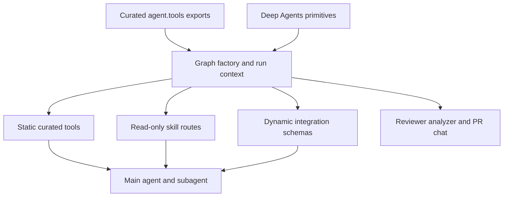
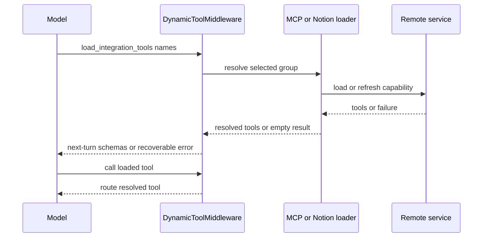

# Tools, Skills, and Authorization

Open SWE treats a tool export, graph wiring, and authorization as separate controls. Exporting makes an implementation importable; a graph factory decides whether the model can see it for a run; sensitive tools must still validate trusted runtime context when invoked. This layered design prevents a broad catalog from becoming a universal capability grant.

## Capability paths

`agent.tools` is the curated import facade. `_TOOL_MODULES` maps public names to local or selected GitHub, Slack, and incident modules. Access imports and caches the exported callable lazily. `_LazyToolsModule` also prefers that callable to an identically named submodule installed on the package by `importlib`. The catalog is therefore not an execution surface.

Deep Agents contributes filesystem and delegation primitives: `read_file`, `write_file`, `edit_file`, `delete`, `ls`, `glob`, `grep`, `execute`, and `task`. `DEEP_AGENT_TOOL_NAMES` reserves those names from collisions with static and integration tools. The main graph normally hides `grep`; other mode gates can remove more built-ins.

This shows the distinction between import availability and the static, skill, and dynamically activated surfaces selected for an executing graph.

## Main-agent eligibility

`get_agent` builds the main static list from web access, plan lifecycle, background work, personal instructions and skills, thread and baby-sit operations, PR actions, sandbox helpers, scheduling, feedback, reporting, and Slack operations. Sandbox iframe, download, and service-URL helpers require the supported sandbox configuration and are omitted otherwise.

The factory narrows that list before the model sees it:

- **Admin authority.** `ADMIN_TOOLS`—automation, workspace, and organization-skill management—are added only if the triggering actor remains an admin. `read_only_sql` additionally requires a private admin surface, not merely admin identity.
- **Personal identity.** If no private credential owner can be resolved, personal instructions, user-skill mutations, and `read_user_settings` are removed. A user skill is persisted under the resolved triggering login, whereas organization skills use a shared namespace and require an admin check.
- **Thread privacy and Slack source.** Channel-history reading is offered only on a private thread because its output enters the shared transcript. Thread-bound Slack tools require trusted source context with a channel and, except `/oswe` ask mode, a thread timestamp. DM runs remove reactions; `/oswe` also removes operations that require a Slack thread.
- **Run kind and incident policy.** A local run is restricted to `http_request`, `fetch_url`, and `web_search`; stop-summary mode gets only Slack thread read/reply static tools. Automatic incident turns receive the research-oriented exclusion set until an authorized responder makes an explicit request. Expedited approval also depends on Slack configuration and a workspace setting.

The general-purpose subagent is compiled separately and does not inherit parent middleware. It receives a filtered static list: parent-context tools such as thread operations and most Slack tools are removed, as are background execution and feedback; source-free channel reading can remain. The factory explicitly passes applicable dynamic-tool and workspace-skill middleware to this subagent.

## MCP and Notion schemas load in two stages

For eligible non-local, non-summary runs with a known credential scope, the factory concurrently obtains MCP and Notion tool definitions. Generic MCP definitions are composed by tier—instance, workspace, then user—with a later same-named connection overriding an earlier one. Tool-loader timeout or failure resolves to an empty list rather than aborting graph construction.

Those definitions are then placed in `MCPs` and `Notion` groups in `DynamicToolMiddleware`. The middleware exposes only `load_integration_tools` and a name-only group-qualified catalog initially; implementation schemas are attached on a later model request only after the model selects their names. It rejects duplicate or reserved names, resets loaded names at the beginning of every run, normalizes qualified aliases, and caches each group resolution behind a per-group lock. An unknown name, an unloaded direct call, or an unavailable group becomes a recoverable tool error rather than a run failure.

The catalog call is a schema-visibility transition: it does not make unselected schemas visible, and a successful selection is callable on the next model turn. Dynamic middleware runs before plan-mode filtering, so plan mode can remove loaded generic MCP tools as well as curated mutations.

### Credential and connection boundaries

A workspace MCP loader returns only administrator-selected allowlisted remote tools, under collision-resistant names. At invocation, a loaded tool re-evaluates its connection: changed headers are used, and a disabled, deleted, or no-longer-allowed connection is refused. A new connection with no selected tools yields no tools at all. The workspace adapter’s discovery operation is deliberately administrative metadata discovery, not remote-tool execution.

Notion is personal and private. Initial loading succeeds only for the private credential owner with a Notion connection. Each exposed schema requires `on_behalf_of`, resolves it to a thread participant, confirms that participant is the private owner, and obtains a fresh access token and MCP tool at call time. Tokens stay in the server-side MCP request path; a missing or revoked token fails the invocation rather than silently using a previously loaded credential.

## Skills are context, not unrestricted files

Skills are `SKILL.md` documents supplied through read-only backend routes. All main runs receive bundled skills from `agent/bundled_skills/`. Desktop runs additionally mount user skills from state; non-desktop runs mount organization skills and, when a private credential owner exists, that owner’s namespaced user skills. Skill storage validates compact lowercase-hyphen names and bounded descriptions/instructions, serializing each record as a virtual `/<name>/SKILL.md` file.

On public/shared non-local runs, `WorkspaceSkillsMiddleware` replaces the standard skills middleware and scopes persisted `skills_metadata` to the currently mounted organization and bundled routes. It clears cached load errors as well. This prevents a prior private user-skill description or diagnostic retained in a thread checkpoint from entering a later public prompt. Organization-skill mutation is admin-only; user-skill mutation derives the triggering login and fails if it cannot resolve one.

Repository instructions are a separate contextual input for reviewer preparation. `fetch_agents_md` reads root `AGENTS.md`, falling back to `CLAUDE.md` only on a root 404; oversized or failed reads yield no instructions. For changed files, scoped `AGENTS.md` ancestors are fetched shallowest first so deeper rules can take precedence; individual failures do not suppress other changed subtrees.

## Specialist surfaces

| Graph | Deliberate surface |
| --- | --- |
| Main | Context-filtered static tools, Deep Agents primitives, selected skills, and dynamically loaded MCP/Notion schemas. |
| Reviewer | Diff and finding lifecycle tools plus `web_search`, `fetch_url`, and `http_request`; it does not receive `open_pull_request`. |
| Analyzer | Only `save_review_style_prompt` and `read_finding_outcomes`, with analysis skills. |
| PR chat | GitHub-backed `read_repo_file` and `search_repo_code`, `list_review_findings`, and web reads. |

PR chat has no sandbox. Its review proxy seeds PR overview, diff, and findings as virtual `/pr/` files, while preparation obtains a repository-scoped GitHub App token for API-backed reads rather than accepting a user credential. Its main graph excludes shell and file mutation; its explicit delegated subagent receives only `read_file`, `ls`, `glob`, and `grep`.

## Tool-side authorization and failure behavior

Factory filtering is least privilege, not a substitute for a tool-side check. `require_admin` checks configured admin identity again on every automation, workspace, and organization-skill operation. Scheduled runs instead require saved authorized-admin schedule authorization. Private-admin operations also require an admin-stamped dashboard or Slack DM surface.

Automation tools use that gate, preserve verified identity when creating/updating schedules, reject contradictory clear-and-set inputs, and return structured errors for authorization and service failures. Workspace publication similarly validates a definition before snapshot capture and discards an unreferenced snapshot if recording the definition fails.

`read_user_settings` accepts no model-supplied target identity. It resolves verified thread participants from run configuration and returns only selected profile preferences, instructions, Notion connection status, and an unresolved-participant count—not tokens or credentials.

## Plan mode is a stateful visibility gate

`PlanModeMiddleware` is installed on every main graph. At run start it overwrites `plan_mode` with the run’s configured initial value, preventing stale checkpoint state from silently constraining a subsequent implementation run. It filters every model request, so `enter_plan_mode` affects the next model turn within the same run.

When active, `PLAN_MODE_EXCLUDED_TOOLS` hides delegation, background work, mutable HTTP, PR/review operations, thread and baby-sit mutation, sandbox service/recreation, personal-skill changes, Slack moves/new threads, workspace changes, and automation mutation. Loaded generic MCP tools are also excluded. `approve_plan`, thread reads, and `read_file`, `write_file`, `edit_file`, and `execute` remain visible. File and shell behavior is constrained by prompt discipline to plan artifacts outside cloned repositories rather than mechanically sandboxed as read-only; `task` is excluded because its separately compiled subagent would bypass this gate.

## Change checklist and focused tests

When adding a capability:

1. Export it from `agent/tools/__init__.py`, but wire it only into the graph and run contexts that need it.
2. Reserve its name against Deep Agents and integration names. For integrations, preserve deferred schema loading and make unavailable services recoverable.
3. Put identity, scope, privacy, and credential checks at the invocation boundary. Do not trust tool arguments, thread metadata alone, or a factory inclusion decision for sensitive effects.
4. Decide whether admin, private credential, private thread, Slack channel, desktop, summary, incident, subagent, and plan-mode gates apply.
5. Add focused tests. `tests/middleware/test_dynamic_tools.py` covers loading, name collisions, aliases, caching, and failure; `tests/tools/test_workspace_mcp_tools.py` covers allowlist and revocation; `tests/tools/test_notion_mcp_tools.py` covers fresh personal credentials; `tests/middleware/test_workspace_skills.py` covers checkpoint privacy; and `tests/agent/test_plan_mode.py` covers exclusions and state transitions.

## Related pages

- [Agent graph](../architecture/agent-graph.md) — graph factories and runtime assembly.
- [Authorization and security](auth-and-security.md) — trust boundaries and credentials.
- [Observability and MCP](../integrations/observability-and-mcp.md) — MCP configuration and operations.
- [Context engineering](../workflows/context-engineering.md) — contextual instructions and prompt composition.
- [PR creation](../workflows/pr-creation.md) — PR workflow controls.
