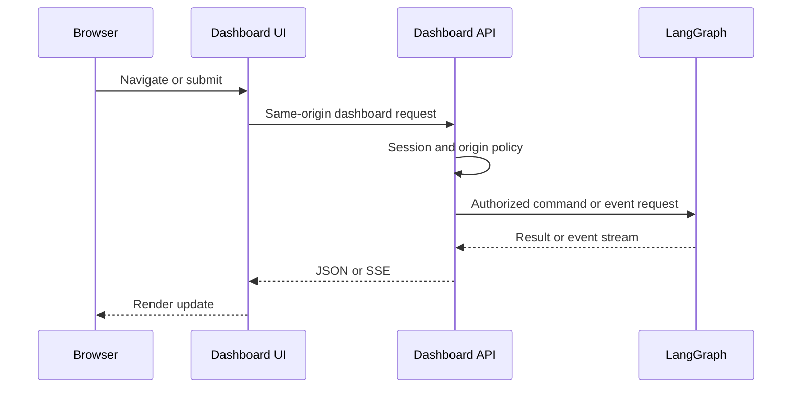
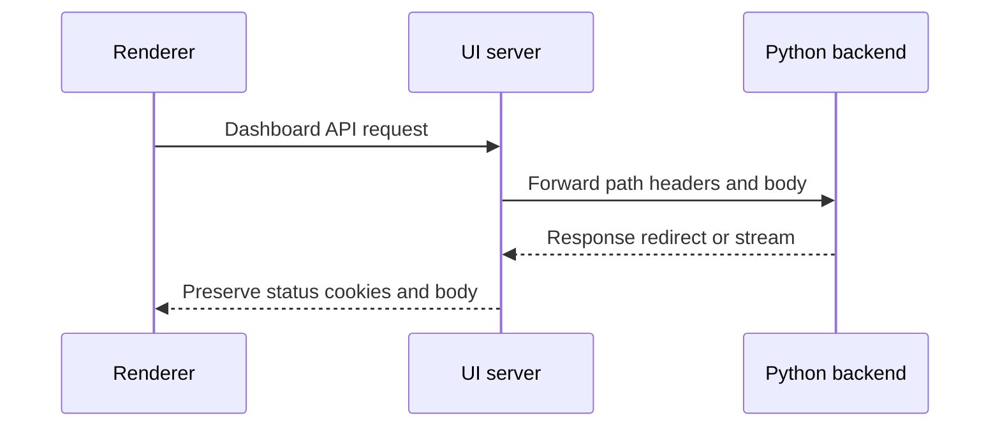
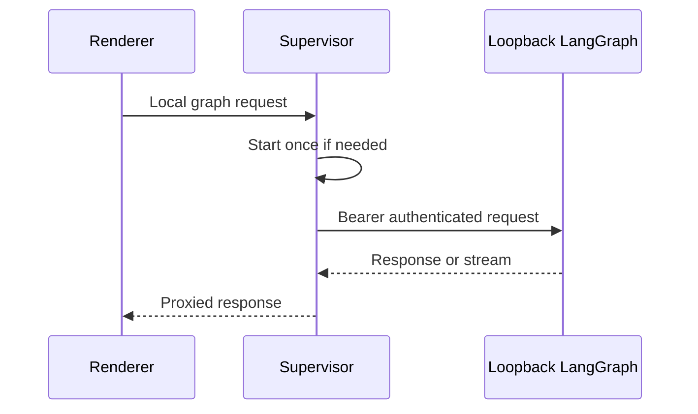

# Dashboard, web UI, and desktop integration

The dashboard is the authenticated human surface for threads, agent runs, workspace controls, and connected services. It deliberately puts product authorization and dashboard-specific adaptation in FastAPI, while the browser and Electron renderer reach LangGraph through controlled proxy boundaries rather than receiving backend credentials.

## API composition and security boundary

`create_app()` includes the aggregate dashboard router at `/dashboard/api`, includes the standalone plan and workflow-approval routers, then mounts the UI. `agent.dashboard` resolves its exported router lazily, avoiding FastAPI and all feature-route imports for consumers that only import a dashboard helper.

`agent/dashboard/routes.py` is an **aggregator**, not the owner of product endpoints. It applies the common prefix, tag, and mutation-origin dependency, then includes feature routers for authentication, users and profiles, options and workspace settings, repositories and pull requests, review, instructions, skills, analytics, schedules, threads, incidents, integrations, and workspaces. Add a feature endpoint to its feature router; include that router here to expose it under the dashboard boundary.

Every dashboard mutation passes the router-level origin guard. Safe HTTP methods pass; an explicit bearer-token request without the session cookie passes because it has no ambient browser credential. Cookie-authenticated mutations must have an allowed `Origin` or `Referer`; WebSockets are always checked. Individual endpoints remain responsible for session, administrator, repository, and thread permissions. `DASHBOARD_ALLOWED_ORIGINS` enables credentialed CORS at application construction, and `*` is rejected.

GitHub sign-in binds signed OAuth state to a nonce held in a short-lived cookie. The callback verifies that binding for normal browser login, exchanges the GitHub code, enforces the configured login gate, stores the OAuth response, signs the user in, and sets the session cookie. Desktop login instead redirects a PKCE-bound handoff code to the local listener without setting a browser session; `POST /auth/desktop/exchange` redeems the code and verifier. Session cookies use `Secure; SameSite=Lax` for same-origin HTTPS, `Secure; SameSite=None` for split-origin HTTPS, and non-secure `SameSite=Lax` for HTTP.

Diagram: browser traffic is mediated by the dashboard API before a protected operation reaches LangGraph.

## Threads and the streamed run experience

The threads feature supplies dashboard summaries, state, mutations, diffs, terminal access, and three guarded LangGraph passthroughs: `POST /threads/{thread_id}/commands`, `/stream/events`, and `/history`. The event endpoint returns `text/event-stream` with no-cache and keep-alive headers. It validates JSON content type and current thread readability *before* beginning the response, so authorization and malformed-request failures remain ordinary HTTP errors. The proxy attaches the server-side LangSmith key when configured; clients never need it.

A newly composed client-side thread can be created only by `run.start`. The command proxy rejects any other command for a missing thread. For an existing thread, it distinguishes postable commands from readable ones, enriches run-start configuration and metadata, forwards the command, and records the accepted run as pending. It also starts a background time-to-first-text observer; it stops when the target run emits first assistant text or reaches a terminal lifecycle event. Readable users may consume thread state, history, and events, while write authority is more restrictive for protected threads.

The React Agents layout owns an `AgentStreamProvider`. It selects the dashboard client for cloud threads and the local graph client for local threads, passes a dashboard-aware fetch implementation to the streaming SDK, and keeps recently left or still-running streams mounted through its pool. Completion invalidates cloud-thread detail and list queries. The provider surfaces custom conversation-offloading and model-routing events and handles reconnection notices. In desktop-local-only mode, an unauthenticated user is allowed only at `/agents` or `/agents/local/{sessionId}`; those local routes select local transport.

## Settings and workflow controls

The dashboard aggregates controls rather than treating them as UI-only state. Profile records contain user-editable defaults such as model, reasoning effort, repository, branch behavior, and preferences, while encrypted GitHub tokens are stored separately so an OAuth refresh cannot overwrite a concurrent profile edit. Validations reject default-model choices and effort combinations that the selected model cannot support.

Workspace settings are tiered: hardcoded defaults, then an instance record, then sparse workspace overrides; callers may layer user profile and thread configuration on top. They cover review behavior, guidelines, model pairs and routing tiers, gateway and feature toggles, and default repository settings. Model resolution keeps a supported configured provider where possible and falls back to a valid default.

Repository instruction records normalize `owner/name`, require current repository access for direct operations, and provide non-empty text for the agent prompt. Skills have separate scopes: any signed-in user can manage their own skills, while organization skills are readable by sessions and modified by administrators. Schedule listing needs a session; schedule create, update, trigger, and deletion require an administrator. The aggregate router also makes reviews, workspace/repository controls, MCP and connected-service configuration, incidents, and analytics available through their owning feature routers.

## Web serving and deployment proxy

A backend can serve a built dashboard directly. `DASHBOARD_STATIC_DIR` selects an explicit build; otherwise `ui/.output/public` is used if it has `_shell.html`. The mount serves hashed `/assets` with one-year immutable caching, serves the shell with `no-cache` for HTML navigation, and declines reserved server paths and unknown non-HTML paths. Build with the appropriate `DASHBOARD_BASE_PATH` when a LangGraph mount prefix is used; the TanStack router uses Vite's `BASE_URL` as its base path. The catch-all must remain after API routes, and `keep_dashboard_ui_last()` restores that ordering after later route registration.

For local UI work, `DASHBOARD_DEV_SERVER_URL` replaces the static mount with a reverse proxy to Vite. It streams bodies in both directions, preserves redirects, and retains the backend origin for HTTP requests and cookies; Vite HMR uses Vite's own port. In a separately deployed UI, Vite development proxies backend prefixes to `DASHBOARD_API_URL` or `http://localhost:2024`. Production Nitro registers `backend-proxy.ts` only for `/dashboard/api/**` and `/webhooks/**`. The handler reads `DASHBOARD_API_URL` per request and fails without it, preserves OAuth redirects rather than following them, strips hop-by-hop/reframed headers, and emits each upstream `Set-Cookie` as its own response header.

Browser dashboard URLs are relative by default and send cookies using the normal same-origin path. Server rendering instead targets `DASHBOARD_API_URL` and explicitly forwards the incoming `cookie` header, since server-side `credentials: "include"` does not carry browser cookies.

Diagram: deployed UI proxying preserves browser-visible OAuth and cookie semantics while selecting its backend at runtime.

## Electron local backend supervision

Electron exposes its compiled UI at `open-swe://app`. Its `BackendSupervisor` starts a local LangGraph process lazily; concurrent starts share one readiness promise. It reserves a loopback-only `127.0.0.1` port, generates a random bearer token, requires configured project and worktree locations, and launches either `uv run langgraph dev` with `langgraph.desktop.json` in development or a bundled Python runtime with the packaged configuration. It supplies the child with its authentication token, project allowlist, worktree path, and—when state storage is configured—artifact and checkpoint locations.

The supervisor polls the loopback root with that bearer token until it is healthy or the 60-second startup deadline expires. It retains recent child output to enrich startup failures. The renderer receives only `{ apiUrl: "/local-graph", graphId: "agent" }`. Requests under `/local-graph` start the supervisor, remove renderer cookies and `Host`, inject the bearer token, and forward the remaining path; neither port nor token is exposed to renderer code. On shutdown it clears state, sends `SIGTERM`, and escalates to `SIGKILL` after five seconds.

Diagram: the desktop renderer uses a stable local proxy path while the supervisor owns loopback process credentials.

## Verification focus

`tests/dashboard/test_dashboard_thread_api.py` exercises the command boundary: run-start metadata stamping and first-text timing, unsurfaced-thread rejection, protected admin-thread command authorization, readable non-owner state/event/history access, and bounded history discovery. UI stream-provider tests cover pool reuse, transport selection, thread creation, and retained streams. Changes to static/proxy behavior should retain reserved-path protection, catch-all ordering, redirect handling, and independent `Set-Cookie` forwarding; changes to Electron supervision should retain the loopback bearer boundary, health polling, and termination escalation.

## Related

- [Architecture overview](../architecture/overview.md)
- [Auth and security](../concepts/auth-and-security.md)
- [Models, profiles, and instructions](../concepts/models-profiles-instructions.md)
- [Deployment](../operations/deployment.md)
- [Invocation](../workflows/invocation.md)
