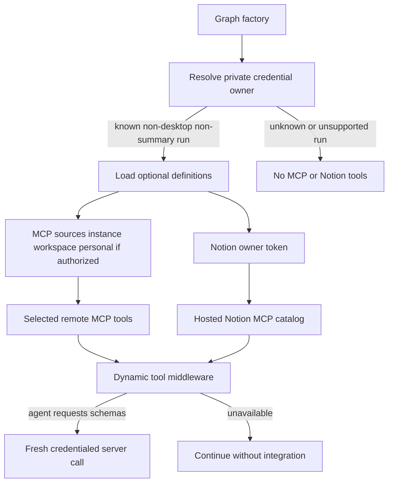

# Connected services, MCP, and observability

Open SWE's optional connected-tool surfaces are generic remote MCP connections and Notion's hosted MCP. They are built in the server process, not injected into the task sandbox. A connection or handshake failure removes that optional tool surface rather than preventing the run. LangSmith is separately used for tracing, trace links, feedback, sandbox operations, and optionally as an LLM Gateway; it is not a current agent run-inspection tool integration.

See [Authentication and security](../concepts/auth-and-security.md) for the trust model, [Tools](../concepts/tools.md) for dynamic tool availability, [Agent graph](../architecture/agent-graph.md) for the factory lifecycle, [Sandbox providers](sandbox-providers.md) for LangSmith sandboxes, and [Configuration](../operations/configuration.md) for deployment settings.

## Availability, credential scope, and loading

The graph factory first establishes whether it can resolve the thread's credential scope. It then loads generic MCP and Notion definitions concurrently only for executable, non-desktop, non-summary runs. Generic MCPs always include the instance and selected workspace tiers; the personal tier is added only when the run is a private thread started by its saved owner. Notion is likewise private-owner-only. If scope resolution fails, neither group is offered.

This flow shows credentials and scope gates before optional tool availability, followed by an explicit schema-loading gate.

The `DynamicToolMiddleware` publishes only connected tool names initially. The model must call `load_integration_tools` before a remote tool is added for the next turn. The middleware loads each group once under a lock, reports missing tools as unavailable, and blocks direct calls that skipped the loading step. This avoids paying MCP handshake and credential-round-trip costs before the first model call.

The server applies a stale-while-revalidate cache plus `TOOL_LOADER_TIMEOUT_SECONDS` (five seconds by default) to Notion's initial catalog load. Timeout or exception results in an empty list. Generic MCP discovery has its own 30-second timeout and a 600-second catalog cache keyed by scope namespace, connection name, and revision. Failed MCP settings lookup returns no generic MCPs rather than falling through to a lower-precedence scope; a failed individual server does not hide the other configured servers.

## Generic remote MCP connections

### Scopes and precedence

A connection is named, enabled or disabled, uses `streamable_http` or `sse`, and has an explicit `allowed_tools` allowlist. Records are stored in one of three Store namespaces:

1. **Instance** (`instance_mcps`): admin-managed connections inherited by every workspace and user.
2. **Workspace** (`workspace_mcps/<workspace>`): admin-managed connections for one workspace.
3. **Personal** (`user_mcps/<login>`): connections a dashboard user manages for their own eligible runs.

Sources are resolved in that order, with later scopes replacing an entire same-named connection. An empty or disabled personal/workspace override therefore deliberately suppresses the lower-level connection rather than falling back to it. Legacy flat `workspace_mcps` records are adopted into the instance scope on first instance read, preserving pre-workspace behavior.

A discovered tool is exposed under a generated `mcp_<connection>_<tool>_...` name to avoid collisions. The wrapper does not trust the catalog forever: each invocation re-resolves its named connection and rejects the call if its source changed, it was deleted/disabled, URL or transport changed, or its remote tool is no longer allowlisted. It constructs a fresh MCP adapter tool with the current headers and authentication before forwarding arguments.

### Administration and secrets

The dashboard mounts MCP APIs below `/dashboard/api`. Instance and workspace list, save, delete, reveal-header, and discovery endpoints require an admin session. `/my-mcps` equivalents operate only on the signed-in user's namespace. All dashboard mutation routes have the dashboard's same-origin dependency; revealed headers are returned with `Cache-Control: no-store`.

Connection URLs and OAuth token URLs must be HTTPS, have a host, and contain neither URL credentials, fragments, whitespace/control characters, nor secret-like query parameters. Headers are limited and validated; hop-by-hop and host-related headers are blocked. Header values and OAuth client secrets are encrypted at rest with `agent.encryption`; normal public records expose only header names and never encrypted values. Saved authentication can be reused only from the prior record in the same scope. Changing a URL requires explicit header replacement/clearing, and changing an OAuth destination or client ID requires a new client secret.

A connection may instead use OAuth `client_credentials` with either `client_secret_post` or `client_secret_basic`; OAuth cannot coexist with an `Authorization` header. The server decrypts the client secret only to request a bearer token, caches tokens by connection identity and encrypted secret, refreshes before expiry, and retries once after a 401. Cache identity includes the scope namespace, so identical settings for different owners do not share bearer tokens.

### Remote boundary and failure behavior

Remote MCP traffic uses a dedicated HTTP transport rather than ambient proxy configuration. Each request must remain on the configured HTTPS origin; redirects are not followed. The target is resolved and required to have public addresses, then the checked address is pinned for the connection while retaining the original Host and TLS SNI hostname. These controls prevent a configured server, redirect, or DNS change from delivering credentials to another or private origin.

Discovery initializes the remote session, follows catalog pagination while rejecting a repeated cursor or duplicate remote tool names, and returns safe diagnostic guidance for common HTTP and timeout failures. Loading failures are logged without upstream secret details and degrade to no tools from that connection. Invocation failures become a generic tool error advising the user to check the connection and credentials.

## Notion hosted MCP and OAuth

Notion is a specialized personal connection to `https://mcp.notion.com/mcp` over streamable HTTP. Its access token is sent as a bearer header from the server process. The initial catalog is loaded with the private thread owner's valid token, and every definition is wrapped with a required `on_behalf_of` argument.

At invocation, the wrapper verifies `on_behalf_of` with `resolve_participant`, then independently confirms that the resolved login is the private credential owner. It fetches a current token, reconnects to find the named remote tool, and invokes it. Consequently, a cached catalog does not grant use of the loader's old token or another participant's Notion connection. No token at load time means no Notion tools; no token at call time asks the user to reconnect in Profile Settings.

Notion's dashboard connection flow discovers protected-resource and authorization-server metadata from Notion, accepts only HTTPS `mcp.notion.com` endpoints, dynamically registers a public OAuth client, and uses authorization-code OAuth with PKCE (`S256`). A hashed state nonce is held in an HttpOnly, SameSite=Lax state cookie and the pending flow is stored per login with its verifier and any client secret encrypted. The callback validates state before exchanging the code and storing the connection. The desktop flow returns an encrypted handoff to the authenticated desktop session instead of exchanging under an unproven browser identity.

Stored Notion access, refresh, and optional client-secret values are encrypted. Credential lookup intentionally fails soft because it gates optional tools. Tokens are refreshed five minutes before expiry under a per-login lock; a definitive `invalid_grant` removes the stale connection and requires reauthorization, while other refresh failures leave the existing access token available when possible.

`on_behalf_of` must be nonempty, match the GitHub login that triggered the run without regard to case, and belong to the verified participants of the active thread. If thread context or membership cannot be verified, the request is rejected rather than using a credential based on uncertain attribution.

## LangSmith observability and gateway routing

LangSmith tracing is configuration-driven. `LANGSMITH_TRACING` enables SDK tracing, while `LANGSMITH_PROJECT` identifies the project used by tracing and trace links (`LANGCHAIN_PROJECT` remains an alias); the deployment defaults it to `default`. `LANGSMITH_API_KEY` is also the key used for sandboxes, trace links, and feedback, and `LANGSMITH_ENDPOINT` supports self-hosted or regional deployments.

The optional LangSmith LLM Gateway is separate from MCP tools and is applied centrally by `make_model`. A workspace `gateway_enabled` value is authoritative; otherwise `LANGSMITH_GATEWAY_ENABLED` controls the deployment default, which becomes enabled when a dedicated `LANGSMITH_GATEWAY_API_KEY` is set. The gateway uses that dedicated key in preference to `LANGSMITH_API_KEY`, and routes `openai`, `anthropic`, `baseten`, `fireworks`, and `google_genai` model IDs to provider-specific paths under `LANGSMITH_GATEWAY_BASE_URL` (default `https://gateway.smith.langchain.com`). The gateway resolves provider secrets from LangSmith workspace Provider Secrets and applies gateway policy and tracing.

Missing gateway credentials or an unsupported provider **degrade to direct provider calls** with a warning; they do not fail model construction. Gateway-routed OpenAI keeps the Responses API by default; `LANGSMITH_GATEWAY_OPENAI_USE_RESPONSES=false` is the compatibility override for Chat Completions.

## Focused verification

Relevant tests cover source precedence, suppression and scope-change behavior in `tests/tools/test_mcp_sources.py`; encrypted configuration, dashboard authorization, validation, and secret redaction in `tests/dashboard/test_workspace_mcps.py` and `tests/dashboard/test_user_mcps.py`; OAuth token lifecycle in `tests/tools/test_mcp_oauth.py`; network pinning in `tests/tools/test_mcp_transport.py`; generic wrapper behavior and catalog caching in `tests/tools/test_workspace_mcp_tools.py`; and Notion wrapper refresh/failure behavior in `tests/tools/test_notion_mcp_tools.py`.
