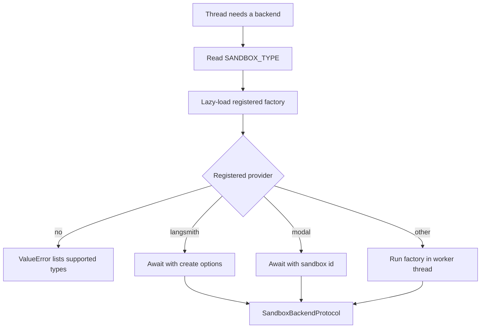
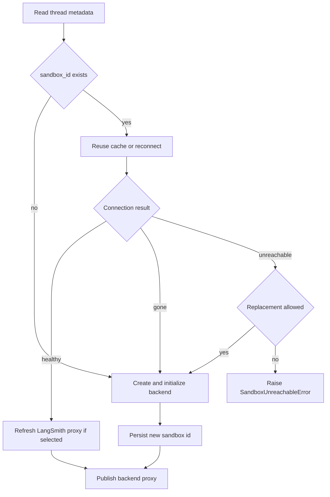

# Sandbox Provider Integration

Open SWE uses a `SandboxBackendProtocol` for repository and shell work. Provider selection is configuration; thread ownership, reconnection, replacement, and publication are lifecycle concerns. Those layers are intentionally separate: a provider implements transport and backend creation, while the lifecycle decides when a thread may reuse or replace its working tree. See [sandbox lifecycle](../architecture/sandbox-lifecycle.md) for the wider run lifecycle and [configuration](../operations/configuration.md) for deployment settings.

## Selection, factory contract, and startup

`SANDBOX_TYPE` defaults to `langsmith`. The registry lazily imports the factory for `langsmith`, `daytona`, `modal`, `runloop`, `e2b`, or `local`; an unknown value raises `ValueError` with the supported names. A factory receives an optional `sandbox_id`: it reconnects when present and creates otherwise. It returns a `SandboxBackendProtocol` and may be synchronous or async.

Only LangSmith receives `snapshot_id`, CPU, memory, filesystem, and arbitrary create-body options from `create_sandbox()`. LangSmith and Modal are awaited directly; the synchronous Daytona, E2B, Runloop, and Local factories run via `asyncio.to_thread`, keeping their SDK or filesystem setup off the event loop.

Provider selection and dispatch; binding the returned backend to a thread happens later in lifecycle code.

The FastAPI lifespan validates the active sandbox configuration before serving. At present that validation is LangSmith-specific: resource and TTL settings must be integers, TTLs cannot be negative, and `SANDBOX_CREATE_EXTRA_JSON` must be a JSON object. Alternative provider credentials are checked by their factories when used.

## Lifecycle integration and failure boundaries

`ensure_sandbox_for_thread()` reads thread metadata and either reuses a cached connection, reconnects to the saved `sandbox_id`, or creates a backend from the workspace ready snapshot (falling back to the administrator base snapshot). It reapplies the bot Git identity on reuse as well as creation.

A deleted and an unreachable backend are deliberately different outcomes. LangSmith translates a missing box into `SandboxGoneError`; the lifecycle recreates it because the old box is gone. Other reconnection or proxy-refresh failures become `SandboxUnreachableError` and normally fail the run rather than silently replacing an uncommitted working tree. Reviewer callers may opt into replacement because they rebuild their checkout for every review.

Thread lifecycle policy: creation includes initialization before metadata persistence, and publication occurs last.

That ordering is an invariant: a newly created backend is initialized first, its id is persisted next, and the in-memory proxy is published last. A failed initialization therefore leaves no half-initialized backend eligible for use. Explicit recreation likewise requires a distinct id and preserves the old binding until metadata updates successfully. The abstraction has no provider delete operation: platform TTLs reclaim sandboxes because a sandbox can be the only copy of a working tree.

## LangSmith provider

### Provisioning and snapshots

LangSmith sandbox operations use the deployment-wide `LANGSMITH_API_KEY` and `LANGSMITH_ENDPOINT`; the former `SANDBOX_LANGSMITH_API_KEY` and `SANDBOX_LANGSMITH_ENDPOINT` overrides are not used. The SDK endpoint is normalized to `/v2/sandboxes`.

A new box uses `DEFAULT_SANDBOX_SNAPSHOT_ID` when configured; otherwise the request omits `snapshot_id` so LangSmith selects its root snapshot. Defaults are 4 vCPUs, 16 GiB memory, 128 GiB filesystem capacity, a two-hour idle TTL, and a 30-day delete-after-stop TTL. Supplying either CPU or memory at creation leaves the other override `None`, rather than combining a partial override with a default. A TTL of zero disables that TTL.

`SANDBOX_CREATE_EXTRA_JSON` supplies deployment-level create fields. Call-specific `create_params` win on conflict. Because the SDK lacks an arbitrary create-payload seam, the integration wraps only its `POST /boxes` request to inject unmodeled fields. Retryable creation failures receive at most three attempts.

Workspace snapshot capture is a LangSmith capability. It captures an image with the mutable `latest` tag before the workspace record is updated, so a record never names a snapshot that was not created. Recreating a thread also boots a fresh workspace or base snapshot, configures it, verifies its id differs, then rebinds the thread.

### Commands and proxy credentials

`TimeoutLangSmithSandbox` provides async execution around the SDK's synchronous sandbox. When a command has an effective timeout, it starts a nonblocking command and waits for that timeout plus `SANDBOX_EXECUTE_CLIENT_GRACE_SECONDS` (default 30 seconds). A server timeout and a client-side deadline both return exit code 124; the latter also attempts to kill the command. WebSocket setup and supported stream failures fall back to the base execution path. With no effective timeout it uses that base path directly.

Command retries are intentionally narrow: only `SandboxRetryableConnectionError`, which denotes a failed WebSocket upgrade before the execute frame was sent, is retried. This avoids double-running commands; retries use at most four jittered exponential-backoff attempts.

For LangSmith only, lifecycle creation and reuse mint a GitHub App installation token at runtime and configure the LangSmith proxy. Proxy rules inject Basic auth for `github.com` and `*.github.com`, and Bearer auth plus a placeholder `GH_TOKEN` for `api.github.com`, so the real GitHub token is not written into the sandbox. Caller-supplied proxy rules are preserved except retired managed rules. If the service rejects a proxy update because the box is not ready, the integration starts it best-effort and retries; other proxy refresh failures make an existing thread backend unreachable.

## Other providers and local boundaries

| Provider | Create or reconnect | Required or notable configuration |
|---|---|---|
| `daytona` | Gets an existing id or creates from a snapshot | `DAYTONA_API_KEY`; `DAYTONA_SANDBOX_SNAPSHOT` defaults to `daytonaio/sandbox:0.6.0` |
| `modal` | Reattaches by id or creates in an app | `MODAL_APP_NAME` defaults to `open-swe` |
| `runloop` | Retrieves an id or creates a devbox | `RUNLOOP_API_KEY` |
| `e2b` | Connects by id or creates a sandbox | `E2B_API_KEY`, optional `E2B_TEMPLATE`, one-hour timeout |
| `local` | Constructs a host `LocalShellBackend`; ids are ignored | Optional `LOCAL_SANDBOX_ROOT_DIR`, otherwise the current directory |

`local` has no isolation and is for supervised local development only. It creates its root if needed and passes an explicitly constructed environment with model-provider, LangSmith, and OAuth broker credentials removed. Unless `GIT_CONFIG_GLOBAL` is already set, it writes a root-local `.gitconfig-sandbox` that includes the host config; bot identity writes therefore do not overwrite `~/.gitconfig`.

Desktop execution is not `SANDBOX_TYPE=local`. A run whose source is `desktop` gets a non-virtual `LocalShellBackend` rooted at a canonicalized project path. The path must be an allowlisted registered project or a worktree below `OPEN_SWE_LOCAL_WORKTREES_DIR`; otherwise creation fails. Its shell environment contains only basic shell variables. The agent composes this writable project backend with read-only bundled and user-skill routes, while `/large_tool_results/` and `/conversation_history/` route to per-thread artifact directories outside the project by default. `ReadOnlyBackend` delegates only async read/list/search/download operations and rejects synchronous methods.

## Reviewer preparation

Reviewer sandbox content is re-derived even when the provider backend is reused. Before model work, preparation clones or fetches the repository, fetches base and head revisions (including a pull ref for fork PRs), force-checks out the requested head SHA, and verifies `HEAD`. It uses a 240-second command timeout and returns `False` on failure so review can proceed from fetched diff context.

Trusted skills are a separate boundary: `.agents/skills` and `.claude/skills` are extracted from the PR base SHA into a sibling `.review-skills` directory, never from the author-controlled PR head. This prevents a changed PR `SKILL.md` from injecting reviewer instructions.

## Extending and verifying

To add a provider, implement `create_<name>_sandbox(sandbox_id: str | None = None)` in `agent/sandboxes/providers/`, returning `SandboxBackendProtocol`, and add its `(module, function)` pair to `SANDBOX_FACTORIES`. Test both creation and reconnection, credential failures, and dispatch. Explicitly decide how the backend handles provider-specific features—snapshots, resource overrides, proxy refresh, timeout semantics, and recreation—rather than treating lifecycle replacement policy as a transport detail.

Focused coverage lives under `tests/sandbox/`: LangSmith configuration and timeout tests cover endpoint/create fields, validation, retries, missing boxes, deadlines, kills, and fallback; Local tests cover host environment and Git isolation; recovery, recreation, and publish-order tests exercise lifecycle safety; proxy-auth and reviewer-recovery tests cover the security and replacement boundaries.
