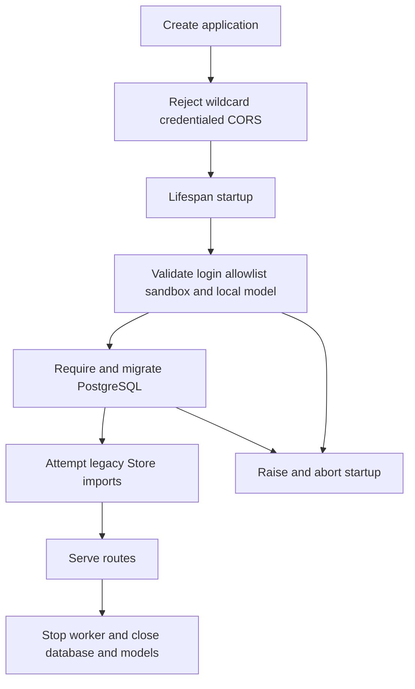
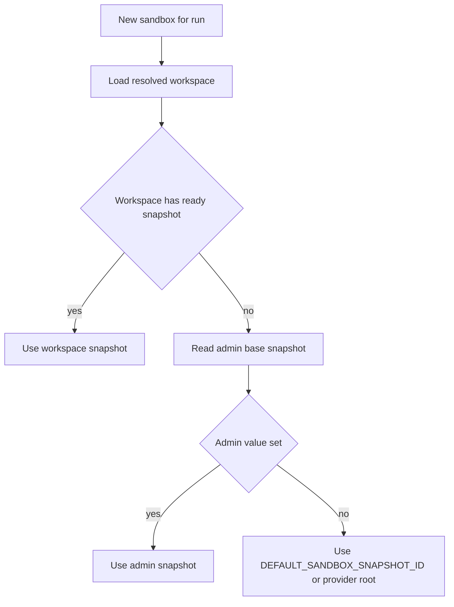

# Configuration and workspace administration

Open SWE has three deliberately separate configuration planes:

- **Deployment configuration** is the lazy `ENV` registry in `agent/config.py`, normally populated by the deployment environment (the platform configuration names `.env`). It owns provider endpoints and keys, application URLs, authentication secrets, and deployment-wide defaults.
- **Administrator configuration** consists of a small instance record plus sparse workspace override records in the LangGraph Store, and workspace records/bindings in PostgreSQL. It changes supported operational choices without putting secrets in the dashboard.
- **User configuration** is stored per login. Profiles and preferences select personal defaults; OAuth and third-party credentials are kept in separate encrypted records so settings edits cannot overwrite tokens.

Treat all environment values marked secret and all stored credentials as sensitive. Configure their names and rotation procedures, not their contents. For installation and deployment topology, see [Deployment](deployment.md); for model selection and instructions, see [Models, profiles, and instructions](../concepts/models-profiles-instructions.md); for provider-specific sandbox setup, see [Sandbox providers](../integrations/sandbox-providers.md).

## Deployment configuration semantics

`ENV` is the application configuration schema. An `EnvVar` reads `os.environ` when it is accessed, not at import time, so late secret hydration, rotation, and test environment changes are visible. It trims values, treats blank values as unset, and resolves the canonical variable before any aliases. Accessors provide integers, conventional booleans, and comma-separated lists; an invalid integer raises a descriptive `ValueError`, while an unrecognized boolean falls back to the accessor's default. Configuration consumers should declare a new variable in this registry rather than read the process environment directly: undeclared attribute or item access fails explicitly, and the registry can report deprecated names and aliases in use.

`langgraph.json` registers the `agent`, `reviewer`, `analyzer`, `chat`, and `scheduler` graphs and mounts `agent.webapp:app` as the HTTP app. It uses delete-based checkpointer TTL cleanup, sweeping every 60 minutes with a 43200-minute default TTL, and points the platform to `.env`.

## Startup lifecycle and validation

The HTTP composition point is `agent.api.app:create_app`. Import-time and lifespan calls pin a single event loop before queue workers are created. On startup, the lifespan validates the GitHub login allowlist, validates the selected sandbox provider, performs the narrowly scoped localhost model-key check, requires and migrates PostgreSQL, then attempts legacy Store-to-database imports. It synchronizes configured admins and starts analytics reporting/worker best-effort. Shutdown stops the analytics worker, closes the database, and closes cached model clients.

The lifespan's critical startup path and cleanup path. Legacy workspace import failure is intentionally non-fatal, but repository routing then fails closed until import succeeds; legacy user import failure leaves those users unresolved without preventing the service from starting. Analytics startup is also logged rather than fatal.

The model check runs only when an explicitly configured `DASHBOARD_BASE_URL` begins with `http://localhost`. It verifies the credential for `LLM_MODEL_ID` (or the deployment default), with desktop OpenAI OAuth accepted in place of `OPENAI_API_KEY`; workspace, profile, and thread selections are deliberately not prevalidated. Sandbox startup validation currently delegates LangSmith settings only when `SANDBOX_TYPE=langsmith`. Other invalid provider names are rejected when a sandbox is actually created.

`DASHBOARD_ALLOWED_ORIGINS` is optional, but when configured it enables credentialed CORS. A literal `*` raises during app construction because wildcard origins cannot safely be used with credentials.

## Sandbox selection and image precedence

`SANDBOX_TYPE` defaults to `langsmith`. The provider registry lazily resolves `langsmith`, `daytona`, `modal`, `runloop`, `e2b`, or `local`; an unknown name raises `ValueError` with the supported types. Only the LangSmith factory receives snapshot, resource, and arbitrary create-body parameters. The other providers accept an optional existing sandbox ID; local execution is host execution and is therefore suitable only for trusted local development.

For LangSmith, deployment defaults are `DEFAULT_SANDBOX_SNAPSHOT_ID`, 128 GiB filesystem (`DEFAULT_SANDBOX_SNAPSHOT_FS_CAPACITY_BYTES`), 4 vCPUs (`DEFAULT_SANDBOX_VCPUS`), 16 GiB memory (`DEFAULT_SANDBOX_MEM_BYTES`), a 7200-second idle TTL, and a 2592000-second delete-after-stop TTL. `0` disables either TTL. `SANDBOX_CREATE_EXTRA_JSON` must be a JSON object. Invalid numeric values, negative resource/TTL values, and malformed JSON are caught by the provider startup validation.

### Effective snapshot and resources

A workspace can supply scripts, a captured snapshot, sizing, and validated provider create parameters. For a run associated with a workspace, its ready snapshot wins; during a replacement capture, the previous ready snapshot remains usable. Otherwise the sandbox base is resolved from the instance-wide admin snapshot setting, then `DEFAULT_SANDBOX_SNAPSHOT_ID`; with neither, the LangSmith provider uses its root snapshot. Workspace resource values override the provider's defaults when present.

Snapshot precedence used for a workspace run.

The admin base setting is a Store record at `sandbox_settings/default`. `GET` and `PUT /dashboard/api/sandbox-settings` require an admin session or an accepted CI/admin bearer credential. The `base_snapshot_id` is provider-scoped opaque text: it is trimmed and limited to 512 characters, not format-validated. Dashboard reads report the stored, environment, and effective values and source (`admin`, `env`, or `unset`). Runtime lookup is fail-soft: Store trouble falls back to the environment default rather than failing a run. Clearing the stored value restores the environment default without redeployment.

Workspace create/update input validates positive resource overrides, repository and Slack bindings, scripts, and JSON create parameters. Create parameters have a size limit, reject non-JSON values and malformed proxy configuration, and reject secret/credential-like keys. They are validated again when read, so legacy or newly disallowed values are ignored instead of sent to the provider. Never put credentials in scripts or create parameters: refresh scripts execute with tracing and their expanded command lines can be retained in logs.

## Dashboard-managed settings and precedence

The dashboard router prefixes these APIs with `/dashboard/api` and applies same-origin protection to mutations. Session-authenticated users can read their effective settings where allowed; writes that change instance or workspace settings require an administrator. The sandbox endpoint additionally accepts an allowlisted GitHub Actions OIDC token or an administrator's GitHub bearer token, which supports CI snapshot rollouts without storing a dashboard session.

### Instance and workspace settings

The historical “team settings” record remains an instance record at `team_settings/default`. Every workspace has a sparse Store record in `workspace_settings/<slug>`; `None` or an absent field inherits the tier below. Effective settings resolve in this order:

1. Hardcoded defaults, including the validated deployment `LLM_MODEL_ID` / `LLM_REASONING_EFFORT` pair.
2. Instance-wide settings.
3. Workspace-specific overrides.
4. Per-user profile and thread `configurable` choices in callers that support them.

`GET`/`PUT /dashboard/api/settings` operate on instance values (`/team-settings` remains a hidden compatibility alias). `GET`/`PUT /dashboard/api/workspaces/{workspace}/settings` exposes an effective view plus that workspace's own overrides and verifies the workspace exists. Deleting a workspace also deletes its settings overrides, preventing a later workspace with the same slug from inheriting old configuration.

Model-and-effort pairs are validated against the supported-model catalog. An effort without a model, an unsupported model, or an effort unsupported by that model is rejected. Deprecated selections are cleared; stale non-deprecated selections resolve to a supported model from the same provider when possible, then to the deployment fallback. Fable is disabled by default. Its toggle is a kill switch: when disabled, persisted Fable model defaults are replaced with a non-Fable fallback, and runtime model construction has a second guard. Chat inherits the agent default if unset or invalid; review diff grouping inherits the reviewer subagent default.

Settings reads are intentionally fail-soft because every run needs them to choose a model: an unavailable Store returns hardcoded defaults rather than failing all runs. This means dashboard configuration is operationally useful but must not be the sole store for secrets or safety-critical access control.

### Workspace lifecycle

Workspace records, repository bindings, and Slack-channel bindings are PostgreSQL-backed. Administrators create, update, refresh, and delete them through `/dashboard/api/workspaces`; simultaneous claims for a slug or binding return HTTP 409. A workspace refresh is started asynchronously, permits only one in-flight refresh, and writes its outcome to the record for dashboard polling. A workspace with a setup script also gets refresh scheduling. User-facing workspace options omit refresh log excerpts unless the requester is an admin because command tracing can expose arguments.

## Models, providers, and gateway routing

The catalog in `agent/dashboard/options.py` defines accepted IDs, reasoning efforts, image support, and whether a model can be a default. `LLM_MODEL_ID` must name a catalog model permitted as a default; `LLM_REASONING_EFFORT` must be supported by that model or resolution raises. With no explicit model, the deployment chooses an Anthropic model only when an Anthropic key is present and an OpenAI key is not; otherwise it selects the OpenAI default.

`LLM_FALLBACK_MODEL_ID` selects the failure fallback. When absent, Anthropic and OpenAI primaries receive a cross-provider fallback; other providers have none. Middleware is added only when a fallback exists and differs from the primary. Model clients are cached by running event loop and effective options and are closed during application shutdown. Direct OpenAI, Anthropic, Baseten, Google GenAI, and Fireworks calls receive a 600-second request timeout and all constructed clients receive up to six retries by default.

LangSmith Gateway is a separate routing layer. `LANGSMITH_GATEWAY_ENABLED` wins if explicitly set; otherwise the presence of `LANGSMITH_GATEWAY_API_KEY` enables it. The stored instance/workspace `gateway_enabled` value is tri-state: `true` or `false` overrides the deployment choice, and unset inherits it. Gateway authentication prefers `LANGSMITH_GATEWAY_API_KEY`, then `LANGSMITH_API_KEY`; `LANGSMITH_GATEWAY_BASE_URL` changes the host. Only OpenAI, Anthropic, Baseten, Fireworks, and Google GenAI route through the gateway. If the provider is unroutable or no LangSmith key is usable, routing logs a warning and falls back to a direct call; direct Baseten calls instead require `BASETEN_API_KEY`.

## Credentials, users, and completion callbacks

`TOKEN_ENCRYPTION_KEY` protects stored OAuth and third-party tokens. It accepts one Fernet key or a comma/newline-separated newest-first list: encryption uses the first key and decryption tries the list in order. Rotate by prepending a valid new key, retaining old keys until records have been rewritten or retired. Missing keys prevent encryption; failed decryptions return an empty value after logging rather than exposing token material.

User profile data and GitHub OAuth tokens use separate Store namespaces, which avoids a profile update racing a token refresh/callback and clobbering credentials. Per-user third-party credentials are similarly namespaced by login. For example, Notion status responses expose connection and expiry metadata but not tokens; access, refresh tokens, and any client secret are encrypted before storage. Personal credentials are available only in the appropriate private-thread credential scope; system threads cannot use them.

Deployment secrets include provider keys, GitHub App credentials and webhook secret, Slack credentials, `DASHBOARD_JWT_SECRET`, and `RUN_COMPLETE_WEBHOOK_SECRET`. `CONFIGURED_ADMINS` is a comma-separated login/email allowlist; an empty list grants no dashboard identity administrator status. Keep deployment secrets out of workspace settings, scripts, snapshot metadata, and logs.

`RUN_COMPLETE_WEBHOOK_SECRET` authenticates `/webhooks/run-complete` by a constant-time token comparison and fails closed when unset. Dispatch attaches a completion callback only if that secret exists and `COMPLETION_WEBHOOK_URL` is absolute and non-loopback; a relative or loopback value is omitted because the platform would reject it at run creation. Configure a public HTTPS endpoint ending in `/webhooks/run-complete` if completion or failure replies are required.

## Operational checklist

1. Declare deployment variables in `agent/config.py`, including secret and alias/deprecation metadata; read them through `ENV`.
2. Provide PostgreSQL before startup. Verify migrations complete, then investigate Store-import warnings promptly because failed workspace import causes repository routing to fail closed.
3. Exercise lifespan startup for the selected provider and, in local development, set explicit `DASHBOARD_BASE_URL=http://localhost...` to validate the default model credential.
4. Use the dashboard/CI sandbox setting for a fleet-wide base-image rollout; use a workspace ready snapshot for repository-specific toolchains. Do not store secrets in either plane.
5. Test workspace inheritance, model/effort validation, gateway tri-state precedence, Store failure fallback, sandbox snapshot precedence, completion webhook URL rejection, and key rotation before changing these boundaries.

## See also

- [Deployment](deployment.md)
- [Authentication and security](../concepts/auth-and-security.md)
- [Models, profiles, and instructions](../concepts/models-profiles-instructions.md)
- [Sandbox providers](../integrations/sandbox-providers.md)
- [Observability and MCP](../integrations/observability-and-mcp.md)
