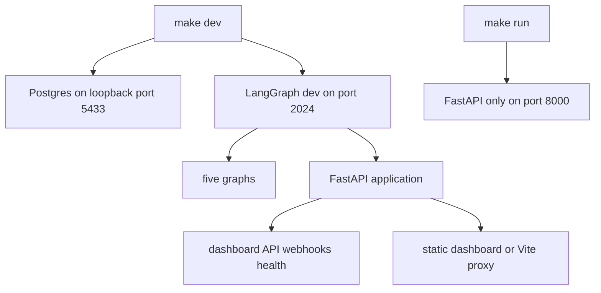
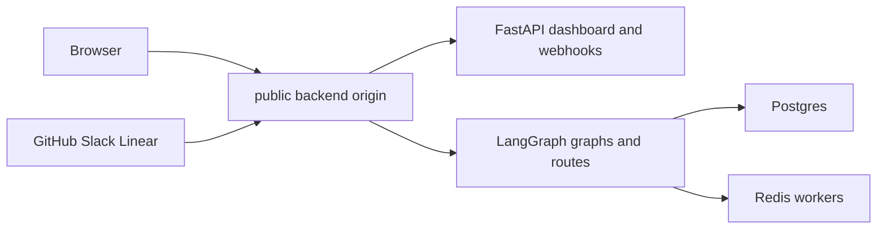

# Development, deployment, and service startup

Open SWE is normally one LangGraph deployment: the `agent`, `reviewer`, `analyzer`, `chat`, and `scheduler` graphs run alongside the FastAPI app at `agent.webapp:app`. The app supplies the dashboard API and integration webhooks; LangGraph supplies graph and runtime routes. When a dashboard build is mounted, serving both from the backend origin keeps `/dashboard/api/*` calls and the session cookie same-origin.

See [Configuration](configuration.md) for environment variables, [Dashboard UI](../integrations/dashboard-ui.md) for frontend behavior, and [Quickstart](../quickstart.md) for initial use.

## Local startup

Install Python development dependencies with `make install`, which runs `uv sync --extra dev`. The normal backend command is:

```bash
make dev
```

It first starts the local Postgres service unless `POSTGRES_URI` is already present in the shell or `.env`, verifies that port 2024 is free, then runs `uv run langgraph dev --no-browser --port 2024 --n-jobs-per-worker 10`. `langgraph.json` is the runtime manifest: Python 3.14, API version 0.13.3, all five graph entrypoints, `.env`, `agent.webapp:app`, and a deleting checkpointer TTL policy (60-minute sweep and 43,200-minute default TTL). The local dependency constraint keeps `langgraph-api` in `>=0.13.3,<0.14`, matching that manifest rather than resolving the obsolete runtime.



This contrasts the complete local runtime with the HTTP-only FastAPI development server.

`make postgres` uses Compose to start `postgres:16`, waits for its health check, binds it only at `127.0.0.1:5433`, and stores data in the named `open-swe-postgres` volume. Thus stopping or removing the container does not discard local data. An explicit `POSTGRES_URI` skips this convenience container.

`make run` runs `uv run uvicorn agent.webapp:app --reload --port 8000`. It is useful for focused HTTP work, but it does not start LangGraph, so dashboard actions that create runs need `make dev`.

### Database bootstrap and lifecycle

The FastAPI lifespan validates login, sandbox, and local-model startup settings, requires the application database, and runs migrations before it imports legacy workspace and user records from the LangGraph Store. Failed imports are logged rather than stopping the process, but workspace import failure makes repository routing fail closed; user records remaining in the Store cannot be resolved for Slack or voting until a later successful import. It then synchronizes configured admins and attempts to start analytics/reporting; analytics startup failures are warnings rather than a server startup failure. Shutdown stops that worker, closes database resources, and closes cached models.

For a deployment, `POSTGRES_URI` is required for the application tables and migration role must be able to create and manage the `open_swe_analytics` schema and its tables. It is distinct from the Agent Server `DATABASE_URI`: provide both where the platform does not expose the same database setting to custom application code. Local tests that exercise these tables should use `TEST_ANALYTICS_POSTGRES_URI`, which creates, migrates, and removes a throwaway schema per test; otherwise those tests skip.

### Dashboard build and hot reload

Build a dashboard for backend serving with:

```bash
make build-dashboard
make dev
```

The build is `ui/.output/public`. The backend accepts either that directory or `DASHBOARD_STATIC_DIR`, serves HTML navigations through `_shell.html`, gives hashed assets immutable caching, and revalidates the shell. Its catch-all refuses API and LangGraph prefixes—including `/dashboard/api`, `/webhooks`, `/health`, `/threads`, and `/runs`—so it cannot shadow their owners. Without a build, the backend remains usable but has no bundled UI.

For UI work, run:

```bash
make dev-ui
```

This runs Vite (`make web`) and `make dev` together. The backend on port 2024 reverse-proxies non-reserved UI requests to Vite at port 3000, so users should open `http://localhost:2024`; API, OAuth, and cookies retain their normal origin while Vite supplies HMR. The HMR WebSocket connects directly to Vite. `make web` alone starts the dashboard dev server, whose development proxy sends backend prefixes to `DASHBOARD_API_URL` or `http://localhost:2024` by default.

Opening Vite directly on `http://localhost:3000` instead requires the dashboard base and API base to be that frontend origin and a matching GitHub callback. `DASHBOARD_ALLOWED_ORIGINS` permits additional credentialed browser origins, but `*` is rejected because CORS credentials are enabled.

The dashboard's `DASHBOARD_BASE_PATH` must equal the LangGraph `http.mount_prefix` at which it is served. This controls assets and client routing. Pass the prefix when building locally; the platform build derives it from the manifest. A mismatch breaks asset or client-route URLs.

## Local webhook exposure

Do not publish the complete local port: `langgraph dev` has no authentication on raw LangGraph routes. `make tunnel NGROK_DOMAIN=<name>.ngrok-free.dev` forwards port 2024 through the supplied ngrok policy, which returns 404 for every path outside `/webhooks/*`. It is suitable for GitHub, Slack, and Linear delivery while dashboard and raw runtime access remain local. Any alternative tunnel needs an equivalent allowlist. Restart the backend after `.env` changes because its environment is not hot-reloaded.

## Production topology and security

Two backend delivery modes are supported:

- **LangGraph Platform:** connect the repository in LangSmith Deployments. The manifest's `dockerfile_lines` best-effort builds and installs the dashboard; a dashboard-build failure does not prevent the backend deployment.
- **Standalone Docker:** `docker build -t open-swe .` builds a LangGraph API server image, not a sandbox image. It uses `langchain/langgraph-api:0.13.3-py3.14`, installs this repository, registers the five graphs, HTTP app, and checkpointer policy, and exposes port 8000.



The usual production arrangement places browser traffic and webhook delivery at one public backend origin.

A standalone deployment needs Agent Server backing services and settings: `DATABASE_URI`, `REDIS_URI`, `LANGSMITH_API_KEY`, `LANGGRAPH_CLOUD_LICENSE_KEY`, plus public `LANGGRAPH_URL`. Do not use scale-to-zero hosting: background runs depend on Redis- and Postgres-backed workers remaining available. The root image does not build the dashboard; build it before `docker build` or supply `DASHBOARD_STATIC_DIR`.

The standalone image defaults to `LANGGRAPH_AUTH_TYPE=noop`, exposing raw LangGraph endpoints to reachable network clients. Use LangSmith authentication (`LANGGRAPH_AUTH_TYPE=langsmith`, `LANGSMITH_AUTH_ENDPOINT`, and `LANGSMITH_TENANT_ID`) or an authenticated private-network boundary. Dashboard sessions and webhook signatures protect custom routes, not raw LangGraph routes.

## Separate dashboard deployment

The optional `ui/Dockerfile`, built from the repository root using `docker build -f ui/Dockerfile .`, is a multi-stage Node 24 build. It installs the filtered pnpm workspace with a frozen lockfile, creates the Nitro `.output` server, and runs it as `node` on port 8080. Its backend is read from `DASHBOARD_API_URL` on every request, so one image can front different deployments; it throws when that variable is unset rather than choosing a fallback.

The production proxy forwards the original path, query, body, and safe headers to the backend, preserves individual `Set-Cookie` headers, and leaves OAuth redirects for the browser. The same-origin option proxies `/dashboard/api/*` and `/webhooks/*`: set the backend's `DASHBOARD_BASE_URL` and `DASHBOARD_API_BASE_URL` to the dashboard origin and register that origin's GitHub callback. The cross-origin alternative builds with `VITE_DASHBOARD_API_BASE_URL` aimed at the backend and adds the frontend origin to `DASHBOARD_ALLOWED_ORIGINS`. `VITE_*` values become browser-visible build inputs; do not put secrets in them.

The pnpm workspace contains `ui`, `desktop`, and `tests/e2e`. Turborepo coordinates package `dev`, `build`, `typecheck`, `test`, and `check` tasks. Build cache outputs include `.output/**`, `.vercel/output/**`, and `build/**`; its cache inputs include `DASHBOARD_API_URL`, `VERCEL`, `E2E_HARNESS`, and `VITE_*`. Root lint and formatting run oxlint and oxfmt directly.

## Desktop packaging boundary

The experimental Electron app packages the compiled dashboard plus a local backend. Packaged users select and store a compatible organization backend URL rather than using a maintainer-hosted default. Cloud dashboard features use that backend, while **This Mac** runs a private loopback LangGraph server that Electron stops with the app.

For source development, run `make dev` then `make desktop`; the shared backend defaults to `http://localhost:2024`. `--backend-url` or `OPEN_SWE_BACKEND_URL` overrides it, ahead of saved configuration and the development default. `pnpm --dir desktop run pack` creates an unpacked app and `pnpm --dir desktop run dist` creates an installer; both build the UI and local backend resources.

On macOS, `make install-desktop` refuses a dirty checkout, fast-forwards `main`, then runs `scripts/install_desktop.sh`; `make install-checkout` installs the current checkout without changing Git. The script verifies macOS, Node, `ditto`, uv, and pnpm or Corepack; it packages the app and stages then swaps it into `/Applications` or `~/Applications`.

## Checks and maintenance helpers

- `make test [TEST_FILE=...]` and `make integration_tests` run pytest through uv, skipping a missing requested path. `make lint`, `make format`, `make format-check`, and `make typecheck` run Ruff or `ty check agent tests`.
- `scripts/create_sandbox_snapshot.py` uses `SandboxClient` to create a LangSmith snapshot from a Docker image, then prints the ID for `DEFAULT_SANDBOX_SNAPSHOT_ID`.
- Run `uv run python scripts/purge_wakeup_crons.py --dry-run` before the destructive mode. It clears expired one-shot `thread_wakeup` cron rows, resolving the deployment URL from `--url` or `LANGGRAPH_URL` and credentials from `LANGGRAPH_API_KEY` or `LANGSMITH_API_KEY`.
- `examples/github-actions/set-base-snapshot.yml` is a copy-ready OIDC workflow for `PUT /dashboard/api/sandbox-settings`. Configure `id-token: write` and allowlist internal repositories with `ADMIN_OIDC_SUBJECTS`; the audience defaults to `open-swe`. An admin personal token is an alternative only if its owner is in `CONFIGURED_ADMINS`; `secrets.GITHUB_TOKEN` is neither an OIDC token nor an identifiable user credential.
