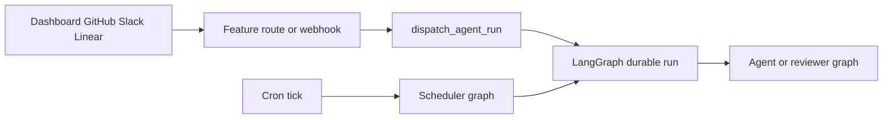

# Open SWE change guide

Open SWE is an asynchronous software factory built around durable LangGraph runs. Dashboard, GitHub, Slack, Linear, and scheduled work can lead to an isolated coding sandbox; separate graphs provide pull-request review, review-style analysis, PR chat, and maintenance scheduling. This is a task-routing page—not a substitute for reading the changed implementation and its focused tests.

## Set up the narrowest local loop

Use Python 3.14+ and `uv` for the Python service. `ui`, `desktop`, and `tests/e2e` are a pnpm workspace; use `pnpm` for those packages. Start with the [local development guide](../docs/DEVELOPMENT.md) when credentials, PostgreSQL, a worktree, or webhooks are involved.

```bash
make install            # uv sync --extra dev
make dev                # LangGraph server on :2024
make run                # FastAPI-only on :8000
make dev-ui             # Vite plus backend, presented through :2024
make web                # dashboard Vite server
make desktop            # Electron client; start a backend separately
```

`make dev` starts local PostgreSQL when `POSTGRES_URI` is absent, then serves the registered LangGraph graphs and HTTP app on port 2024. Use it for graph/runs work. `make run` is useful for FastAPI-only work but cannot create LangGraph runs. `make dev-ui` keeps the browser on port 2024 while the backend fronts Vite on port 3000.

For real local GitHub or Slack callbacks, use `make tunnel NGROK_DOMAIN=<name>.ngrok-free.dev`. Its policy exposes only `/webhooks/*`: `langgraph dev` has unauthenticated LangGraph runtime endpoints, so do not replace this with a whole-port public tunnel. Restart the backend after changing `.env`.

### Repository conventions that affect a change

- Keep implementations async-only. If an interface forces a synchronous method, make it raise `NotImplementedError` rather than maintaining a second implementation.
- Keep Python and TypeScript types precise; do not use `Any` or `any` to suppress uncertainty. Use absolute imports except for a same-package single-dot import.
- Put prompts and user-facing message templates in `agent/resources/prompts/` and load them through `load_prompt` or `render_prompt`; do not inline them in Python.
- Put a dashboard endpoint in the package that owns its feature, not in the dashboard route aggregator. A UI-exposed write should also be an appropriately authorized agent tool unless direct UI mutation is explicitly required.
- Propagate or log every caught failure. Use structured logging with a static message and values in `extra`.

## Find the runtime owner

`langgraph.json` is the deployment registration boundary. It declares five graph entrypoints and `agent.webapp:app`; the modules under `agent/graphs/` are thin re-export shims, so ordinarily change the owner listed below rather than the registration shim. It also sets delete-based checkpoint cleanup: a 60-minute sweep and a 43,200-minute default TTL.

| Registered entrypoint | Change owner | Route changes here |
| --- | --- | --- |
| `agent.graphs.agent:traced_agent` | `agent/server.py` | Coding-agent assembly: model/profile resolution, sandbox preparation, tools, skills, prompts, subagents, and middleware. See [Coding agent assembly](architecture/agent-graph.md) and [middleware boundaries](architecture/middleware-stack.md). |
| `agent.graphs.reviewer:traced_reviewer_agent` | `agent/reviewer.py` | Non-mutating PR review, checkout/diff preparation, findings, publishing, and review recovery. See [reviewer and analyzer graphs](architecture/reviewer-and-analyzer.md) and [PR review](workflows/pr-review.md). |
| `agent.graphs.analyzer:traced_analyzer` | `agent/analyzer.py` | Repository review-style analysis and learned guidance. |
| `agent.graphs.chat:traced_chat_agent` | `agent/chat.py` | Dashboard PR chat and its read-only contextual tools. |
| `agent.graphs.scheduler:get_scheduler` | `agent/scheduler.py` | Cron dispatch, scheduled coding work, CI watches, background tasks, reconciliation, refreshes, and cost/feedback jobs. See [scheduling and monitoring](workflows/scheduling-and-baby-sit.md). |
| `agent.webapp:app` | `agent/api/app.py` | FastAPI composition, dashboard, webhook ingress, plan/approval APIs, health, CORS, and static UI mounting. |



This diagram shows the high-level run-routing boundary: product triggers use shared dispatch, while a scheduler tick either performs a maintenance action or launches scheduled work.

### State and safety boundaries

The coding graph is rebuilt from a stateless factory; continuity belongs to the thread’s LangGraph state/metadata and its sandbox. Do not silently replace an unreachable coding sandbox, because it may hold uncommitted work. The reviewer may replace its sandbox because it recreates its checkout for every review.

The reviewer toolset excludes commit, push, and PR-opening tools. PR chat has no sandbox, seeds diff/findings/overview as `/pr/` virtual files, excludes shell and file mutation, and uses a repository-scoped GitHub App token for GitHub-backed reads. See [threads and durable state](concepts/threads-and-state.md), [sandbox lifecycle](architecture/sandbox-lifecycle.md), and [tools and authorization](concepts/tools.md) before changing these boundaries.

`dispatch_agent_run` is the common contract for Slack, Linear, GitHub, and dashboard agent/reviewer launches. It defaults to interrupting concurrent work on the selected thread, assigns durable-run metadata/configuration, and rejects mixing a prebuilt `input` with content, context, or source identities. For ingress validation and thread selection, start at [inbound invocation](workflows/invocation.md); for continuation semantics, see [follow-up messages](workflows/follow-up-messages.md).

## Route product and operations changes

**Product and delivery.** Use [dashboard and desktop integration](integrations/dashboard-ui.md) for dashboard APIs, UI routing/proxying, streaming, or Electron. Use [PR creation](workflows/pr-creation.md) for commit/push/approval/PR behavior, and [authentication and credential scope](concepts/auth-and-security.md) for login, repository access, webhook verification, OAuth/App tokens, and secrets.

**Configuration and startup.** Read [configuration](operations/configuration.md) for environment and persisted settings, model/provider choice, workspaces, and credentials; read [deployment and service startup](operations/deployment.md) for server topology and packaging. At application startup FastAPI pins one event loop, validates GitHub login, sandbox, and local-development model configuration, requires and migrates the database, imports legacy workspace/user store records, and starts analytics best-effort. Workspace-import failure is logged but keeps repository routing fail-closed; analytics startup failure is warning-only. Shutdown stops analytics and closes the database and cached models. Credentialed CORS is installed only for configured dashboard origins and rejects `*`.

**Extension points.** For model, profile, instruction, skills, and prompt composition, use [models, profiles, and instructions](concepts/models-profiles-instructions.md) and [context engineering](workflows/context-engineering.md). For sandbox selection and provider contracts, use [sandbox provider integration](integrations/sandbox-providers.md). For MCP, browser, and tracing service adapters, use [connected services and observability](integrations/observability-and-mcp.md). The system-level map is [runtime and product architecture](architecture/overview.md).

## Validate only the changed boundary

**Never run the full suite locally.** Read the closest behavior test first, then run its file or a single node id. `make test` defaults to `tests/`, so always provide an existing focused path.

```bash
make test TEST_FILE=tests/github/test_open_pull_request.py
uv run pytest -vvv tests/path/to_test.py::test_name
make lint
make format-check
make typecheck
```

Python tests run in asyncio auto mode. Shared fixtures route `agent.store` through an in-memory fake while retaining production serialization, clear the process-global TTL cache and sandbox registries around cases, and disable a locally built dashboard. They also default the GitHub login allowlist and automatic-review gate; override those fixtures explicitly when testing access or opt-in behavior. Database regressions need `TEST_ANALYTICS_POSTGRES_URI`; the fixture creates, migrates, and drops an isolated schema, while unconfigured database-dependent tests skip.

Choose a focused family matching the owner—commonly `tests/agent/`, `tests/reviewer/`, `tests/sandbox/`, `tests/webhooks/`, `tests/dashboard/`, `tests/github/`, `tests/slack/`, `tests/middleware/`, or `tests/tools/`. See [focused validation strategy](testing/overview.md) for exact ownership and frontend checks.

Escalate to one Playwright spec only for a cross-boundary contract:

```bash
pnpm install --frozen-lockfile
pnpm run test:e2e:install
pnpm exec playwright test tests/full_flow.spec.ts
```

The E2E harness uses real agent code, local sandbox, git remote, dashboard, and Electron paths, while faking the model and external SaaS HTTP boundaries. Browser execution is serial (`workers: 1`); the desktop configuration selects only `desktop.spec.ts`. Prefer the single warm-server spec command above over the browser suite. See [testing overview](testing/overview.md) for E2E artifacts and desktop-focused commands.
