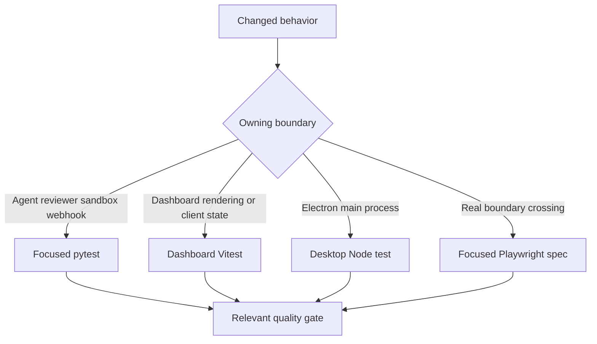
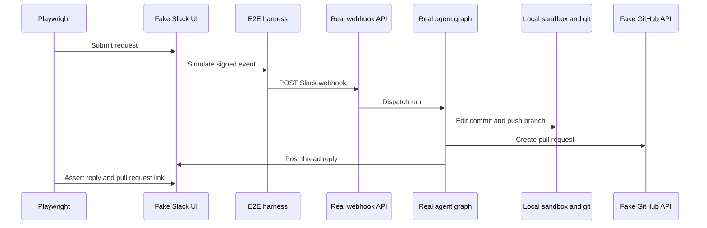

# Testing strategy and focused validation

Validate at the lowest layer that owns the changed **observable** contract. Start with one focused test or test file; do not run the full suite locally. Prefer deterministic assertions about outputs, persisted state, authorization, or user-visible effects over prompt snapshots, constants, internal call order, or source structure. Escalate to Playwright only when the behavior crosses the real webhook, authenticated UI, sandbox/git, or Electron boundary.



This is the validation routing decision: select the narrowest test owner, then add only the independent check that the change requires.

## Python: behavioral contracts and isolation

Pytest collects `tests/` and uses asyncio auto mode, so asynchronous tests and fixtures need no per-test asyncio marker. The agent, reviewer, sandbox, webhook, dashboard/API, GitHub, Slack, middleware, and tools directories provide the usual focused boundary. The default Makefile target is `tests/`, but that is the whole Python suite: do not use it locally without narrowing `TEST_FILE`.

Agent assembly belongs in `tests/agent/test_agent_assembly_context.py`, which captures the arguments passed to `create_deep_agent`. It protects the initialized sandbox-backed composite backend that enables deepagents context eviction and summarization, the source- and visibility-sensitive skills/tools, and middleware and parent-tool boundaries. It also demonstrates the desired assertion style: verify the assembled behavioral capability rather than a prompt string or incidental construction sequence.

### Shared fixtures are deliberate test environment policy

`tests/conftest.py` makes ordinary unit tests independent of local processes and artifacts:

- `fake_store` routes all `agent.store` access through an in-memory `FakeStore`, but preserves the production `model_dump`/`model_validate` round trip. Seed it only when persistence is part of the behavior under test.
- Autouse fixtures point `DASHBOARD_STATIC_DIR` to a missing temporary location, clear the process-global TTL cache before and after every test, and clear sandbox backend/connection registries before and after every test. These prevent a built dashboard, cached workspace settings, or a live sandbox handle from leaking across cases.
- The default auto-review fixture returns enabled for all repositories because the dashboard opt-in list would otherwise be empty without a live Store. A test of the real opt-in gate must replace that stub with its intended policy.
- `registry_db` uses `TEST_ANALYTICS_POSTGRES_URI` to create, migrate, and drop a unique PostgreSQL schema; it skips if the variable is absent. `registry_db_if_available` instead supports code that deliberately degrades when PostgreSQL is unavailable.

### Choose the owner that carries the failure semantics

| Change | Focused location and contract |
| --- | --- |
| Main-agent backend, skills/tools, middleware, model routing, or source/visibility policy | `tests/agent/test_agent_assembly_context.py`; protects initialized `CompositeBackend`/`SandboxBackendProxy` wiring, read-only skill routes, conditional exposure, and parent/subagent separation. |
| Reviewer finding outcomes or feedback learning | `tests/reviewer/test_reviewer_outcomes.py`; maps resolved versus dismissed findings and GitHub/Slack feedback to true/false-positive outcomes, while missing credentials or repository configuration is a no-op. |
| Lazy sandbox reconnect, output capture offload, timeout defaults, or sandbox identity recovery | `tests/sandbox/test_sandbox_state.py`; protects `BaseSandbox` compatibility, delegation or safe fallback, one shared reconnect, cancellation-safe waiting, retry after startup failure, and metadata recovery. |
| Completion status, Slack failure replies, reviewer check cleanup, usage, or deduplication | `tests/webhooks/test_completion_webhook.py`; checks terminal error paths at the notification boundary, including missing metadata/token and cleanup failures. |

## Focused commands and separate gates

Install the Python development set with `make install`, which runs `uv sync --extra dev`; that extra contains pytest, pytest-asyncio, Ruff, ty, and Pygments. `make test` and `make tests` run `uv run pytest -vvv $(TEST_FILE)` only if `TEST_FILE` is an existing file or directory; otherwise they print a skip message. Therefore pass a test path to Make, and use pytest directly for a node id.

```bash
make install
make test TEST_FILE=tests/sandbox/test_sandbox_state.py
uv run pytest -vvv tests/sandbox/test_sandbox_state.py::test_sandbox_proxy_retries_failed_startup
make lint
make typecheck
```

Tests are not substitutes for static gates: `make lint` runs Ruff check plus a Ruff format diff; `make format` applies Ruff formatting and fixes; and `make typecheck` runs `ty check agent tests`.

For a dashboard component/client change, run its workspace test rather than root `pnpm test`; root test delegates workspace `test` tasks to Turbo. For Electron main-process changes, use the desktop workspace test, which builds the main bundle then runs Node's test runner.

```bash
pnpm --filter open-swe-dashboard run test
pnpm --dir desktop run test
```

The dashboard command is `vitest run`; the desktop command ultimately runs `node --test test/*.test.cjs`. Keep browser E2E for behavior that these unit-level scopes cannot establish.

## Playwright: real paths with controlled external seams

The E2E harness is an integration test environment, not a fake agent. It runs the real agent through `langgraph dev`, real webhook routes, deepagents/tools/middleware, a real local-provider sandbox in a temporary directory, and real git against a seeded local bare remote. It substitutes the LLM with a scripted `BaseChatModel`, external GitHub/Slack HTTP and credential boundaries, and the snapshot service. In-memory fake Slack/GitHub stores are rendered by mock UIs, so a browser assertion observes the state the real agent wrote.



This shows the focused browser happy path: the external interfaces are controllable, while the production webhook, graph, sandbox, git, and output behavior remain live.

The harness overlays the real `agent.webapp` application with fake GitHub/Slack endpoints, mock UIs, and control endpoints. Its Slack and GitHub controls sign deliveries before posting them to the real webhook routes, so signature validation and route handling are covered. `full_flow.spec.ts` uses this environment for the Slack request → local implementation → PR → same-thread reply path.

### Dashboard and desktop boundaries

Browser E2E drives the real built dashboard rather than a static or mocked UI. Global setup builds `ui/` with the harness configured as its server-side API/proxy target, starts the resulting Nitro server, and Playwright uses that UI-server origin. This covers SSR, the session gate and redirects, hydration, and same-origin `/dashboard/api/*` proxy calls with a genuine signed session cookie. Set `E2E_FORCE_UI_BUILD=1` after a UI or port change to rebuild instead of reusing the built server.

The browser configuration is serial, excludes `desktop.spec.ts`, and uses a 90-second test timeout. Its desktop configuration selects only `desktop.spec.ts`, uses a 180-second test timeout and a longer expectation timeout, and writes distinct reports/results. The Electron spec resets harness state, clones the seeded remote into an isolated temporary project, injects a harness-issued `osw_session` cookie, makes a local-agent request, and checks both the local edit and fake-GitHub PR fields.

```bash
pnpm install --frozen-lockfile
pnpm run test:e2e:install
pnpm exec playwright test tests/full_flow.spec.ts
pnpm run test:e2e:desktop
```

Install Chromium before the first browser run. The E2E backend also requires `POSTGRES_URI`; see `tests/e2e/README.md` for the local throwaway PostgreSQL setup. Prefer a single spec against the locally reused warm server over the entire E2E suite.

## Diagnosing E2E failures

Browser runs retain screenshots on failure and retain trace/video on failure locally or on the first retry in CI. `E2E_ARTIFACTS=1` captures trace and video for every attempt under `test-results/` and `playwright-report/`. Desktop intentionally disables Playwright's automatic media because the spec starts an Electron trace and attaches screenshots for the unified and completed local-agent views; it removes its temporary state unless `E2E_KEEP_TMP` is set.

```bash
pnpm exec playwright show-report
pnpm exec playwright show-trace test-results/<test>/trace.zip
SLOW_MO=700 pnpm exec playwright test --headed
```

Inspect the trace, screenshot, and fake-boundary state before increasing a timeout or weakening an assertion.

## Related pages

- [Agent graph](/openwiki/architecture/agent-graph.md)
- [Sandbox lifecycle](/openwiki/architecture/sandbox-lifecycle.md)
- [Dashboard UI](/openwiki/integrations/dashboard-ui.md)
- [Quickstart](/openwiki/quickstart.md)
- [Invocation workflow](/openwiki/workflows/invocation.md)
