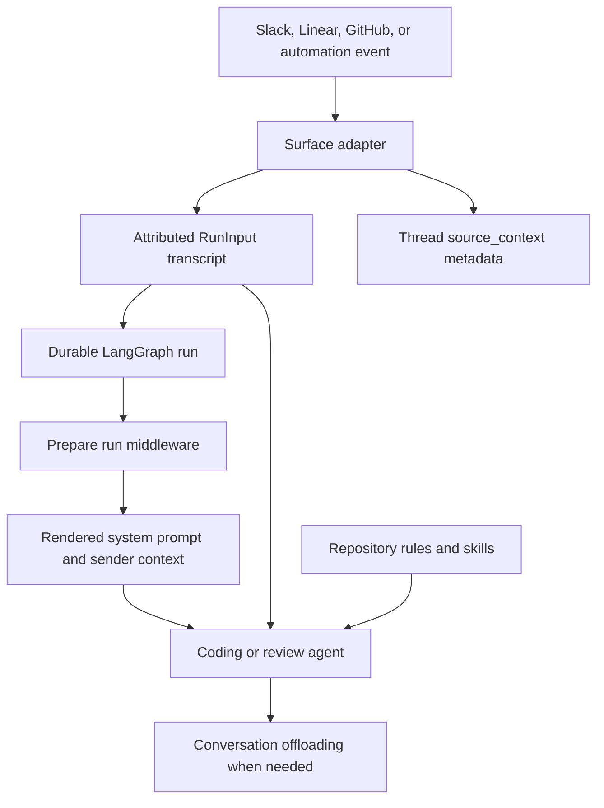

# Repository and conversation context engineering

Open SWE does not pass webhook text straight to a model. It first constructs a durable, attributed `RunInput`; then graph middleware obtains run-specific workspace and identity material; finally the model sees a rendered system prompt, structured input messages, virtual skills, and—when necessary—a summarized conversation. This division keeps event provenance, untrusted user content, repository rules, and operational setup distinct. See [Invocation](invocation.md) for durable-run creation, [Agent graph](../architecture/agent-graph.md) for graph composition, and [Reviewer and analyzer](../architecture/reviewer-and-analyzer.md) for the specialized graphs.

This flow shows the distinct lifecycle of transcript input, durable provenance, per-invocation preparation, and later context compaction.

## Normalize surface input before execution

`RunInput` is the application-owned transcript format: a sequence of user-role messages (including serialized system-originated input) plus optional virtual `files`. `agent/input_messages.py` serializes authored text into escaped `<input-message>` envelopes with namespaced sender IDs, surface, kind, optional channel, and structured data. Text blocks in multimodal content are enveloped, while non-text blocks remain in place. Entity introductions precede messages as content-addressed `<dynamic-context>` blocks. Channel `topic` and `purpose` are explicitly marked `trust="untrusted"`, so channel configuration is not elevated into instructions.

`dispatch_agent_run` is the shared boundary used by surface adapters. It either accepts their deliberately ordered prebuilt input or constructs a one-message input and fallback identity from `RunConfig`; it rejects mixing those modes. Slack fallback uses triggering-user and channel data, GitHub login or Linear email creates a person identity, and an otherwise unattributed event becomes a system identity. It then creates the Protocol-v2 durable run with normalized configuration and metadata.

Surface adapters use prebuilt transcripts where one event represents a conversation:

- **Slack** introduces the channel and each distinct participant, preserves prior thread ordering, distinguishes Open SWE and other bots as system senders, adds operational context, and appends the request under the actual triggering person or allowed bot. The explicit trigger fallback prevents edit and button events from being attributed to Open SWE or to nobody.
- **Linear** sends issue description and issue metadata as system input, then relevant non-bot comments as attributed human input. It chooses comments from the triggering comment onward when possible, otherwise recent comments; fetched images remain alongside their corresponding text blocks.
- **GitHub** treats an existing issue thread as a follow-up/update, but for a new thread fetches and orders the issue comments to establish initial context. GitHub-specific builders carry issue, PR, comment, and location metadata in the structured transcript.

### Identity continuity and durable provenance

A dynamic-context hash is SHA-256 over canonical XML. The builder suppresses an introduction already injected in its supplied registry. However, state visibility—not merely historical presence—controls reintroduction: deepagents summarization replaces messages before its cutoff, so `visible_dynamic_context_hashes` ignores that prefix and permits an identity the model can no longer see to be sent again. Parsing helpers validate namespaced IDs and ignore malformed XML.

`SourceContext` is separate from that model transcript. It is thread metadata (and baby-sit watch metadata) that identifies the originating Slack thread, Linear issue, GitHub issue, and PR for replies and lifecycle behavior. Its Pydantic models accept extras, dump only set fields, and return an empty context rather than raising on invalid historical metadata. That permits read-enrich-write callers to retain unknown fields from integrations or older deployments.

## Assemble prompts at the per-run boundary

The coding graph begins with an empty `system_prompt`. `PrepareAgentRunMiddleware` resolves the sandbox and work directory, workspace settings, sender identity and standing instructions, and records run metadata; it also schedules title work. It constructs the main prompt with the resolved data and adds sender context as fresh structured messages associated with the current sender. It does not mutate a cached historical user message, which would make a later invocation serialize an old message differently.

`BasePrepareRunMiddleware` fingerprints the middleware class, latest message, and relevant configuration. A checkpointed matching `run_prepared_for` latch skips duplicate setup on a resumed attempt; a later message creates a new fingerprint and therefore refreshes credentials, prompt, and context. `_prepare` implementations must be idempotent because failures before the checkpoint can rerun them. Sandbox-unreachable errors are notified and re-raised rather than allowing a run to continue without its workspace. Immediately before every model call, the middleware prepends the rendered prompt to any existing system message.

Prompt content is code-owned under `agent/resources/prompts/`. `load_prompt` permits only relative `.md` resource names with no parent traversal, reads UTF-8 resources from that root, caches them, and `render_prompt` applies template substitutions. `construct_system_prompt` composes the main template from source-specific guidance, working environment, repository setup, plan mode, dependency and commit/PR guidance, custom default prompt, repository instructions, workspace instructions, and optional admin or sandbox-download sections. Sender context separately contains the turn-specific commit identity, participant identities, PR draft policy, collaboration attribution, workspace-admin flag, and user instructions.

The instruction hierarchy is deliberately explicit in the prompt: repository custom and workspace instructions are included as system material, while the repository's `AGENTS.md` rules take precedence on conflict. The root file must be read after repository setup. `SubdirAgentsReadMiddleware` supplements that model-directed root read: after a successful string `read_file`, it tries unread ancestor `AGENTS.md` files from shallowest to deepest and appends a system reminder saying the deepest scope wins. It remembers paths per thread, marks direct `AGENTS.md` reads as loaded, caps reads at 1,000 lines and 64 KiB, and treats absent, unreadable, non-UTF-8, or failed candidates as non-fatal to the original file read.

## Review context is fetched at the base revision

A reviewer may not have a usable checkout when it prepares its prompt, so it fetches conventions from GitHub Contents at the PR **base SHA**. Root lookup tries `AGENTS.md`, then `CLAUDE.md` only if the first request is 404. Any other response, network failure, or a document larger than 64 KiB yields no root convention rather than applying a possibly stale fallback. After the diff is available, changed-file paths determine ancestor candidates; scoped documents are fetched independently with bounded concurrency and are inserted shallow-to-deep. Each applies only below its directory, and deeper applicable documents win.

The reviewer prompt also combines its baseline with organization-wide guidelines, learned repository review style, PR overview and existing review-thread context, fetched conventions, and an API-standards skill when available. PR title and body are author-controlled and are wrapped as an escaped untrusted-data block before insertion. This contextual material refines review decisions but does not relax the reviewer's in-diff anchoring discipline.

## Skills and conversation offloading

Skills are intentionally lazy prompt extensions: `create_deep_agent` advertises skill paths and a routed `CompositeBackend` serves their read-only `SKILL.md` files through ordinary `read_file` calls rather than inlining every skill. Main-agent skill sources vary by hosted, organization, user, and desktop run; bundled skills remain available. The analyzer instead receives its bundled playbooks as `RunInput.files` and exposes `/skills/` through a `StateBackend`; its selected mode determines whether the bootstrap or continual-learning playbook is required. Review-style launchers seed those files and anchor continual work to a deterministic repository analyzer thread.

`ConversationOffloadingMiddleware` replaces deepagents' default summarization middleware while retaining its summarization policy. Its summary model is tagged `nostream` and hidden from tracing output. Automatic compaction emits started, failed, and completed custom stream events and stores completion metadata including the cutoff and summary file path. A run configured for manual offloading executes the compaction hook before a model call, returns no normal model response, jumps to the graph end, and reports `skipped` if no summary is made. The original message history remains state; the summarization event identifies the portion replaced in the model-visible prompt, which is why identity context can be reintroduced.

## Safe changes and focused checks

When extending an adapter, preserve ordering and attach provenance as metadata separately from the transcript. Treat all author-controlled surface content as data; do not turn Slack channel fields or PR descriptions into trusted instructions. When changing preparation, preserve checkpoint idempotency and avoid rewriting historical messages. When changing compaction, preserve cutoff semantics because dynamic-context visibility depends on them.

Focused coverage includes `tests/agent/test_input_messages.py` for XML escaping, multimodal order, hashes, and summarized-prefix visibility; `tests/middleware/test_conversation_offloading.py` for manual and automatic lifecycle behavior; `tests/agent/test_source_context.py` and `tests/agent/test_dispatch.py` for provenance and dispatch contracts; and the convention and skill tests for scoped rule injection, reviewer fetch failure behavior, and virtual-skill routing.
