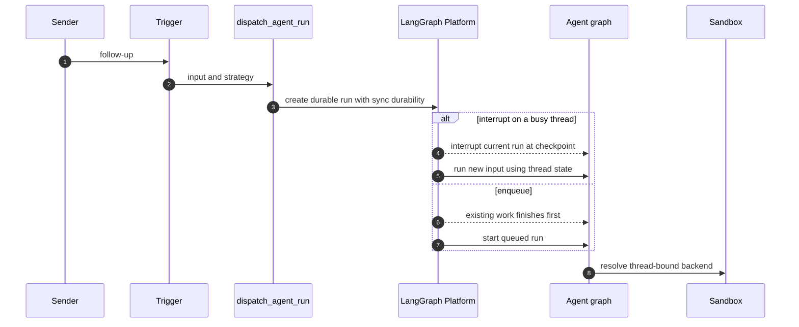
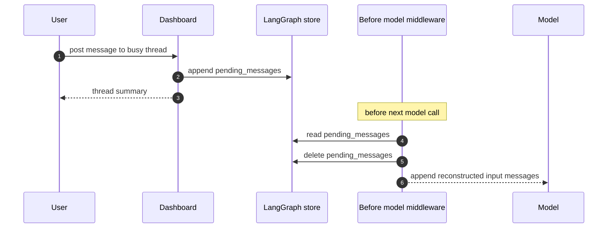
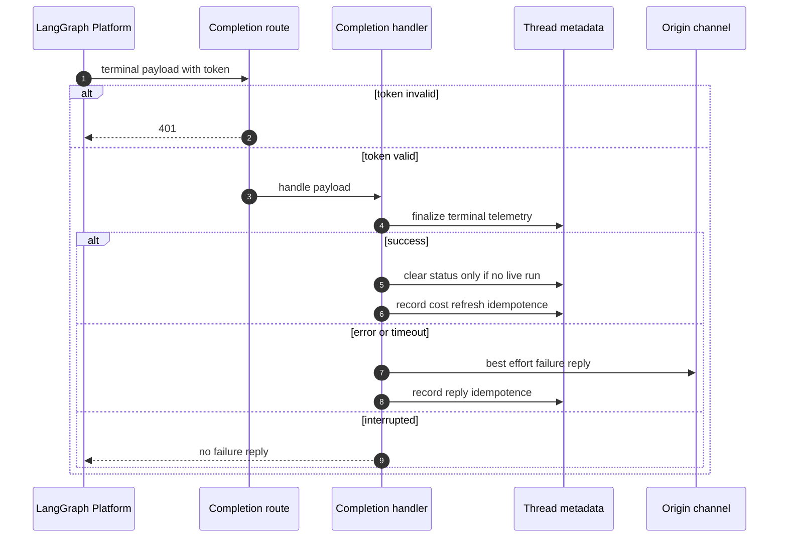

# Follow-ups, interruption, and completion

A thread is the continuity boundary: durable runs use its checkpointed graph state, while its metadata binds the work to a sandbox. A later request can therefore redirect or extend existing work without provisioning a second workspace. This page distinguishes two mechanisms that are deliberately not interchangeable:

- **A durable follow-up run** is submitted with a LangGraph multitask strategy. `"interrupt"` preempts current work; `"enqueue"` waits for work already active on that thread.
- **A store-backed message queue** deposits input for a *currently busy* run. Before its next model call, middleware consumes the queue and adds messages to that same run's state.

The platform is responsible for durable scheduling, checkpoints, and run status. Queueing a message and channel notifications are application behavior: they provide useful handoff and feedback but are not a guarantee that a particular model step or external notification will occur. See [Invocation](invocation.md), [Threads and state](../concepts/threads-and-state.md), [Middleware stack](../architecture/middleware-stack.md), and [Sandbox lifecycle](../architecture/sandbox-lifecycle.md) for the adjacent ownership boundaries.

## Durable follow-up dispatch

`dispatch_agent_run` is the shared agent and reviewer entrypoint. Callers either provide a prebuilt `RunInput`, or provide content and identities from which it builds one; it rejects mixing those two forms. It selects the graph through `assistant_id` and delegates to `create_durable_run`. Agent runs from interactive Slack, web, desktop, and dashboard sources also record feedback activity before dispatch.

`create_durable_run` merges supplied config and metadata, resolves or creates an invocation identifier, records its start time, and enables the `__event_streaming_v2` compatibility marker that selects the v3 event-stream path. It then creates the run with the following defaults:

- `multitask_strategy="interrupt"`, unless a caller explicitly selects another strategy;
- `durability="sync"` and resumable streaming;
- the v3 `values`, `updates`, `messages`, `custom`, `tasks`, and `checkpoints` stream modes with subgraphs enabled; and
- an optional completion webhook.

Sync durability and resumable streams make persisted execution state and later stream attachment platform-backed capabilities, rather than effects of a Slack or dashboard process remaining alive. In particular, the dashboard can attach to an externally initiated run using the same event shape. A caller may pass `after_seconds` for deferred creation, but this does not change the thread-continuation model.

The durable run strategy controls execution ordering; it is distinct from the application message queue described below.

### Sandbox continuity and failure safety

`ensure_sandbox_for_thread` first reads the thread's persisted sandbox metadata. With an existing ID it reuses the process cache when available or reconnects to that sandbox, refreshes its GitHub proxy configuration, and reapplies git identity. With no ID it creates and initializes a sandbox, then persists the ID and publishes the backend only after successful initialization; a failed setup does not leave a half-built sandbox bound to the thread.

An unreachable existing sandbox raises `SandboxUnreachableError` for normal agent work instead of silently replacing it, because a replacement is empty and could hide uncommitted changes. A deleted sandbox (`SandboxGoneError`) is replaceable, and callers such as the read-only reviewer can explicitly allow replacement of an unreachable sandbox because their checkout is re-derivable. Interrupt dispatch serializes normal thread work, avoiding concurrent provisioning for the same thread.

### Choosing interruption or waiting

Slack classifies an explicitly tagged request as an interruption and an untagged follow-up as an enqueued run. Thus a direct request can redirect current work, while conversational context normally waits its turn. A Slack message edit is different again: it is stored in `pending_messages`, not dispatched as an independent run. If the agent is already idle, that correction remains queued until some later run reaches a model boundary.

Automation avoids preempting interactive work. Baby-sit terminal/failure follow-ups and completed sandbox background-task notifications use `multitask_strategy="enqueue"`. The background-task monitor claims a terminal task before dispatch and marks that claim delivered only after submission, releasing it on failure so a later monitor can retry.

## Injecting a dashboard follow-up into a live run

`POST /threads/{thread_id}/messages` calls `send_dashboard_message`. This is a live-run continuation endpoint, not an idle-thread launch endpoint: after post authorization, it checks thread activity and returns 409 when idle or 502 when it cannot determine activity. It refreshes handoff metadata including participants, activity time, plan mode, and an optionally selected model/effort. It constructs a payload with text, `source: "dashboard"`, `surface: "web"`, a GitHub-attributed sender, a unique `queue_id`, and non-text image blocks. Queue insertion failure is a 502. Updating a corresponding Slack handoff indicator is attempted after successful queueing but failures there are logged rather than returned to the caller.

`queue_message_for_thread` stores `{"content": ...}` records at `("queue", thread_id) / "pending_messages"`. It appends FIFO, deduplicates a dictionary payload that has the same `queue_id`, and retains at most the newest 100 records, dropping the oldest overflow. It also notes feedback activity. The read-modify-write is an application-level store operation, so callers should not treat a successful HTTP response as a durable execution guarantee beyond successful queue persistence.

The dashboard queue hands input to the current run at its next model boundary; its response and the optional Slack handoff update do not guarantee that boundary will be reached.

### Queue drain and attribution

`check_message_queue_before_model` runs in both the agent and reviewer middleware stacks; the agent excludes it in `stop_summary` mode. It is a no-op without a thread ID or store. At each model boundary it:

1. reads the batched autofix event at `("autofix", thread_id) / "pending_event"`, deletes it when present, and prepares a system instruction to revisit CI and review feedback;
2. reads `pending_messages`; and
3. deletes the message record **before** converting its content, preventing the same batch from being injected by a later middleware invocation.

It returns a `messages` state update in queue order. If the queue read fails, it still flushes an autofix instruction already assembled; a broader middleware failure is logged and allows the model call to continue.

Messages are rebuilt through `build_input_messages`, not pasted as bare transcript text. Ordinary queued blocks are attributed to `system:thread-queue` on the automation surface. A dashboard payload first emits a dashboard-handoff system message, then an attributed human web message. Dynamic identity context is emitted only for hashes not visible in the current state, respecting the summarization cutoff. Structured envelopes remain separate messages because the transcript parser expects one envelope per message. For payloads containing image URLs, the middleware resolves the model once; unsupported fetched images are omitted with a vision warning, while supplied image blocks remain.

## Stop policies

Both Slack and dashboard stops enumerate all `pending` and `running` run IDs and cancel them with `action="interrupt"`, rather than trusting `latest_run_id`. This is necessary because the visible client may not have created the active run and cached metadata can lag platform execution. Their cleanup and continuation policies intentionally differ.

### Slack reaction and code-channel stop

A `:x:` reaction is resolved either through a Slack reply-to-run mapping or, for a root message, its root timestamp. The handler then verifies that the mapped Open SWE thread's Slack metadata names the same channel and thread timestamp. Only after validation does it claim the Slack event ID, so missing IDs, duplicate deliveries, unmapped replies, and mismatched metadata have no stop side effects.

After canceling live runs, Slack stop deletes both deferred records (`pending_messages` and the autofix `pending_event`), marks metadata `latest_run_status="interrupted"`, and records `stop_requested_at_ms`. It dispatches a `stop_summary` agent run and maps that run back to the Slack thread. The summary mode excludes the message-queue middleware, and its dedicated prompt constrains the turn to a concise, read-only summary rather than task continuation. Cancellation or deferred-work cleanup failure prevents summary dispatch.

A code-channel `agent_session_stopped` event applies cancellation, deferred-work cleanup, and interrupted metadata to the session thread, then sets the Slack session back to `active`; it does not start a summary run.

### Dashboard stop and queued continuation

The authorized dashboard stop cancels all live work and marks the thread interrupted **without deleting** queued messages. When `pending_messages` exists, it submits an empty-input agent run, which lets the before-model middleware drain that preserved queue, then records the new pending run ID. If that dispatch fails, the endpoint returns 502 even though cancellation was already requested. The administrative variant performs cancellation and status update but no queued continuation.

## Completion, status, and failure replies

A completion callback is attached only if `RUN_COMPLETE_WEBHOOK_SECRET` is configured and `COMPLETION_WEBHOOK_URL` is an absolute non-loopback HTTP(S) URL. The dispatch helper otherwise omits the webhook so invalid configuration cannot make run creation fail. The public `/webhooks/run-complete` route verifies the query token with a fail-closed shared-secret comparison, rejects bad tokens with 401, and accepts only JSON objects for completion handling.

The callback is authenticated terminal handling; channel replies and status updates are best-effort side effects, not a substitute for durable run execution.

`handle_run_completion` finalizes agent usage telemetry for `success`, `error`, `timeout`, and `interrupted` payloads that carry a usable invocation ID. For successful non-reviewer runs it settles Slack or code-channel activity only after checking that no pending/running run remains, schedules answer feedback unless the run is an automated thread wakeup, and schedules Slack session-cost refresh once per run ID. For `error` and `timeout`, it may settle a reviewer check and posts a source-appropriate Slack, Linear, or GitHub failure notification. `interrupted` is intentionally not a failure: it is the normal terminal state of work superseded by an interrupting follow-up. Failure replies use run-scoped metadata deduplication (bounded to 20 IDs), with a legacy thread-level fallback when a payload lacks a run ID.

## Focused tests and safe changes

`tests/slack/test_slack_stop.py` covers mapped-reply and root reactions, cancellation of both pending and running runs, cleanup of deferred work, metadata updates, stop-summary mapping, non-owner reactions, duplicate and missing event safety, mapping mismatch rejection, cleanup/cancellation failure, and the code-channel no-summary path. When changing follow-up behavior, preserve the distinction between platform scheduling and store injection; audit both stop policies before altering queue cleanup; and test out-of-order terminal callbacks so they cannot clear a status for newer work.
