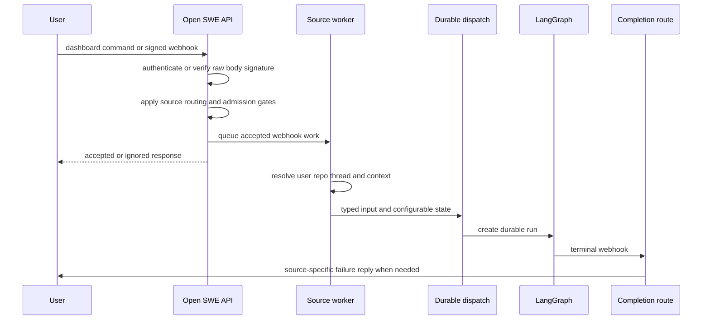

# Inbound Invocation to Durable Run

Open SWE admits work from an authenticated dashboard, signed integration callbacks, and automation. The sources have different authentication, routing, identity, and thread-selection rules, but integration workers converge on a durable LangGraph run with source context and typed messages. This page focuses on that boundary; see [Threads and state](../concepts/threads-and-state.md), [Dashboard UI](../integrations/dashboard-ui.md), [Follow-up messages](follow-up-messages.md), and [Scheduling and baby-sit](scheduling-and-baby-sit.md) for adjacent behavior.

## End-to-end path

This sequence shows the source-specific admission paths converging on a LangGraph run and the independent completion callback.

`create_app` mounts dashboard, plan, workflow-approval, Linear, Slack, health/completion, and GitHub routers. Startup validates dashboard login policy, sandbox and local-model configuration, and database setup; repository import failures leave GitHub repository routing fail-closed, returning `503` so GitHub retries instead of silently losing a delivery. CORS credentials are never combined with a wildcard dashboard origin.

## Admission before dispatch

### Dashboard commands

The dashboard proxy requires `application/json`, authenticates and authorizes reads/posts against thread metadata, then forwards permitted commands to the LangGraph thread command endpoint. Only a missing-thread `run.start` can lazily create a thread; any other method receives `404`. A start on a busy existing thread is rejected with `409` rather than creating concurrent dashboard work.

Before forwarding `run.start`, the proxy requires the caller's GitHub token, assigns a fresh invocation identity and start time, resolves configuration, and turns the caller's content into a typed web input attributed to `github:<login>`. Creation stamps the dashboard thread's owner, visibility, repository, model and other metadata; image content is validated against the resolved model. On a successful start, the proxy records the pending run and observes time to first assistant text. A desktop invocation is recognized only by `source="desktop"`; its shell backend refuses a local project path unless it resolves to a configured allowlist entry or a worktree beneath `OPEN_SWE_LOCAL_WORKTREES_DIR`.

### Signed webhooks

GitHub, Linear, and Slack verify platform signatures on the *raw* body before JSON parsing and return `401` for failure. Slack signature verification includes the request timestamp, therefore replay protection is part of verification. Accepted integration work is normally queued in FastAPI `BackgroundTasks`, keeping remote API calls, history gathering, and durable-run creation out of the delivery response.

GitHub first verifies that a repository is owned by a workspace. A transient workspace lookup error yields `503`; an unowned repository is ignored. It then distinguishes PR actions, pushes, CI events, issues, issue/PR comments, and review-finding replies. Normal issue/comment work must be allowlisted, satisfy the public-repository organization gate, and mention Open SWE; PR auto-review and push paths additionally require auto-review to be enabled. GitHub issue opening can also launch matching issue automations, with a delivery claim preventing duplicate automation launches.

Linear accepts only non-bot `Comment` `create` events that mention Open SWE. It selects a repository from explicit comment text, then the author's dashboard default, then the workspace default, and rejects absent or non-allowlisted choices. The worker derives the stable thread from the Linear issue id, maps the comment author (then creator, then assignee) to GitHub identity, persists Linear source context, and builds a system issue message plus per-author human comments before dispatching. Images may cause a vision-capable model fallback.

Slack has the most selective routing because a delivery is also a conversation turn. It blocks channels that are externally shared or unverified. An app mention in an external channel receives a one-time refusal only after the event claim succeeds. It drops self/bot messages unless an explicitly allowed bot satisfies its additional checks, validates that a message edit retains identity and changes visible text, and outside code channels admits only mentions, DMs, ready-plan replies, or qualifying untagged two-party replies. A code channel is one shared session: all messages use its session timestamp and are treated as directed turns.

Slack claims the event before it schedules normal work, so only a claimed delivery can create a Slack run. It resolves the agent thread by preferring an explicit stored Slack-location binding, then a unique metadata match, and finally a deterministic ID. More than one metadata match, or a conflicting binding, is an error: the route refuses to guess. The worker loads profile and conversation context, resolves the mapped user's GitHub credential, and does not dispatch if the credential is missing unless bot-token-only operation applies. Explicit requests use `multitask_strategy="interrupt"`; ordinary follow-ups use `"enqueue"`. Edits are processed as updates to the established thread rather than a separate conversation.

## Thread, attribution, and input contract

Thread IDs are a persisted cross-process routing contract. Slack locations, Linear issue IDs, GitHub issue/PR identities, and reviewer PR identities must reproduce the same ID to rediscover state. An Open SWE branch can carry an embedded UUID for a coding PR; otherwise PR comments use the deterministic PR key. Changing a formula, namespace, or stable input string strands existing threads.

GitHub PR comment processing illustrates the contract: it recovers the branch UUID or derives the PR thread, resolves the author's token, retries token resolution once after a `401`, reacts with eyes, loads comments since the last Open SWE tag, and builds typed human messages. Reviewer work is deliberately separate: automatic reviews, re-reviews, and review-finding replies use `reviewer_thread_id` and `assistant_id="reviewer"`, rather than the coding-agent thread.

The graph boundary takes `RunInput`, not an unstructured prompt convention. `human_input` and `system_input` enforce their respective kind, serialize authored text into XML-escaped `<input-message>` envelopes, and carry sender, surface, channel, and structured data. Dynamic identity/context introductions are SHA-256 hashed so previously visible introductions can be omitted; Slack channel topic and purpose are marked `trust="untrusted"`.

## Shared durable dispatch

`dispatch_agent_run` is the common agent/reviewer creation contract. A caller supplies either prebuilt typed input or raw content and identities, never both; the wrapper synthesizes identity only for the latter case and calls `create_durable_run`. The source selects logging/metadata behavior while `assistant_id` selects the agent or reviewer graph.

`create_durable_run` defaults to interrupt multitasking, synchronous durability, creation of a missing thread, and resumable streaming. It adds the v3-compatible streaming marker, all supported stream modes, and subgraph streaming. `prepare_run_config` resolves a supplied `invocation_id` or legacy `prepare_run_id`, rejects conflicts or malformed IDs, otherwise creates one, then writes both names and a common invocation start time into configurable state and metadata. This correlation is used by terminal processing and telemetry.

A completion callback is optional by design. Dispatch attaches it only when `RUN_COMPLETE_WEBHOOK_SECRET` is configured and `COMPLETION_WEBHOOK_URL` is absolute and non-loopback; invalid local configuration disables completion callbacks instead of causing every run creation to fail. The receiving `/webhooks/run-complete` route fails closed on the query token before parsing JSON.

## Completion and operational failure behavior

Completion finalizes invocation usage telemetry for terminal statuses when it can resolve the invocation identity. Successful non-review runs settle Slack/code-channel status, may schedule an answer-feedback prompt, and schedule a deduplicated Slack session-cost refresh only when Slack source context and a valid invocation id exist.

For `error` and `timeout`, completion best-effort settles an unfinished reviewer check, clears Slack/code-channel presentation only after confirming no pending or running replacement run remains, and posts a failure reply through Slack, Linear, or GitHub according to source metadata. Failure replies are deduplicated per run ID; legacy payloads without one use a thread-level flag. `interrupted` is deliberately not a failure reply because interruption is normal when a later explicit turn replaces a run. Automated thread-wakeup failures are also silent.

## Schedules and automations

The scheduler graph dispatches task-specific work and treats a schedule tick without a task as `launch_scheduled_agent_run`. Schedule launch rejects disabled/mismatched records and rechecks workspace repository access before starting. Each execution creates a fresh UUID thread with system ownership and automation metadata, builds a system-attributed typed input, and uses the same `create_durable_run` contract. When a schedule is configured to always notify Slack, it creates and binds the Slack root message before dispatch; posting failure stops the run so notification context is not lost.

GitHub issue automation is another automation entry: matching schedule records claim the GitHub delivery per schedule before launch and release the claim if launch fails or does not start. It therefore shares the durable schedule-run machinery while retaining event-specific duplicate protection.

## Safe changes and focused verification

- Keep webhook signature verification on raw bytes before parsing, and preserve Slack event claims and channel eligibility gates. Test signature failure, retries, external-channel refusal, bot/self filtering, edit validation, and directed-message admission.
- Treat `agent/thread_ids.py`, persisted Slack bindings, `SourceContext`, and invocation-id aliases as compatibility surfaces. Test conflict rejection rather than adding fallback guesses.
- Put new sources through `dispatch_agent_run` or `create_durable_run`; test durability defaults, v3 stream configuration, invocation correlation, and safe completion-webhook omission in `tests/agent/test_dispatch.py`.
- Test dashboard command content type, lazy creation, busy-thread rejection, attribution/structured input, image checks, and command authorization in `tests/dashboard/test_dashboard_thread_api.py`.
- Test completion status handling, source-specific replies, per-run deduplication, reviewer cleanup, and intentional silence for interrupted or automated wakeup failures in `tests/webhooks/test_completion_webhook.py`.
