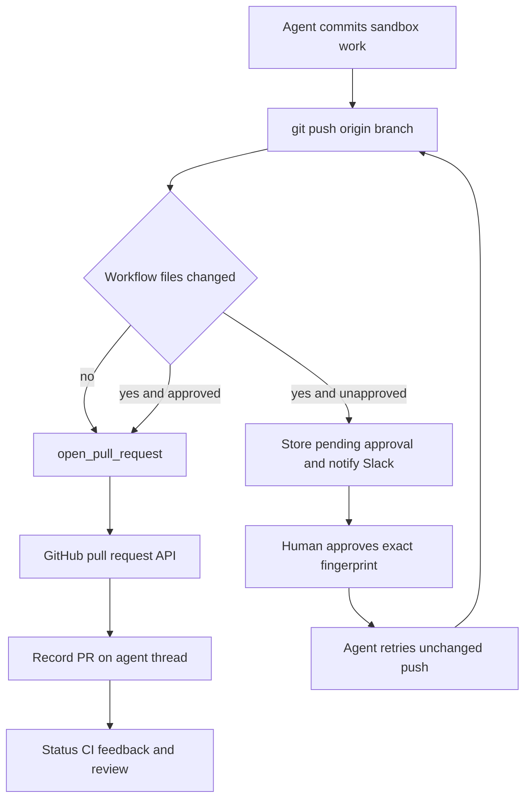
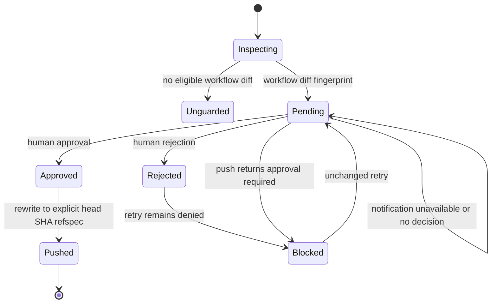

# Code delivery and pull-request creation

Delivery is **commit → push → open or update a PR → react to CI and review feedback**. The normal sandbox and branch preparation are covered in [Sandbox lifecycle](../architecture/sandbox-lifecycle.md). This page documents the delivery boundary: new PRs must go through the attributed `open_pull_request` tool, while a push that changes GitHub Actions workflows must cross an explicit human-approval boundary. Thread PR records carry the result into Slack, dashboard status, lifecycle handling, and follow-up work.

Caption: a workflow-file change cannot reach GitHub until a person approves the computed change fingerprint; ordinary code pushes proceed to PR creation.

## Create or update a PR

Push the branch to `origin` before opening a new PR, then call `open_pull_request(owner, repo, head, base, title, body, draft=True, resolves_thread=False)`—not `gh pr create`. The result carries URL, number, author, token kind, and `created`; `created=False` means the head branch already has an open PR and should be updated with `gh pr edit` rather than duplicated. A 422 create response triggers that open-PR lookup.

`open_pull_request` determines authorship from the thread's credential scope. User-owned threads use the authenticated requester’s GitHub login and retrieve that login's current OAuth token; absence or expiry is an authorization failure, not a fallback to a bot. System-owned threads have no PR author login and use the GitHub App installation token. In a public, user-owned thread, a user token is additionally allowed only after the tool verifies that the target repository belongs to the workspace App installation, unless the run has private credentials. This keeps user-attributed publication within the workspace boundary; see [Authentication and security](../concepts/auth-and-security.md).

Before its POST, the tool reads the repository and the base branch, and also reads the head branch when it belongs to the target owner. It reports distinct repository/App-access, branch-visibility, and other preflight failures (`github_app_access_missing_or_repo_not_found`, `github_pr_branch_not_visible`, and `github_pr_preflight_failed`), including GitHub status, selected response headers, and a bounded response body. A missing token is separately reported as `no_github_token`.

### Drafts, references, and resolution intent

`draft` is only an input default: a non-null `RunConfig.draft_prs` preference wins when a new PR is posted. The server populates that setting from the sender profile, whose default is draft PRs. Duplicate discovery does not mutate an existing PR.

Unless the supplied body already has `## References`, the tool can add a dashboard plan link and a Slack thread, Linear-ticket, or GitHub-issue source link. Source links are added only if GitHub positively confirms the destination repository is private; an error or an indeterminate response omits them, avoiding accidental publication of private conversation URLs.

Set `resolves_thread=True` only for a PR intended to complete the work. The tool persists that intent with the PR record. Lifecycle webhooks update linked PR records and resolve an agent thread only when every tracked PR is closed or merged and at least one tracked record has this flag. If all are terminal without it, the thread receives `attention_reason="prs_closed"`; reopening clears the attention state and reverses prior PR-driven auto-resolution.

## Record delivery without losing a successful PR

After creation or duplicate discovery, `_record_pr_telemetry` fetches details, records usage and `pr_opened` feedback, and upserts normalized `pull_requests` metadata plus legacy PR fields and `pr_urls` on the thread. A record includes repository/number identity, branches, author, diff statistics, normalized `draft`/`open`/`closed`/`merged` state, and resolution intent; it is also saved in the pull-request registry to link threads to lifecycle events.

For an active Slack code-channel session it refreshes the repository context, registers a PR resource, and sets a diff view only for a successful nonempty diff fetch. This is best effort: a telemetry or registry exception is logged and must not convert a GitHub PR that already exists into a failed tool result. The outer telemetry sequence is not transactional, so a preceding exception can prevent later auxiliary updates.

## Enforce safe mutations

### Prevent unattributed shell fallbacks

`PullRequestCreationGuardMiddleware` wraps `execute` and `background_execute` for hosted main-agent runs. It blocks shell creation outside `open_pull_request`: `gh pr create`, `gh api` creation of `/pulls`, and `curl` POST/body submissions to GitHub's pulls endpoint. It tokenizes command forms and expands supported `bash`, `dash`, `sh`, and `zsh` `-c` nesting to a bounded depth; exceeding the depth is blocked rather than treated as safe.

The returned `PullRequestCreationFallbackBlocked` tool error has code `pr_creation_fallback_blocked` and is non-recoverable by the agent. Its purpose is to surface the attributed tool's actual failure instead of hiding it with a PR authored by another identity. This guard is omitted for local runs. The independent workflow guard is installed on both main agents and subagents.

### Approve workflow changes before the push

`WorkflowPushGuardMiddleware` deliberately recognizes only conservative, standalone `git push origin <refspec>` commands, including `git -C`, `cd ... &&`, and `--set-upstream` variants. Unsafe shell syntax, non-`origin` forms, non-current branches, and ambiguous refspecs are not interpreted or rewritten. For an eligible current-branch push, it inspects the sandbox repository, compares against the remote branch or merge base, and lets the original command run unchanged if no `.github/workflows/` path changed.

When workflow files did change, the guard gathers the binary diff, bounded preview, file/addition/deletion statistics, base/head SHAs, normalized remote, and whether a merge introduced workflow changes from a base branch. A SHA-256 fingerprint over the exact delivery identity and diff keys a `workflow_push_approvals` record in thread metadata. Records hold the review fields, notification state, request time, and eventual decision/actor/time; persistence retains the 20 newest entries.

Caption: approval is attached to one fingerprint, so a changed workflow diff returns the delivery attempt to pending approval rather than reusing an earlier approval.

An approved fingerprint causes the middleware to replace the command with a safe explicit `<head_sha>:refs/heads/<branch>` refspec before executing it. Otherwise it returns `WorkflowPushApprovalRequired`, ensures a pending record, and attempts a Slack interactive approval request. It posts only while `notified` is false, and marks notification complete only after Slack returns a message timestamp without an error. A rejected record remains blocked. Since the fingerprint includes the diff and refs, a workflow-file change requires a fresh decision.

The workflow-approval router uses a session and same-origin mutation protection. Listing needs a readable thread; approval and rejection require a promptable thread. Both record the authenticated session subject as actor. Approval dispatches an agent follow-up that instructs it to retry the blocked push without altering workflows; rejection only persists the denial. This is the human boundary, not an automatic retry authorization.

## Observe CI, feedback, and review

`request_pr_review` is a review handoff, not PR creation: it parses a GitHub PR URL, resolves the active Slack thread and triggering identity, then delegates to `trigger_pr_review_from_ref`. Use it for an explicit reviewer request; see [PR review](pr-review.md).

CI readers paginate GitHub check runs and legacy commit statuses and return `None` on permission or HTTP failures, keeping webhook handling best effort. Auto-fix candidates are completed checks with `failure`, `timed_out`, or `action_required` conclusions; Open SWE’s own check names are excluded. The auto-fix path removes names already failing at the base SHA and fails closed unless an unmentioned requester has `write`, `maintain`, or `admin` repository permission. CI webhook helpers normalize branch, head SHA, and completed-failure state across `check_run`, `check_suite`, `workflow_run`, and legacy `status` events; the baby-sit handler proceeds only for a failure matching an active watch.

For GitHub review feedback, `fetch_pr_comments_since_last_tag` merges issue comments, inline comments, and nonempty reviews in chronological order. A first configured Open SWE mention yields all context; later mentions yield material after the preceding mention. Mention matching rejects handles that are merely prefixes of longer handles. Bodies are sanitized, and text from untrusted authors is wrapped before prompt inclusion.

## Dashboard status contract

For each tracked PR record, the status service independently fetches the live PR and unresolved GraphQL review threads, then checks check-runs and legacy statuses for a valid live head SHA. It reports live open/closed/merged state, draft state, merge-conflict state, linked failing checks, pending and inconclusive counts, and unresolved review-thread information.

The response is intentionally partial rather than falsely healthy. `statusAvailable`, `checksAvailable`, and `commentsAvailable` distinguish portions that GitHub supplied; invalid records, missing permissions, malformed payloads, and transient failures leave their relevant fields unavailable. Dashboard consumers must honor those flags.

## Focused verification

`tests/github/test_open_pull_request.py` covers access preflight, duplicate behavior, references, and recording behavior. `tests/github/test_pr_creation_guard.py` exercises direct and nested shell fallback detection. `tests/agent/test_workflow_push_guard.py` verifies parsing, sandbox diff/fingerprint construction, notification, inherited workflow identification, and approved SHA-ref rewriting; `tests/agent/test_agent_assembly_context.py` confirms the subagent guard. CI and feedback behavior is covered by `tests/github/test_github_ci.py`, `tests/github/test_baby_sit_webhook.py`, and comment tests.
