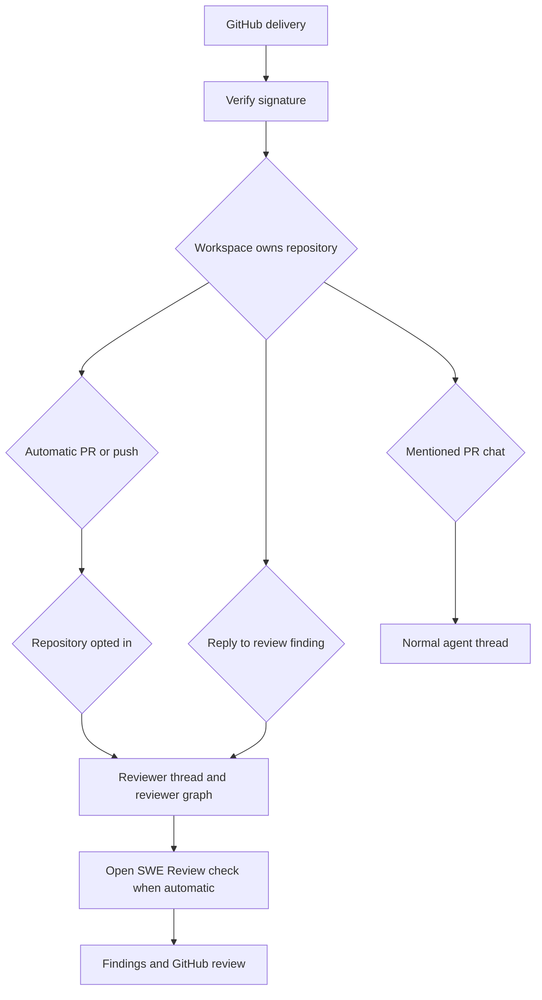
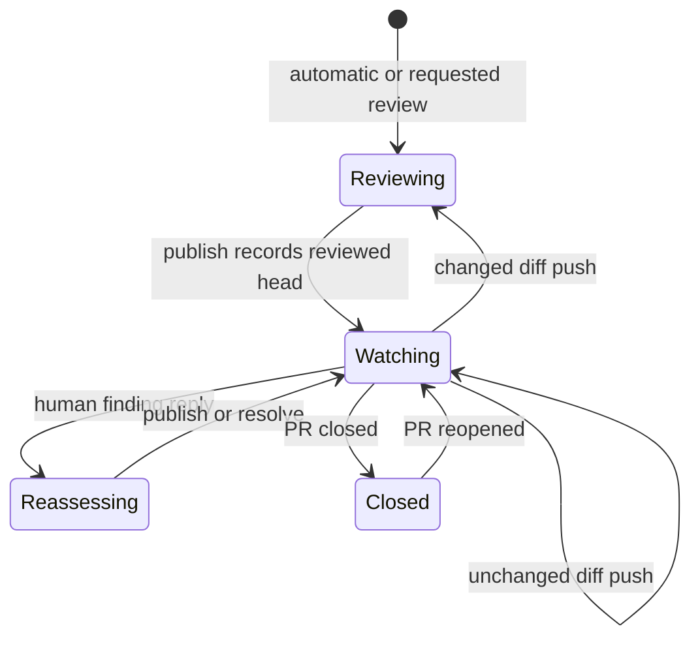

# Pull-request review workflow

Open SWE has a dedicated `reviewer` graph for pull-request review. It is deliberately separate from **PR chat**, where a mention routes work to the normal agent thread, and from **coding-agent changes**, which create or update a branch and PR. A review has a deterministic, durable reviewer thread per PR, so first reviews, watched pushes, and finding replies share findings and GitHub identities rather than becoming independent conversations. See [Reviewer and Analyzer Architecture](../architecture/reviewer-and-analyzer.md), [Invocation Workflow](invocation.md), and [PR Creation Workflow](pr-creation.md).

## Admission and entrypoints

`POST /webhooks/github` is signed ingress: it verifies `X-Hub-Signature-256`, rejects bad signatures, ignores unsupported event types/actions, parses JSON, and schedules accepted handlers as FastAPI background tasks. Before event-specific work, a repository named in the delivery must be assigned to a workspace; an unreadable ownership lookup returns `503` so GitHub retries, while an unowned repository is ignored. Automatic-review PR and push paths also require the repository to be opted into automatic review. The enabled-repository store is fail-soft: missing configuration or a read failure means disabled, avoiding surprise reviews and webhook failures.

Automatic first review accepts `opened` and `ready_for_review`. A draft additionally requires the author's `review_draft_prs` profile override, or the owning workspace default when no override exists. The public-repository organization gate applies to automatic PR review and comment/reply paths.

There are three intentionally distinct interaction paths:

- **Automatic review:** PR lifecycle and watched-push webhooks dispatch `assistant_id="reviewer"`; automatic first reviews and changed-diff push re-reviews create an **Open SWE Review** GitHub check.
- **Explicit review request:** `request_pr_review` parses a GitHub PR URL, retains an active Slack thread when available, and calls `trigger_pr_review_from_ref`; the dashboard uses the same entrypoint. It fetches PR metadata, records `watch=True` and the live head on the reviewer thread, posts a transient review-started PR comment, then dispatches the reviewer.
- **PR chat and coding work:** mentions in PR comments/reviews are handled by `process_github_pr_comment` and queue a normal agent run on a branch-derived or PR-comment thread. They do not become reviewer findings or a reviewer check. The reviewer graph exposes finding and review-thread tools, not code-authoring tools.

The ingress flow keeps automatic review, interactive PR chat, and coding-agent work on separate execution paths.

## Durable reviewer state

`reviewer_thread_id(owner, repo, pr_number)` is UUIDv5 over `"{owner}/{repo}/pr/{pr_number}/reviewer"`. Webhooks, dashboard reads, and reviewer tools re-derive it; its exact formula is therefore a persisted routing contract whose change would orphan active reviewer state.

The LangGraph thread metadata, marked `kind="reviewer"`, owns PR identity, `head_sha`, `last_reviewed_sha`, `watch`, optional Slack origin, current run/check state, and the evolving `findings` list. This survives replaceable sandbox instances and can be queried across threads. `assistant_id="reviewer"` maps to `agent.graphs.reviewer:traced_reviewer_agent`.

A finding captures location and side, severity, confidence, title, description, fingerprint, lifecycle (`open`, `resolved`, or `dismissed`), and GitHub publication/thread identities. Reads normalize older singular identity fields and a nested `surface` record into canonical ID lists and forward-only `surface_state`. Mutations are serialized per reviewer thread/event loop, re-read fresh metadata, and write only on change; snapshot replacement merges by ID and append deduplicates open findings by fingerprint. If the backing thread is gone, tools return a structured `thread_not_found` result that says not to retry.

## Preparation and finding discipline

Before the model runs, `PrepareReviewerRunMiddleware` obtains and caches a GitHub App token for the thread, creates or replaces an unreachable reviewer sandbox, and prepares the checkout. It materializes the PR diff for a first review or the `last_reviewed_sha`-to-head range for a re-review, then computes a per-file/per-side changed-line set. It also loads PR overview, existing review threads, organization and repository guidance, base-branch `AGENTS.md`/`CLAUDE.md` conventions, and applicable trusted skills. Existing PR descriptions and thread bodies are attacker-controlled data: they are delimited and escaped so they cannot close their data blocks or become instructions.

The prompt requires concrete, changed-line defects and excludes style-only, speculative, pre-existing, and out-of-diff reports. Repository conventions can establish a meaningful rule—for example an architectural or documentation requirement—but a resulting finding must still be in the diff and describe a concrete failure mode.

`add_finding` requires a generated non-default title, valid severity/confidence/side values, and a nondecreasing range. It normalizes a one-ended range, validates it against the prepared changed-line set when available, and returns `success: false`, `in_diff: false`, and a do-not-retry message for an invalid anchor. A line-less file finding may be recorded but cannot produce an inline GitHub comment. Suggestions over `MAX_SUGGESTION_LINES` (4) are removed while retaining the description-only finding.

## Publishing findings and checks

Publication first reconciles stored findings against live GitHub threads and resolves the effective head from thread metadata, because a push can update that metadata while a run retains a frozen configuration. It considers only unpublished, open, in-diff findings; a re-review further limits candidates to findings first seen at the current head. The severity filter defaults to `medium`, orders critical through low then file/line, and normally caps output at `REVIEW_FINDING_CAP` (6). Confidence is retained for calibration, not publication gating.

`publish_review` sends eligible findings as one GitHub PR Review. Each inline comment uses `path`, `line`, and `side` (and a range when applicable), a hidden finding marker, generated heading, explanation, and optional fenced suggestion. The host-formatted summary carries its own marker, links where configured, and reports lower-severity findings as additional web-app-visible items. The returned review, comment, and GraphQL review-thread identities are recorded onto findings so future reconciliation can avoid duplicates and resolve the correct threads.

A re-review with nothing new skips a duplicate summary only when a prior Open SWE review is known, but it still resolves fixed threads, advances `last_reviewed_sha`, clears the transient status comment, and settles its check. Eval mode is dry-run and persists only evaluation-publication metadata. A numeric `review_id` with neither `dry_run` nor `skipped_empty_re_review` denotes an actual newly posted review. For GitHub's unresolved-anchor `422`, the tool identifies invalid anchors using the current diff, drops them, and retries the remaining batch once; otherwise it returns `unresolvable_findings` with a fix-or-resolve hint rather than inviting identical retries.

## Watch, reconciliation, and interactive follow-up

This lifecycle is for reviewer state; PR chat and coding-agent runs do not enter it.

`closed` disables watch and `reopened` enables it. `converted_to_draft` disables watch only when the author's effective draft-review setting is off. A watched push must name an open PR with an existing reviewer thread; it is skipped if `watch` is false or the head equals `last_reviewed_sha`. When comparison proves the base-to-head diff unchanged, the system advances `last_reviewed_sha` and creates then completes a **No new changes to review** success check on the new head, since GitHub displays checks only for the current commit. For a changed diff it best-effort reconciles threads, updates metadata, creates an in-progress check, and dispatches `re_review=True` with the prior reviewed SHA. A `ready_for_review` event similarly re-reviews only when its head differs from an existing reviewed SHA.

Reconciliation matches a finding to live review threads by its embedded marker first, then recorded thread/comment identity. It backfills identity and marks the finding surfaced, records the latest non-bot reply after the bot comment as an interaction needing reassessment, and changes an open finding to resolved only when all matched threads are resolved. Outdated threads are terminal but do not qualify as resolved. It writes only when something changed.

A non-bot reply to an Open SWE inline review comment is routed before ordinary mention handling. The handler reconciles, finds the parent comment's finding, stores the reply interaction, and dispatches a focused run with `reviewer_event="finding_reply"`. The reviewer can then respond, dismiss, or resolve through its review-thread tools.

Automatic first-review and changed-push paths create an **Open SWE Review** check and persist `review_check_run_id`. Publishing settles the check and clears that ID only after the completion PATCH succeeds; a failure retains the ID and stores the intended `review_check_pending_result`. The after-agent `settle_review_check_on_exit` middleware retries that intended result when present. If the run never published, it closes the remaining check as `neutral`, not failure, because an incomplete review is infrastructure failure rather than a verdict on the PR.

## Operations and focused tests

Enable automatic review explicitly in the enabled-review-repositories store; GitHub App installation alone is not opt-in. When a check appears stuck, inspect the reviewer-thread `review_check_run_id` and `review_check_pending_result`, token availability, and sandbox preparation. A `thread_not_found` finding-tool response is terminal for that run.

`tests/reviewer/` covers PR admission/draft gates, watched-push and unchanged-diff short circuits, public-token scoping, finding validation/storage, reconciliation, and review publication/check behavior. In particular, `test_reviewer_watch.py` asserts branch-deletion and non-watching skips, unchanged-diff check settlement, changed-push re-review configuration, head idempotence, token scoping, and watch lifecycle transitions.
