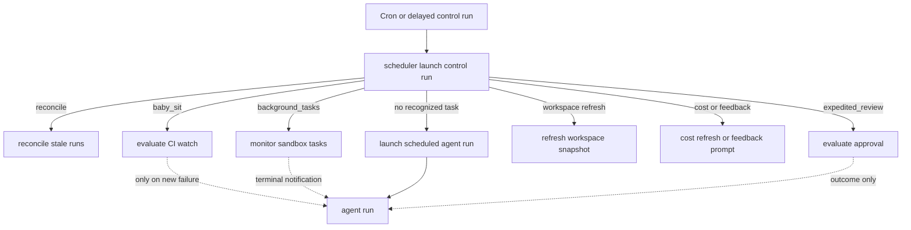
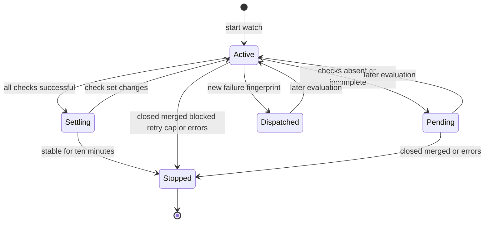

# Schedules, monitoring, and background work

The `scheduler` assistant is the system's bounded automation control plane. It performs no LLM decision-making: a cron or delayed run reaches one router node, which either performs maintenance itself or deliberately dispatches a separate `agent` run. Producers own the lifecycle of the cron or delayed run they create.

## Dispatch: control runs versus work runs

`agent/scheduler.py` is a single-node LangGraph `StateGraph` registered as `scheduler`. It reads `task` from the state or configurable run data and routes to an explicit handler. Task-specific branches return a `missing_watch_key` or `missing_thread_id` result when their routing key is absent; the dashboard schedule fallback similarly returns `missing_schedule_id`. A malformed control tick is therefore an observable no-op, not an exception that crashes the cron.

Diagram: the scheduler control run is separate from the agent run it may enqueue; several branches are entirely model-free.

Recognized maintenance tasks include `reconcile`, `baby_sit`, `expedited_review`, `background_tasks`, `workspace_refresh` (and legacy `environment_refresh`), `session_cost`, `thread_feedback`, and `agent_cost`. The last fallback is a dashboard recurring schedule. `workspace_refresh` defaults to a full refresh unless its `refresh_kind` is exactly `update`.

## Recurring agent schedules

`agent/schedules/store.py` owns dashboard schedules and their Cron rows. It validates and normalizes a five-field cron expression, permitting numeric values, wildcards, ascending ranges, steps, and comma lists only within each field's allowed range. A scheduled automation is stored under `agent_schedules`; its scheduler Cron is tagged `kind=agent_schedule` and carries only its `schedule_id`.

At firing time, `launch_scheduled_agent_run` loads the record and creates a **fresh** `agent` thread and durable run with automation/system input. It checks that the selected repository remains accessible to the workspace before launching. It can announce in a configured Slack channel, or defer notification until action when configured accordingly. Definition data and operational data are intentionally distinct: `agent_schedule_run_state` stores the last thread, run, trigger time, and errors. Creating a scheduled record rolls the record back if Cron creation fails; updates create a replacement Cron before deleting the old one, while disabling, changing to a non-schedule trigger, or deleting a schedule removes its Cron.

## Repair and deferred housekeeping

### Stale durable runs

Normal completion releases a thread, but `reconcile_stale_runs` is the recovery sweep for missed completion delivery. It pages through `busy` threads, examines their `pending` runs, and interrupts runs older than the default 1,800 seconds. Per-thread exceptions are isolated and the result reports checked threads, stale runs, and cancellations, so one unreadable thread cannot block the sweep.

### Cost and feedback delayed runs

Session-cost and agent-usage-cost enrichment use stateless, self-terminating delayed `scheduler` runs, each configured with `on_completion="delete"`. Both use the fixed `(15, 30, 60, 120, 240)`-second attempt budget rather than a permanent poller.

* A session-cost attempt locates the Slack response mapped to an agent run, retrieves the LangSmith thread cost, and updates the reply footer. It marks the reply as pending after the initial scheduling attempt; a transient missing trace/message/update retries, while an invalid mapping or exhausted budget clears that marker and terminates.
* An agent-cost attempt retrieves the invocation's `run_only=True` LangSmith cost and writes it to the analytics usage record. Invalid payloads and explicitly unavailable cost end the flow; retrieval or persistence failures schedule only the next bounded attempt.
* Thread feedback is another delayed scheduler task. It rechecks activity and run state after five quiet minutes under the thread PR-state lock. If activity or a running run pushes out the quiet deadline, it schedules itself again; otherwise it marks the stored feedback event ready and posts the Slack prompt when applicable. Stale or superseded feedback records are skipped.

## Background command monitoring

A sandbox command monitor is also model-free. `ensure_background_task_cron(thread_id)` idempotently creates one UTC every-minute `kind=background_tasks` Cron on `scheduler` and removes duplicates. `monitor_background_tasks` obtains the thread sandbox and lists its tasks.

For a terminal, not-yet-notified task (`completed`, `failed`, `timed_out`, `stopped`, or `lost`), it atomically creates a task-directory claim before enqueueing a system-context completion message to the originating agent thread. It renames the claim to `notify.done` only after dispatch succeeds; dispatch failure releases it for a later tick. With no running task and no undelivered terminal notification, it takes a monitor lock, rechecks state, and then removes the monitor Crons. Missing sandbox metadata removes them immediately. These two claims prevent duplicate follow-ups and premature self-removal during a task transition.

## One-shot thread wakeups

`schedule_thread_wakeup` does not invoke `scheduler`: it creates a thread-bound, single-fire Cron directly against `agent`. It accepts 1 minute through 24 hours, rounds the fire time up to a minute, and gives the Cron an `end_time` about 90 seconds later. The system wakeup input uses a supplied prompt or the default polling prompt, carries selected source/repository/context fields, and receives normal run preparation and a completion webhook when configured.

To prevent autonomous loops, the tool records a per-thread wakeup count keyed to the latest human input-message generation. At most 10 wakeups may be scheduled before another human message; system wakeups do not reset the budget. It records the slot before creating the Cron, so a creation failure still consumes it. Because the platform retains a fired Cron row, it best-effort purges only expired `metadata.kind=thread_wakeup` rows, fully paginating before deletion, before scheduling another wakeup.

## Workspace snapshot refresh

Workspace refreshes are scheduler control runs that rebuild snapshots on throwaway builder sandboxes. A daily full-refresh Cron is deterministic but staggered from 03:00 through 05:59 UTC per workspace. A full refresh boots from the base snapshot and runs `setup_script` then `update_script`; an update refresh boots from the current snapshot and runs only `update_script`. A stale snapshot can lazily enqueue an update refresh when a sandbox is created, while that run's own sandbox runs its update script before its first model call.

Refresh state prevents concurrent work until it is older than three hours. Each script must exit successfully before the snapshot is captured; failure records capped diagnostic state on the workspace and leaves the prior ready snapshot usable. The builder is stopped in all outcomes. `start_refresh_run` starts a one-shot scheduler run and stores its run ID, and `run_workspace_refresh_tick` can refresh one workspace or sweep all workspaces with setup scripts.

## CI baby-sitting

`/baby-sit` is opt-in, durable PR CI monitoring. Cloud runs use `manage_baby_sit`; local/desktop runs use a bounded foreground `gh pr checks --watch` loop instead. A watch is keyed by lower-cased `owner/repo#pr_number` in `baby_sit_watches` and captures the initiating agent thread, PR head SHA/ref, GitHub App installation, selected run configuration, source context, retry/deduplication state, and Cron ID. Only one active agent thread can own a PR watch.

Starting a watch saves the row then ensures one UTC `*/10 * * * *` `kind=baby_sit_watch` scheduler Cron, reusing one matching Cron and deleting duplicates. A newly-created row is rolled back when Cron creation fails. An active watch stopped after a Cron deletion failure is marked inactive so it cannot evaluate.

Diagram: a baby-sit watch persists through cheap evaluations and retires on a terminal outcome.

Signed GitHub CI webhooks are first checked with `X-Hub-Signature-256`, routed only for an assigned and allowlisted repository, then processed in the background. Failing CI payloads match active watches by SHA or branch and deduplicate a delivery ID. Both that immediate route and the ten-minute fallback acquire the same short-lived, per-watch lock; concurrent evaluation returns `busy`.

An evaluation fetches the PR and its check runs and commit statuses. A head change resets retry, settling, failure-dispatch, and alert state. Pending, settling, and duplicate conditions dispatch no model run. Green is terminal only when the exact check-set fingerprint has remained stable for 10 minutes. A new failing fingerprint enqueues a `/baby-sit --continue` run on the origin thread; the prompt presents CI signals as untrusted data. The fingerprint is removed if dispatch fails so a later trigger can retry.

The agent records an evidence-backed flaky rerun through `record_retry`. Ownership and SHA must match, retries are capped at three per head, and a Slack alert is deduplicated per head/check/safe GitHub URL. Closure, settled success, blocked terminal checks, retry exhaustion, or three consecutive evaluation failures first try to notify the source context (Slack or GitHub issue) and otherwise enqueue `/baby-sit --terminal` to the origin thread, then stop the watch.

## Expedited-review watches

Expedited review uses a separate persisted approval lifecycle, not a baby-sit watch. `start_approval` reuses an active approval for the same revision or retires a superseded revision, then creates a `*/5 * * * *` `kind=expedited_review_watch` scheduler Cron. `evaluate_approval` checks the feature setting, GitHub credentials, PR state and head SHA, and a diff fingerprint before opening or updating a Slack review card. Retiring an approval deletes its Cron and reports the outcome; a ready approval with quorum can resume a previously blocked merge. GitHub review, PR, and CI events provide an immediate re-evaluation path, while the Cron is the fallback.

## Verification focus

`tests/tools/test_schedule_thread_wakeup.py` covers wakeup delay validation, UTC minute rounding, context/correlation wiring, the pre-recorded budget, human-message reset behavior, concurrency, and safe cleanup selection. The scheduler, baby-sit, background-task, cost-refresh, reconciliation, workspace-refresh, and expedited-review test suites cover their dispatch routes, lifecycle cleanup, deduplication, retries, and failure isolation.
